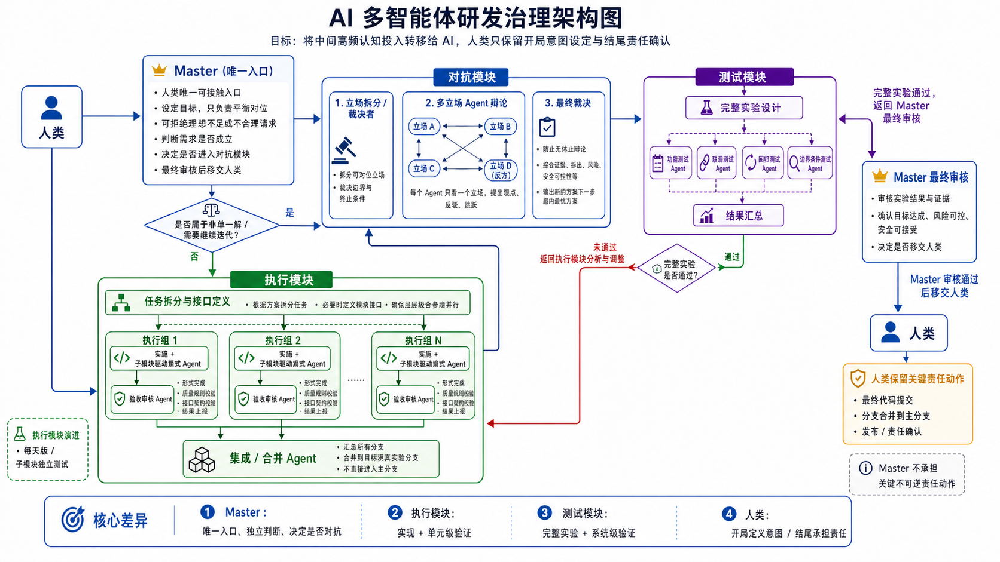

# Aegis

Aegis is a layered AI organization architecture for governed multi-agent software engineering.

It is not a generic agent chat framework. Aegis is designed to make AI collaboration auditable, contract-bounded, causally traceable, and safe to inherit across sessions.

## Core idea

```text
aegis-master-kit = organization constitution / management architecture / Master-level governance
specific business = code-repo + aegis-archive + aegis-causal + aegis-knowledge
aegis-router     = local communication mechanism for governed agent domains
aegis-runtime    = demo/runtime implementations that execute master-kit contracts
```

`aegis-master-kit` is not a project knowledge base, not a causal truth store, not a task archive, and not a code repository. It only tells the Master how to organize work.

The project separates:

- organization rules;
- communication enforcement;
- runtime demos;
- business code;
- archive / knowledge / causal state.

## Why Aegis exists

Single-agent coding can produce useful patches, but complex engineering work needs more than code generation.

Aegis focuses on the missing organizational layer:

```text
semantic alignment
-> request admission
-> adversarial debate when needed
-> contract-first task split
-> implementation
-> verification
-> final review
-> causal result handoff
-> archive / knowledge / causal promotion
```

> [!IMPORTANT]
> Aegis stores **causal structure**, not bare conclusions.
>
> A bare conclusion can look like an unconditional fact. A causal result records why the conclusion currently holds, what evidence supports it, what assumptions and material conditions it depends on, where it applies, what alternatives failed, and what changes would invalidate or reopen it.
>
> This distinction is a system safety rule: objective facts may remain stable under the same material conditions, but engineering reasoning results are maintained by their premises, evidence, scope, assumptions, and material conditions. When those supports change, the conclusion must be inherited, narrowed, reopened, superseded, or invalidated instead of blindly preserved.
>
> Full rationale: `aegis-master-kit/organization/departments/debate/CAUSAL_STRUCTURE_RATIONALE.md`.

## High-level governance flow

The following diagram shows the high-level Master governance flow. It is not a complete system architecture diagram.



## Repository layout

```text
aegis/
  docs/                 Project definitions, technical baseline, and phase scope
  aegis-master-kit/     Master constitution and top-level organization architecture
  aegis-router/         Python implementation of a local MCP-style message router
  aegis-runtime/        Demo/runtime implementations that execute master-kit contracts
  examples/             Demo business skeleton showing how code + three libraries may coexist
  runtime_test_reports/ Runtime verification reports for completed demo phases
```

Important boundary:

```text
aegis-master-kit/organization/departments/*
  = department contracts, schemas, prompts, and governance rules

aegis-runtime/*
  = executable demo/runtime implementations of those contracts
```

Runtime code must not be moved into `aegis-master-kit` unless the project intentionally changes that boundary.

## Current status

Current branch: `v0.1.0-alpha`.

The current prototype has closed the following demo/acceptance mechanisms:

1. Top-level Master communication topology.
2. Router-enforced directed communication.
3. Route envelope and mailbucket communication model.
4. Real route-envelope path protection demo path:
   - Ed25519 sender identity signing;
   - RSA-OAEP/SHA-256 receiver-only path encryption.
5. Debate Department contract package.
6. Debate Department router-integrated runtime demo.
7. Debate Leader explicit causal-chain output.
8. Execution Department contract package.
9. Execution Department deterministic runtime demo.
10. Execution router-integrated closure across:
    - `master -> execution`;
    - `execution -> test`;
    - `test -> execution`;
    - `execution -> debate`;
    - `debate -> execution`;
    - `execution -> master`.
11. Execution Leader final `execution_causal_chain` output as a `causal_candidate`.
12. Test Department contract package with strict evidence-state result semantics.
13. Test Department deterministic runtime demo.
14. Test router-integrated closure across:
    - `execution -> test`;
    - `test -> execution`;
    - `test -> final_review`.
15. Test result retention of reproducibility set and artifact manifest.
16. Test result output as scoped evidence, not global causal truth.
17. Final Review Department contract package with single-Leader whole-chain review semantics.
18. Final Review Department deterministic runtime demo.
19. Final Review router-integrated closure across:
    - `test -> final_review`;
    - `final_review -> master`.
20. Final Review resource-policy gate with `blocked_resource_policy` precedence.
21. Final Review output as recommendation to Master, not production release or global causal truth.
22. Root model and reasoning-budget policy for Master and top-level department Leaders.
23. Master top-level runtime demo for policy-bound nested-Codex Leader creation.
24. Real nested-Codex creation proof for Debate, Execution, Test, and Final Review Leaders.
25. Phase 17 proof audit with sha256 for all four real nested-Codex Leader proof files.
26. Debate Worker profile is explicitly locked as `gpt-5.5 / high` with fallback and silent downgrade forbidden.
27. Phase 18 real Debate Worker acceptance:
    - Master creates only the Debate Leader for the acceptance run;
    - Debate Leader creates one real nested-Codex Debate Worker per valid stance;
    - Debate Workers are request-scoped, stance-bound, and department-local;
    - each Worker preserves local causal state, route priority, and expand priority;
    - Debate Leader preserves adjudicator causal state, route priority, and expand priority;
    - causal equipoise is preserved and marked with `developer_decision_required: true`;
    - final Debate output is delivered as a complete mailbucket causal package;
    - strict proof audit fails on missing Worker proof;
    - mailbucket proof copies are byte-identical to source proof files.
28. Phase 18 Debate runtime test closure:
    - targeted proof-audit tests passed;
    - targeted mailbucket-package tests passed;
    - full Debate runtime suite passed with 23 tests.
29. Phase 19A Execution git topology acceptance:
    - the target business-code repo is `rain-123-bow/aegis-execution-sandbox`;
    - Execution Leader validates a real local sandbox clone;
    - Execution Leader validates split boundaries before group branch creation;
    - one local group branch is created per accepted independent subtask;
    - Leader integrates group branches into a Leader-owned integration branch;
    - a Test handoff package is produced with integration branch, commit, changed files, and group responsibility mapping;
    - no remote push, PR, production merge, release, or sign-off is performed;
    - this does not claim real Front/Back Codex agent closure.
30. Phase 19A Execution runtime test closure:
    - targeted git-topology tests passed;
    - full Execution runtime suite passed;
    - sandbox integration-branch pytest passed.
31. Execution Front and Back Agent profiles are explicitly locked as `gpt-5.5 / high` with fallback and silent downgrade forbidden.
32. Phase 19B real Execution Front/Back Agent acceptance:
    - Master creates only the Execution Leader;
    - Execution Leader creates one real Front Agent and one real Back Agent per accepted Execution Group;
    - Front/Back Agents are request-scoped, group-internal, and not top-level route agents;
    - every Front/Back Agent leaves proof and output files;
    - missing proof or missing output fails acceptance;
    - Front output status is strictly `front_output_candidate`;
    - Back review status is strictly `review_candidate`;
    - Back Agents independently review Front output and have blocking authority;
    - Leader integrates accepted Front/Back-reviewed group branches into a local integration branch;
    - final handoff to Test remains a local candidate and not production merge.
33. Phase 19B evidence clean-fix closure:
    - Leader integration evidence is consistent with the final report;
    - no `no integration` residue remains in Leader evidence;
    - no `completed` status residue remains in Front/Back output evidence;
    - proof audit passed for 4 agents;
    - output audit passed for 4 agents;
    - targeted Phase 19B tests passed;
    - full Execution runtime tests passed;
    - sandbox integration-branch pytest passed.
34. Phase 20A Test handoff validation acceptance:
    - Test Leader consumes the Execution Phase 19B handoff package;
    - Test Leader validates the handoff target, status, integration branch, integration commit, changed files, and group mapping;
    - Test Leader checks out the sandbox integration branch `aegis/phase19b/integration-001`;
    - Test Leader runs local sandbox pytest through the Test handoff-validation path;
    - Test Leader preserves stdout/stderr, branch, commit, changed files, reproducibility set, and artifact manifest;
    - final Test result is `passed`;
    - next route is `final_review`;
    - Test output remains scoped evidence / `causal_candidate`, not global causal truth;
    - no real Test Worker Codex agent is created in Phase 20A;
    - no source code modification, remote push, PR, remote merge, release, production sign-off, or global causal truth mutation is performed.
35. Phase 20A Test runtime closure:
    - targeted Phase 20A handoff-validation tests passed;
    - full Test runtime suite passed;
    - sandbox pytest passed through the Test Leader handoff-validation path;
    - reproducibility set and artifact manifest were generated.
36. Test Worker profile is explicitly locked as `gpt-5.5 / high` with fallback and silent downgrade forbidden.
37. Phase 20B real Test Worker acceptance:
    - Master creates only the Test Leader;
    - Test Leader creates one real nested-Codex / Codex Test Worker per accepted validation route;
    - Test Workers are request-scoped, route-bound, and Test-department-internal;
    - every Test Worker leaves proof, output, route evidence, and private work evidence;
    - missing proof or missing output fails acceptance;
    - Test Worker proof audit passed for 2 workers;
    - Test Worker output audit passed for 2 workers;
    - `route.sandbox_pytest` passed;
    - `route.changed_files_scope` passed;
    - final Test result is `passed`;
    - next route is `final_review`;
    - Test output remains scoped evidence / `causal_candidate`, not global causal truth;
    - no implementation code modification, remote push, PR, remote merge, release, production sign-off, or global causal truth mutation is performed.
38. Phase 20B Test runtime closure:
    - targeted Phase 20B real-worker tests passed;
    - full Test runtime suite passed;
    - direct sandbox pytest cross-check passed;
    - final review handoff package was produced with `handoff_kind: test_real_worker_result`.

This is demo/acceptance closure, not production closure.

## Phase-1 scope

Phase 1 validates the following chain:

```text
Developer -> Codex Master -> aegis-master-kit -> top-level departments -> department leaders -> aegis-router communication
```

The Debate, Execution, Test, and Final Review Departments have demo-level closures. The root model and reasoning-budget policy is locked for Master and top-level department Leaders. Master can bootstrap top-level Leaders through nested-Codex creation and audit their proof files.

Phase 18 adds strict Debate Worker acceptance below the Debate Leader:

```text
Master
  -> Debate Leader
      -> real nested-Codex Debate Worker per valid stance
      -> complete Debate causal package
  -> Master receives package through router/mailbucket boundary
```

Phase 19A adds local Execution git-topology acceptance below the Execution Leader:

```text
Master
  -> Execution Leader
      -> target sandbox local clone
      -> one local group branch per accepted subtask
      -> Leader-owned integration branch
      -> Test handoff package
  -> Test receives integration branch information
```

Phase 19B adds real Execution Front/Back Agent acceptance below the Execution Leader:

```text
Master
  -> Execution Leader
      -> Execution Group per accepted subtask
          -> real nested-Codex Front Agent
          -> real nested-Codex Back Agent
      -> strict proof/output audit
      -> Leader-owned local integration branch
      -> Test handoff package
```

Phase 20A adds Test handoff validation after Execution Phase 19B:

```text
Execution Phase 19B handoff package
  -> Test Leader
      -> validate handoff fields
      -> checkout sandbox integration branch
      -> run local pytest
      -> preserve reproducibility set and artifact manifest
      -> produce scoped final Test result
  -> passed result routes to Final Review
```

Phase 20B adds real Test Worker acceptance below the Test Leader:

```text
Execution Phase 19B / Test Phase 20A validation material
  -> Test Leader
      -> accepted validation routes
          -> real nested-Codex Test Worker per route
      -> strict Test Worker proof/output audit
      -> route-level scoped evidence
      -> final Test result
      -> Final Review handoff package
```

Phase 1 does **not** implement a full autonomous software company, a full causal database, automatic code submission, or production branch governance.

## Aegis Router

`aegis-router` is a lightweight local MCP-style message router.

It is responsible for:

- creating routing domains;
- registering agents;
- enforcing authoritative directed route tables;
- rejecting invalid sender -> receiver edges;
- sending small route envelopes by identity;
- maintaining inbox / outbox state;
- supporting ack and heartbeat;
- owning temporary mailbucket folders.

It is not responsible for:

- judging task quality;
- evaluating causal truth;
- parsing README or attachments;
- writing Archive / Knowledge / Causal stores;
- acting as a vault.

Router tests currently validate strict topology, envelope validation, mailbucket behavior, governance message boundaries, and the real double-crypto route-envelope path.

## Debate Department

The Debate Department is responsible for adversarial reasoning when a request has multiple defensible solution paths, unresolved causal conflict, significant ambiguity, or project-direction impact.

External boundary:

```text
Master / Execution <-> Debate Leader
```

Internal shape in the current phase:

```text
Debate Leader
  -> Debate Worker per valid stance
  -> leader-mediated round-robin broadcast
  -> adjudication by causal strength
  -> complete causal package
  -> cleanup
```

Key rules:

- The Debate Leader is the only external department boundary.
- Debate Workers are temporary, request-scoped, and stance-bound.
- Master must not create Debate Workers directly.
- Each valid stance maps to one Debate Worker.
- Debate Workers do not become top-level Master-route agents.
- Independent evidence-collector, scope-checker, researcher, or persistent expert roles are forbidden in the current Debate Department shape.
- Each Worker owns the complete personal work for its stance: information collection inside allowed evidence boundaries, defense, attack, answers, scope narrowing, causal concession, and local causal-state maintenance.
- Each Worker must preserve `worker_local_causal_state`, `route_priority`, and `expand_priority`.
- The Worker local causal state has higher authority for later turns than compressed transcript context.
- The Leader maintains `adjudicator_causal_state`, `route_priority`, and `expand_priority` during the run.
- The Leader adjudicates by causal strength, not vote count.
- The Leader must stop endless debate when evidence, scope, risk, or no-new-causal-information conditions justify stopping.
- Causal equipoise must not be collapsed into a fake winner. It must be preserved and handed to Master with `developer_decision_required: true`.
- Debate output is a `causal_candidate`, not global causal truth.

Real Debate Worker acceptance requires:

- one real nested-Codex Debate Worker per valid stance;
- proof file for every Worker;
- strict proof audit with missing proof as failure, not skip;
- complete mailbucket package containing:
  - `README.md`;
  - `final_report.json`;
  - `adjudicator_causal_state.json`;
  - `worker_states/*.json`;
  - `worker_proofs/*_proof.json`;
  - `transcript_digest.json`;
  - `evidence_manifest.json`.

## Execution Department

The Execution Department is responsible for turning admitted executable work into traceable implementation candidates.

External boundary:

```text
Master / Debate / Test <-> Execution Leader
```

Internal structure:

```text
Execution Leader
  -> contract/context check
  -> plan selection or Debate request
  -> objective subtask split
  -> Execution Groups
  -> Front Agent implementation
  -> Back Agent review
  -> Leader-owned integration branch/workspace
  -> Test handoff
  -> Test feedback mapping
  -> rework when needed
  -> final execution_causal_chain
  -> cleanup/release of active groups after success
```

Key rules:

- The Execution Leader is the only external department boundary.
- Execution Groups are internal responsibility units, not top-level Master-route agents.
- A task may be split only when independence, contracts, ownership, local validation, and feedback mapping are objectively justified.
- Each independent subtask maps to one Execution Group.
- Each Execution Group has a Front Agent and a Back Agent.
- Front Agents implement their assigned group task, preserve touched files and evidence, run local validation when available, and emit a group causal fork.
- Back Agents independently review Front output, local tests, diffs, contract compliance, and first-principles suitability.
- Back Agents have blocking review authority.
- Group branches/workspaces must remain traceable to task, subtask, group, branch, and touched files.
- The Leader owns integration, not the individual groups.
- Test feedback is mandatory whether it passes or fails.
- Failure feedback must be evidence-backed and mapped before rework.
- Success feedback allows the Leader to release active groups only after responsibility records and causal output are preserved.
- Execution output is a `causal_candidate`, not global causal truth.

The current Execution runtime demo validates:

```text
Master -> Execution -> Test -> Execution -> Master
```

It also validates the conditional handoff:

```text
Execution -> Debate -> Execution
```

The Debate handoff demo selects `PLAN_B` and binds Debate's causal candidate into the final Execution causal chain.

### Phase 19A git topology acceptance

Phase 19A validates local git topology and Leader-owned integration on a separate target business-code repository:

```text
rain-123-bow/aegis-execution-sandbox
```

Phase 19A proves:

- Execution Leader can operate on a real local target repository clone;
- the target repository must be clean before execution;
- invalid splits are rejected before group branches are created;
- one local group branch is created per accepted independent subtask;
- the Leader owns the integration branch;
- group branches are merged into the integration branch;
- integration changed files are preserved;
- a Test handoff package is emitted.

Phase 19A acceptance label:

```text
accepted_execution_git_topology_closure
```

Phase 19A must not be labeled:

```text
accepted_real_execution_agent_closure
```

Known limits:

- Front/Back agents are deterministic or deferred in Phase 19A.
- The integration branch is a local Test handoff candidate only.
- No remote push, PR, remote merge, release, or production sign-off is performed.
- Real request-scoped Front/Back Codex agent acceptance is deferred to Phase 19B.

### Phase 19B real Front/Back Agent acceptance

Phase 19B validates real request-scoped Front/Back agent acceptance below the Execution Leader.

The target business-code repository remains:

```text
rain-123-bow/aegis-execution-sandbox
```

Phase 19B proves:

- Execution Front Agent profile is `gpt-5.5 / high`;
- Execution Back Agent profile is `gpt-5.5 / high`;
- Front/Back profiles are no longer deferred;
- Execution Leader creates real Front/Back agents for each accepted Execution Group;
- every Front/Back agent leaves an auditable proof file;
- every Front/Back agent leaves an auditable output file;
- Front output must use `status: front_output_candidate`;
- Back review output must use `status: review_candidate`;
- output audit rejects `completed` as an invalid Front/Back output status;
- Back Agents review Front outputs and have blocking authority;
- Leader-owned integration evidence is aligned with the final execution candidate;
- the final integration branch remains a local Test handoff candidate.

Phase 19B acceptance label:

```text
accepted_real_execution_front_back_agent_closure
```

Phase 19B must not be labeled:

```text
production_execution_lifecycle_closure
```

Known limits:

- no persistent production agent supervision;
- no restart/recovery lifecycle;
- no remote branch governance;
- no remote push;
- no PR;
- no remote merge;
- no release;
- no production sign-off;
- no global causal merge.

## Test Department

The Test Department is responsible for converting integrated implementation candidates into reproducible evidence and scoped test conclusions.

External boundary:

```text
Execution / Final Review <-> Test Leader
```

Internal demo structure:

```text
Test Leader
  -> implementation candidate intake
  -> contract/context check
  -> deterministic test plan generation
  -> one Test Worker per accepted route
  -> route-level evidence production
  -> result aggregation by evidence state
  -> failed/inconclusive/ordinary blocked feedback to Execution Leader
  -> passed/scoped-pass/final-governance blocked material to Final Review
  -> reproducibility set and artifact manifest retention
```

Key rules:

- The Test Leader is the only external department boundary.
- Test Workers are route-scoped internal workers, not top-level Master-route agents.
- Test owns evidence production and scoped test conclusions, not implementation modification.
- Test may provide owner hints, but Execution Leader owns rework assignment.
- Proven candidate failure with ambiguous owner remains `failed`.
- Missing, unstable, or insufficient evidence becomes `inconclusive` or `blocked`.
- Governance or policy bypass becomes `blocked` with `blocker_kind: governance`.
- Passed or scoped-pass results go to Final Review, not directly to Master.
- Test output is evidence/scoped conclusion, not global causal truth.

The current Test runtime demo validates:

```text
Execution -> Test -> Execution
Execution -> Test -> Final Review
```

The runtime uses request-provided candidate snapshots and in-process route workers. It does not perform production git checkout, real CI, real environment provisioning, or nested-Codex Test Worker orchestration.

### Phase 20A handoff validation acceptance

Phase 20A validates Test Leader consumption of the Execution Phase 19B handoff package.

The input is the local sandbox integration candidate:

```text
target repo: rain-123-bow/aegis-execution-sandbox
integration branch: aegis/phase19b/integration-001
handoff kind: execution_real_front_back_candidate
```

Phase 20A proves:

- handoff target is `test`;
- handoff status is `ready_for_test_department`;
- the sandbox integration branch is checked out and validated;
- the integration commit matches the expected commit;
- sandbox pytest passes through the Test Leader handoff-validation path;
- reproducibility set is generated;
- artifact manifest is generated;
- final Test result is `passed`;
- next route is `final_review`;
- Test does not modify implementation code;
- no real Test Worker Codex agent is claimed;
- no remote push, PR, remote merge, release, production sign-off, or global causal truth mutation occurs;
- sandbox ending on `aegis/phase19b/integration-001` is expected, not failure.

Phase 20A acceptance label:

```text
accepted_test_handoff_validation_closure
```

Phase 20A must not be labeled:

```text
accepted_real_test_worker_closure
production_test_lifecycle_closure
```

### Phase 20B real Test Worker acceptance

Phase 20B validates real request-scoped Test Worker acceptance below the Test Leader.

The source material remains the Execution Phase 19B / Test Phase 20A sandbox integration candidate:

```text
target repo: rain-123-bow/aegis-execution-sandbox
integration branch: aegis/phase19b/integration-001
source handoff: Execution Phase 19B / Test Phase 20A
```

Phase 20B proves:

- Test Worker profile is `gpt-5.5 / high`;
- Test Worker profile is no longer deferred;
- Master creates only the Test Leader;
- Test Leader creates real Test Workers for accepted validation routes;
- Test Workers are route-bound, request-scoped, and Test-department-internal;
- every Test Worker leaves an auditable proof file;
- every Test Worker leaves an auditable output file;
- every Test Worker preserves route evidence and private work evidence;
- missing proof or output fails acceptance;
- worker output status is `test_worker_report_candidate`;
- worker causal status is `scoped_evidence_candidate`;
- `route.sandbox_pytest` passed;
- `route.changed_files_scope` passed;
- final Test result is `passed`;
- next route is `final_review`;
- final review handoff package is produced;
- Test does not modify implementation code;
- no remote push, PR, remote merge, release, production sign-off, or global causal truth mutation occurs.

Phase 20B acceptance label:

```text
accepted_real_test_worker_closure
```

Phase 20B must not be labeled:

```text
production_test_lifecycle_closure
```

## Final Review Department

The Final Review Department is responsible for single-Leader whole-chain consistency review before results return to Master.

External boundary:

```text
Test / Master <-> Final Review Leader
```

Internal demo structure:

```text
Final Review Leader
  -> final review package intake from Test
  -> resource-policy gate
  -> single-subject whole-chain review
  -> object consistency check
  -> Execution/Test/Debate reference completeness check
  -> evidence, scope, and governance review
  -> final_review_result generation
  -> final_review_result handoff to Master
```

Key rules:

- The Final Review Leader is the only external department boundary.
- Final Review has no internal workers in v0.1.
- Parallel reviewer fanout is forbidden.
- Final Review reviews evidence and references; it does not modify code or run tests.
- Final Review may recommend Execution rework or Test expansion only through Master.
- Resource-policy failure returns `blocked_resource_policy` before substantive review.
- `accept_for_master` requires no `known_limits`, `blocked_scope`, or `missing_evidence`.
- `accept_for_master_with_scope_limit` requires explicit accepted limits.
- Final Review returns only to Master under the current topology.
- Final Review output is a recommendation, not a release action or global causal truth.

The current Final Review runtime demo validates:

```text
Test -> Final Review -> Master
```

The runtime is deterministic demo infrastructure. It does not call real external models, create root model/reasoning-budget policy files, perform production artifact review, or merge global causal truth.

## Model and reasoning-budget policy

Root policy file:

```text
MODEL_REASONING_BUDGET_POLICY.yaml
```

The current phase uses a locked static policy:

```text
Master                      -> gpt-5.5 / extra_high
Debate Leader               -> gpt-5.5 / high
Debate Worker               -> gpt-5.5 / high
Execution Leader            -> gpt-5.5 / high
Execution Front Agent       -> gpt-5.5 / high
Execution Back Agent        -> gpt-5.5 / high
Test Leader                 -> gpt-5.5 / high
Test Worker                 -> gpt-5.5 / high
Final Review Leader         -> gpt-5.5 / extra_high
```

Hard rules:

- model and reasoning-budget selection is owned by the root policy;
- agents must not self-select models or budgets;
- fallback and silent downgrade are forbidden in the current phase;
- Master dynamic adjustment is deferred;
- Test Worker profile is no longer deferred after Phase 20B;
- Debate Worker is no longer deferred after Phase 18;
- Execution Front/Back profiles are no longer deferred after Phase 19B.

## Master top-level nested-Codex bootstrap

The Master runtime can create the four top-level department Leaders through nested-Codex and register them into the top-level Router domain:

```text
Master
  -> Debate Leader
  -> Execution Leader
  -> Test Leader
  -> Final Review Leader
```

Phase 17 proof verifies:

- root policy parsing for Master and all top-level Leaders;
- nested-Codex creation request construction with the locked model and reasoning budget;
- real nested-Codex MCP creation for all four top-level Leaders;
- Router registration for the created Leaders;
- all 10 v1 top-level route checks, including `debate -> master`;
- proof-file audit with sha256 for each real nested-Codex Leader proof.

Phase 18 Debate acceptance intentionally used a narrower top-level creation scope: Master created only the Debate Leader, and the Debate Leader created the request-scoped Debate Workers.

Phase 19A Execution acceptance uses the Execution Leader boundary to operate on a separate local sandbox repository and create local group/integration branches. It does not create real Front/Back Codex agents.

Phase 19B Execution acceptance uses the Execution Leader boundary to create real request-scoped Front/Back Codex agents for sandbox Execution Groups. It still does not claim production branch governance or production agent lifecycle supervision.

This is still demo/acceptance closure. It does not claim production Master runtime closure or production nested-Codex process supervision.

## Quick validation

From repository root on Windows PowerShell.

### Debate runtime and real-worker tooling

```powershell
py -3.13 -m venv .venv-debate-real-worker
.\.venv-debate-real-worker\Scripts\python.exe -m pip install -U pip
.\.venv-debate-real-worker\Scripts\python.exe -m pip install -e ".\aegis-router[dev]"
.\.venv-debate-real-worker\Scripts\python.exe -m pip install -e ".\aegis-runtime\debate[dev]"

.\.venv-debate-real-worker\Scripts\python.exe -m pytest .\aegis-runtime\debate -vv
```

Strict real-worker utility flow:

```powershell
.\.venv-debate-real-worker\Scripts\python.exe -m aegis_debate_runtime.real_worker_cli prepare-requests `
  --policy .\MODEL_REASONING_BUDGET_POLICY.yaml `
  --request .\aegis-runtime\debate\examples\demo_request.json `
  --output-dir .\.aegis-debate-real-worker

# Real creation requires a concrete nested-Codex/Codex MCP create-agent surface.
# If the available surface is a current-session MCP tool, create workers there
# and then run strict proof audit after proof files are written.

.\.venv-debate-real-worker\Scripts\python.exe -m aegis_debate_runtime.real_worker_cli audit-proofs `
  --expected .\.aegis-debate-real-worker\expected_worker_proofs.json `
  --proof-dir .\.aegis-debate-real-worker\worker_proofs `
  --output .\.aegis-debate-real-worker\worker_proof_audit_summary.json
```

### Execution runtime, Phase 19A, and Phase 19B

```powershell
py -3.13 -m venv .venv-execution-phase19b
.\.venv-execution-phase19b\Scripts\python.exe -m pip install -U pip
.\.venv-execution-phase19b\Scripts\python.exe -m pip install -e ".\aegis-router[dev]"
.\.venv-execution-phase19b\Scripts\python.exe -m pip install -e ".\aegis-runtime\execution[dev]"

.\.venv-execution-phase19b\Scripts\python.exe -m pytest .\aegis-runtime\execution\tests\test_execution_git_topology_closure.py -vv
.\.venv-execution-phase19b\Scripts\python.exe -m pytest .\aegis-runtime\execution\tests\test_execution_real_front_back_agent_acceptance.py -vv
.\.venv-execution-phase19b\Scripts\python.exe -m pytest .\aegis-runtime\execution -vv
```

Phase 19A/19B sandbox runs require a clean local clone of:

```text
C:\Users\playm\Documents\self-git\aegis-execution-sandbox
git@github.com:rain-123-bow/aegis-execution-sandbox.git
```

Phase 19A local git topology CLI shape:

```powershell
.\.venv-execution-phase19b\Scripts\python.exe -m aegis_execution_runtime.git_topology_cli run `
  --request .\.aegis-phase19a-execution-test\inputs\phase19a_execution_git_topology_request.json `
  --output-dir .\.aegis-phase19a-execution-test\outputs
```

Phase 19B real Front/Back request/audit CLI shape:

```powershell
.\.venv-execution-phase19b\Scripts\python.exe -m aegis_execution_runtime.real_agent_cli prepare-requests `
  --policy .\MODEL_REASONING_BUDGET_POLICY.yaml `
  --execution-package .\.aegis-phase19b-execution-test\inputs\phase19b_execution_package.json `
  --run-id phase19b-execution-real-agents-001 `
  --output-dir .\.aegis-phase19b-execution-test\prepared `
  --proof-dir .\.aegis-phase19b-execution-test\agent_proofs `
  --agent-output-dir .\.aegis-phase19b-execution-test\agent_outputs

.\.venv-execution-phase19b\Scripts\python.exe -m aegis_execution_runtime.real_agent_cli audit-proofs `
  --expected .\.aegis-phase19b-execution-test\prepared\expected_execution_agent_proofs.json `
  --proof-dir .\.aegis-phase19b-execution-test\agent_proofs `
  --output .\.aegis-phase19b-execution-test\agent_proof_audit_summary.json

.\.venv-execution-phase19b\Scripts\python.exe -m aegis_execution_runtime.real_agent_cli audit-outputs `
  --expected .\.aegis-phase19b-execution-test\prepared\expected_execution_agent_outputs.json `
  --agent-output-dir .\.aegis-phase19b-execution-test\agent_outputs `
  --output .\.aegis-phase19b-execution-test\agent_output_audit_summary.json
```

### Test runtime

```powershell
py -3.13 -m venv .venv-test-runtime
.\.venv-test-runtime\Scripts\python.exe -m pip install -U pip
.\.venv-test-runtime\Scripts\python.exe -m pip install -e ".\aegis-router[dev]"
.\.venv-test-runtime\Scripts\python.exe -m pip install -e ".\aegis-runtime\test[dev]"

.\.venv-test-runtime\Scripts\python.exe -m pytest .\aegis-runtime\test
.\.venv-test-runtime\Scripts\python.exe -m pytest .\aegis-runtime\test\tests\test_router_integrated_test_closure.py -vv
.\.venv-test-runtime\Scripts\python.exe -m aegis_test_runtime.cli --request .\aegis-runtime\test\examples\demo_request_pass.json
.\.venv-test-runtime\Scripts\python.exe -m aegis_test_runtime.cli --request .\aegis-runtime\test\examples\demo_request_failure.json
```

### Test runtime and Phase 20A

```powershell
py -3.13 -m venv .venv-test-phase20a
.\.venv-test-phase20a\Scripts\python.exe -m pip install -U pip
.\.venv-test-phase20a\Scripts\python.exe -m pip install -e ".\aegis-router[dev]"
.\.venv-test-phase20a\Scripts\python.exe -m pip install -e ".\aegis-runtime\test[dev]"

.\.venv-test-phase20a\Scripts\python.exe -m pytest .\aegis-runtime\test\tests\test_test_handoff_validation_closure.py -vv
.\.venv-test-phase20a\Scripts\python.exe -m pytest .\aegis-runtime\test -vv
```

Phase 20A handoff validation CLI shape:

```powershell
.\.venv-test-phase20a\Scripts\python.exe -m aegis_test_runtime.handoff_validation_cli `
  --handoff .\.aegis-phase20a-test-handoff-validation\inputs\phase20a_test_handoff_package.json `
  --output-dir .\.aegis-phase20a-test-handoff-validation\outputs `
  --test-command ".\.venv\Scripts\python.exe -m pytest -vv"
```

### Test Phase 20B real-worker tooling

```powershell
py -3.13 -m venv .venv-test-phase20b
.\.venv-test-phase20b\Scripts\python.exe -m pip install -U pip
.\.venv-test-phase20b\Scripts\python.exe -m pip install -e ".\aegis-router[dev]"
.\.venv-test-phase20b\Scripts\python.exe -m pip install -e ".\aegis-runtime\test[dev]"

.\.venv-test-phase20b\Scripts\python.exe -m pytest .\aegis-runtime\test\tests\test_test_real_worker_acceptance.py -vv
.\.venv-test-phase20b\Scripts\python.exe -m pytest .\aegis-runtime\test -vv
```

Phase 20B real Test Worker request/audit CLI shape:

```powershell
.\.venv-test-phase20b\Scripts\python.exe -m aegis_test_runtime.real_worker_cli prepare-requests `
  --policy .\MODEL_REASONING_BUDGET_POLICY.yaml `
  --validation-package .\.aegis-phase20b-test-real-worker\inputs\phase20b_validation_package.json `
  --run-id phase20b-test-real-workers-001 `
  --output-dir .\.aegis-phase20b-test-real-worker\prepared `
  --proof-dir .\.aegis-phase20b-test-real-worker\test_worker_proofs `
  --worker-output-dir .\.aegis-phase20b-test-real-worker\test_worker_outputs

.\.venv-test-phase20b\Scripts\python.exe -m aegis_test_runtime.real_worker_cli audit-proofs `
  --expected .\.aegis-phase20b-test-real-worker\prepared\expected_test_worker_proofs.json `
  --proof-dir .\.aegis-phase20b-test-real-worker\test_worker_proofs `
  --output .\.aegis-phase20b-test-real-worker\test_worker_proof_audit_summary.json

.\.venv-test-phase20b\Scripts\python.exe -m aegis_test_runtime.real_worker_cli audit-outputs `
  --expected .\.aegis-phase20b-test-real-worker\prepared\expected_test_worker_outputs.json `
  --worker-output-dir .\.aegis-phase20b-test-real-worker\test_worker_outputs `
  --output .\.aegis-phase20b-test-real-worker\test_worker_output_audit_summary.json
```

Unit tests and `prepare-requests` validate tooling only. Real Phase 20B acceptance requires actual Test Worker creation through the available nested-Codex/Codex surface and strict proof/output audit.

### Final Review runtime

```powershell
py -3.13 -m venv .venv-final-review-runtime
.\.venv-final-review-runtime\Scripts\python.exe -m pip install -U pip
.\.venv-final-review-runtime\Scripts\python.exe -m pip install -e ".\aegis-router[dev]"
.\.venv-final-review-runtime\Scripts\python.exe -m pip install -e ".\aegis-runtime\final_review[dev]"

.\.venv-final-review-runtime\Scripts\python.exe -m pytest .\aegis-runtime\final_review
.\.venv-final-review-runtime\Scripts\python.exe -m pytest .\aegis-runtime\final_review\tests\test_router_integrated_final_review_closure.py -vv
.\.venv-final-review-runtime\Scripts\python.exe -m aegis_final_review_runtime.cli --request .\aegis-runtime\final_review\examples\demo_request_accept.json
.\.venv-final-review-runtime\Scripts\python.exe -m aegis_final_review_runtime.cli --request .\aegis-runtime\final_review\examples\demo_request_blocked_resource.json
.\.venv-final-review-runtime\Scripts\python.exe -m aegis_final_review_runtime.cli --request .\aegis-runtime\final_review\examples\demo_request_scope_limit.json
```

### Master top-level runtime

```powershell
py -3.13 -m venv .venv-master-runtime
.\.venv-master-runtime\Scripts\python.exe -m pip install -U pip
.\.venv-master-runtime\Scripts\python.exe -m pip install -e ".\aegis-router[dev]"
.\.venv-master-runtime\Scripts\python.exe -m pip install -e ".\aegis-runtime\master[dev]"

.\.venv-master-runtime\Scripts\python.exe -m pytest .\aegis-runtime\master -vv
.\.venv-master-runtime\Scripts\python.exe -m pytest .\aegis-runtime\master\tests\test_master_nested_codex_agent_proof_audit.py -vv

.\.venv-master-runtime\Scripts\python.exe -m aegis_master_runtime.cli validate-recording `
  --policy .\MODEL_REASONING_BUDGET_POLICY.yaml `
  --router-state .\.aegis-master-runtime\router_state.json `
  --output-dir .\.aegis-master-runtime
```

Real nested-Codex validation is performed through the available local MCP surface and audited through proof files. The stdio `validate-real` path remains available for a future standardized create-agent MCP tool name.

Before committing local changes:

```powershell
git diff --check
git status --short
```

Do not commit generated files such as virtual environments, runtime state, mailbucket folders, cache directories, generated keys, generated secrets, proof directories, or runtime artifacts.

## Verification reports

Important runtime reports:

```text
runtime_test_reports/PHASE_9_COMMIT_GATE_READINESS_AUDIT_REPORT.md
runtime_test_reports/PHASE_10_DEBATE_RUNTIME_DEMO_IMPLEMENTATION_REPORT.md
runtime_test_reports/PHASE_11_DEBATE_ROUTER_INTEGRATED_CLOSURE_REPORT.md
runtime_test_reports/PHASE_12_DEBATE_CAUSAL_CHAIN_CLOSURE_REPORT.md
runtime_test_reports/PHASE_13_EXECUTION_RUNTIME_DEMO_IMPLEMENTATION_REPORT.md
runtime_test_reports/PHASE_14_EXECUTION_DEBATE_HANDOFF_CLOSURE_REPORT.md
runtime_test_reports/PHASE_15_TEST_RUNTIME_DEMO_IMPLEMENTATION_REPORT.md
runtime_test_reports/PHASE_15_TEST_RUNTIME_DEMO_LOCAL_VERIFICATION_REPORT.md
runtime_test_reports/PHASE_16_FINAL_REVIEW_RUNTIME_DEMO_IMPLEMENTATION_REPORT.md
runtime_test_reports/PHASE_16_FINAL_REVIEW_RUNTIME_DEMO_LOCAL_VERIFICATION_REPORT.md
runtime_test_reports/PHASE_17_MASTER_NESTED_CODEX_TOP_LEVEL_RUNTIME_IMPLEMENTATION_REPORT.md
runtime_test_reports/PHASE_17_MASTER_NESTED_CODEX_TOP_LEVEL_RUNTIME_LOCAL_VERIFICATION_REPORT.md
runtime_test_reports/PHASE_17_MASTER_NESTED_CODEX_AGENT_PROOF_AUDIT_REPORT.md
runtime_test_reports/PHASE_18_DEBATE_REAL_NESTED_CODEX_WORKER_PATCH_PLAN.md
runtime_test_reports/PHASE_18_DEBATE_REAL_NESTED_CODEX_FULL_ACCEPTANCE_REPORT.md
runtime_test_reports/PHASE_18_DEBATE_REAL_WORKER_POST_ACCEPTANCE_FIX_REPORT.md
runtime_test_reports/PHASE_19A_EXECUTION_GIT_TOPOLOGY_PATCH_PLAN.md
runtime_test_reports/PHASE_19A_EXECUTION_GIT_TOPOLOGY_FULL_ACCEPTANCE_REPORT.md
runtime_test_reports/PHASE_19B_EXECUTION_REAL_FRONT_BACK_AGENT_PATCH_PLAN.md
runtime_test_reports/PHASE_19B_EXECUTION_REAL_FRONT_BACK_AGENT_FULL_ACCEPTANCE_REPORT.md
runtime_test_reports/PHASE_19B_EXECUTION_REAL_FRONT_BACK_AGENT_POST_ACCEPTANCE_FIX_REPORT.md
runtime_test_reports/PHASE_19B_EXECUTION_REAL_FRONT_BACK_AGENT_EVIDENCE_CLEAN_FIX_REPORT.md
runtime_test_reports/PHASE_20A_TEST_HANDOFF_VALIDATION_PATCH_PLAN.md
runtime_test_reports/PHASE_20A_TEST_HANDOFF_VALIDATION_FULL_ACCEPTANCE_REPORT.md
runtime_test_reports/PHASE_20B_TEST_REAL_WORKER_PATCH_PLAN.md
runtime_test_reports/PHASE_20B_TEST_REAL_WORKER_FULL_ACCEPTANCE_REPORT.md
```

Current demo/acceptance closure point:

```text
router-integrated communication closure
+ Debate temporary worker lifecycle closure
+ Debate Leader adjudication closure
+ Debate explicit causal-chain output closure
+ Debate Worker gpt-5.5/high model-policy closure
+ Debate Worker local causal-state and priority contract closure
+ Debate Leader adjudicator causal-state and priority contract closure
+ Debate real nested-Codex Worker proof-audit acceptance closure
+ Debate result mailbucket causal-package closure
+ Debate proof byte-identical mailbucket-copy closure
+ Execution group responsibility closure
+ Execution Test feedback/rework closure
+ Execution Debate handoff closure
+ Execution final causal-chain output closure
+ Execution Phase 19A target sandbox repository closure
+ Execution Phase 19A local group-branch topology closure
+ Execution Phase 19A Leader-owned integration-branch closure
+ Execution Phase 19A Test handoff package closure
+ Execution Front/Back gpt-5.5/high model-policy closure
+ Execution Phase 19B real Front/Back proof-audit closure
+ Execution Phase 19B real Front/Back output-audit closure
+ Execution Phase 19B Leader-owned integration evidence closure
+ Execution Phase 19B sandbox pytest closure
+ Test Department strict evidence-state semantics closure
+ Test deterministic route-worker evidence closure
+ Test failed-feedback-to-Execution closure
+ Test passed-result-to-Final-Review closure
+ Test reproducibility-set and artifact-manifest retention closure
+ Test Phase 20A handoff validation closure
+ Test Phase 20A reproducibility-set closure
+ Test Phase 20A artifact-manifest closure
+ Test Phase 20A scoped final-test-result closure
+ Test Worker gpt-5.5/high model-policy closure
+ Test Phase 20B real Test Worker proof-audit closure
+ Test Phase 20B real Test Worker output-audit closure
+ Test Phase 20B route-level evidence closure
+ Test Phase 20B final-review handoff package closure
+ Final Review single-Leader whole-chain review closure
+ Final Review resource-policy gate closure
+ Final Review object-consistency and evidence-sufficiency closure
+ Final Review result-to-Master closure
+ Root static model/reasoning-budget policy for Master, top-level Leaders, Debate Workers, and Execution Front/Back agents
+ Master nested-Codex top-level Leader creation closure
+ Master top-level Router registration and 10-edge communication closure
+ Four-Leader proof-file sha256 audit closure
```

## Production hardening not yet included

The current prototype intentionally does not claim production closure.

Deferred production topics include:

- full key lifecycle;
- key rotation;
- hardware-backed keys;
- certificate chains and remote trust;
- payload/content encryption;
- nonce garbage collection;
- dynamic topology loading;
- MCP caller/session binding;
- JSON store locking;
- real persistent nested-Codex session lifecycle;
- standardized nested-Codex create-agent MCP tool name;
- real git branch/worktree orchestration beyond local Phase 19A/19B topology validation;
- production real Front/Back worker supervision, restart/recovery, and lifecycle management;
- remote Execution branch governance;
- production Debate Worker supervision, restart/recovery, and lifecycle management;
- production Test lifecycle supervision;
- production Test CI, durable environment provisioning, and external artifact backend;
- production Test Worker supervision, restart/recovery, and lifecycle management;
- production Final Review runtime with real external model invocation, root resource-policy integration, and production artifact review backend;
- Master-driven dynamic model and reasoning-budget adjustment;
- real Archive / Knowledge / Causal admission;
- real global causal merge;
- production branch protection;
- remote push / PR / merge / release.

## Responsibility boundary

Aegis can generate candidates and reports.

Developers retain all critical responsibility actions, including remote push, main-branch merge, release, production deployment, and formal external sign-off.
