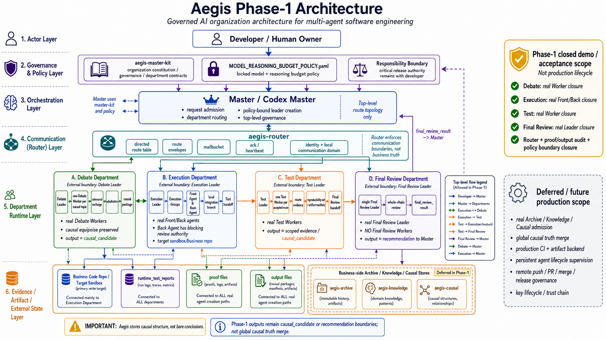

# Aegis

Aegis is a layered AI organization architecture for governed multi-agent software engineering.

It is not a generic agent chat framework. Aegis is designed to make AI collaboration auditable, contract-bounded, causally traceable, and safe to inherit across sessions.



This diagram shows the Phase-1 demo / acceptance architecture. It does not claim production lifecycle closure.

## Core idea

```text
aegis-master-kit = organization constitution / management architecture / Master-level governance
specific business = code-repo + aegis-archive + aegis-causal + aegis-knowledge
aegis-router     = local communication mechanism for governed agent domains
aegis-runtime    = demo/runtime implementations that execute master-kit contracts
```

`aegis-master-kit` is not a project knowledge base, not a causal truth store, not a task archive, and not a code repository. It only tells the Master how to organize work.

The project separates:

- organization rules;
- communication enforcement;
- runtime demos;
- business code;
- archive / knowledge / causal state.

## Why Aegis exists

Single-agent coding can produce useful patches, but complex engineering work needs more than code generation.

Aegis focuses on the missing organizational layer:

```text
semantic alignment
-> request admission
-> adversarial debate when needed
-> contract-first task split
-> implementation
-> verification
-> final review
-> causal result handoff
-> archive / knowledge / causal promotion
```

> [!IMPORTANT]
> Aegis stores **causal structure**, not bare conclusions.
>
> A bare conclusion can look like an unconditional fact. A causal result records why the conclusion currently holds, what evidence supports it, what assumptions and material conditions it depends on, where it applies, what alternatives failed, and what changes would invalidate or reopen it.
>
> This distinction is a system safety rule: objective facts may remain stable under the same material conditions, but engineering reasoning results are maintained by their premises, evidence, scope, assumptions, and material conditions. When those supports change, the conclusion must be inherited, narrowed, reopened, superseded, or invalidated instead of blindly preserved.
>
> Full rationale: `aegis-master-kit/organization/departments/debate/CAUSAL_STRUCTURE_RATIONALE.md`.

## Repository layout

```text
aegis/
  docs/                 Project definitions, technical baseline, and phase scope
  aegis-master-kit/     Master constitution and top-level organization architecture
  aegis-router/         Python implementation of a local MCP-style message router
  aegis-runtime/        Demo/runtime implementations that execute master-kit contracts
  examples/             Demo business skeleton showing how code + three libraries may coexist
  runtime_test_reports/ Runtime verification reports for completed demo phases
```

Important boundary:

```text
aegis-master-kit/organization/departments/*
  = department contracts, schemas, prompts, and governance rules

aegis-runtime/*
  = executable demo/runtime implementations of those contracts
```

Runtime code must not be moved into `aegis-master-kit` unless the project intentionally changes that boundary.

## Current status

Current branch: `v0.1.0-alpha`.

The current prototype has closed the following demo/acceptance mechanisms:

1. Top-level Master communication topology.
2. Router-enforced directed communication.
3. Route envelope and mailbucket communication model.
4. Real route-envelope path protection demo path:
   - Ed25519 sender identity signing;
   - RSA-OAEP/SHA-256 receiver-only path encryption.
5. Debate Department contract package.
6. Debate Department router-integrated runtime demo.
7. Debate Leader explicit causal-chain output.
8. Execution Department contract package.
9. Execution Department deterministic runtime demo.
10. Execution router-integrated closure across `master -> execution`, `execution -> test`, `test -> execution`, `execution -> debate`, `debate -> execution`, and `execution -> master`.
11. Execution Leader final `execution_causal_chain` output as a `causal_candidate`.
12. Test Department contract package with strict evidence-state result semantics.
13. Test Department deterministic runtime demo.
14. Test router-integrated closure across `execution -> test`, `test -> execution`, and `test -> final_review`.
15. Test result retention of reproducibility set and artifact manifest.
16. Test result output as scoped evidence, not global causal truth.
17. Final Review Department contract package with single-Leader whole-chain review semantics.
18. Final Review Department deterministic runtime demo.
19. Final Review router-integrated closure across `test -> final_review` and `final_review -> master`.
20. Final Review resource-policy gate with `blocked_resource_policy` precedence.
21. Final Review output as recommendation to Master, not production release or global causal truth.
22. Root model and reasoning-budget policy for Master and top-level department Leaders.
23. Master top-level runtime demo for policy-bound nested-Codex Leader creation.
24. Real nested-Codex creation proof for Debate, Execution, Test, and Final Review Leaders.
25. Phase 17 proof audit with sha256 for all four real nested-Codex Leader proof files.
26. Debate Worker profile is explicitly locked as `gpt-5.5 / high` with fallback and silent downgrade forbidden.
27. Phase 18 real Debate Worker acceptance:
    - Master creates only the Debate Leader for the acceptance run;
    - Debate Leader creates one real nested-Codex Debate Worker per valid stance;
    - Debate Workers are request-scoped, stance-bound, and department-local;
    - each Worker preserves local causal state, route priority, and expand priority;
    - Debate Leader preserves adjudicator causal state, route priority, and expand priority;
    - causal equipoise is preserved and marked with `developer_decision_required: true`;
    - final Debate output is delivered as a complete mailbucket causal package;
    - strict proof audit fails on missing Worker proof;
    - mailbucket proof copies are byte-identical to source proof files.
28. Phase 18 Debate runtime test closure:
    - targeted proof-audit tests passed;
    - targeted mailbucket-package tests passed;
    - full Debate runtime suite passed with 23 tests.
29. Phase 19A Execution git topology acceptance:
    - the target business-code repo is `rain-123-bow/aegis-execution-sandbox`;
    - Execution Leader validates a real local sandbox clone;
    - invalid splits are rejected before group branches are created;
    - one local group branch is created per accepted independent subtask;
    - Leader integrates group branches into a Leader-owned integration branch;
    - a Test handoff package is emitted;
    - no remote push, PR, production merge, release, or sign-off is performed;
    - this does not claim real Front/Back Codex agent closure.
30. Phase 19A Execution runtime test closure:
    - targeted git-topology tests passed;
    - full Execution runtime suite passed;
    - sandbox integration-branch pytest passed.
31. Execution Front and Back Agent profiles are explicitly locked as `gpt-5.5 / high` with fallback and silent downgrade forbidden.
32. Phase 19B real Execution Front/Back Agent acceptance:
    - Master creates only the Execution Leader;
    - Execution Leader creates one real Front Agent and one real Back Agent per accepted Execution Group;
    - Front/Back Agents are request-scoped, group-internal, and not top-level route agents;
    - every Front/Back Agent leaves proof and output files;
    - missing proof or output fails acceptance;
    - Front output status is strictly `front_output_candidate`;
    - Back review status is strictly `review_candidate`;
    - Back Agents independently review Front output and have blocking authority;
    - Leader integrates accepted Front/Back-reviewed group branches into a local integration branch;
    - final handoff to Test remains a local candidate and not production merge.
33. Phase 19B evidence clean-fix closure:
    - Leader integration evidence is consistent with the final report;
    - no `no integration` residue remains in Leader evidence;
    - no `completed` status residue remains in Front/Back output evidence;
    - proof audit passed for 4 agents;
    - output audit passed for 4 agents;
    - targeted Phase 19B tests passed;
    - full Execution runtime tests passed;
    - sandbox integration-branch pytest passed.
34. Phase 20A Test handoff validation acceptance:
    - Test Leader consumes the Execution Phase 19B handoff package;
    - Test Leader validates the handoff target, status, integration branch, integration commit, changed files, and group mapping;
    - Test Leader checks out the sandbox integration branch `aegis/phase19b/integration-001`;
    - Test Leader runs local sandbox pytest through the Test handoff-validation path;
    - Test Leader preserves stdout/stderr, branch, commit, changed files, reproducibility set, and artifact manifest;
    - final Test result is `passed`;
    - next route is `final_review`;
    - Test output remains scoped evidence / `causal_candidate`, not global causal truth;
    - no real Test Worker Codex agent is created in Phase 20A;
    - no source code modification, remote push, PR, remote merge, release, production sign-off, or global causal truth mutation is performed.
35. Phase 20A Test runtime closure:
    - targeted Phase 20A handoff-validation tests passed;
    - full Test runtime suite passed;
    - sandbox pytest passed through the Test Leader handoff-validation path;
    - reproducibility set and artifact manifest were generated.
36. Test Worker profile is explicitly locked as `gpt-5.5 / high` with fallback and silent downgrade forbidden.
37. Phase 20B real Test Worker acceptance:
    - Master creates only the Test Leader;
    - Test Leader creates one real nested-Codex / Codex Test Worker per accepted validation route;
    - Test Workers are request-scoped, route-bound, and Test-department-internal;
    - every Test Worker leaves proof, output, route evidence, and private work evidence;
    - missing proof or output fails acceptance;
    - Test Worker proof audit passed for 2 workers;
    - Test Worker output audit passed for 2 workers;
    - `route.sandbox_pytest` passed;
    - `route.changed_files_scope` passed;
    - final Test result is `passed`;
    - next route is `final_review`;
    - Test output remains scoped evidence / `causal_candidate`, not global causal truth;
    - no implementation code modification, remote push, PR, remote merge, release, production sign-off, or global causal truth mutation is performed.
38. Phase 20B Test runtime closure:
    - targeted Phase 20B real-worker tests passed;
    - full Test runtime suite passed;
    - direct sandbox pytest cross-check passed;
    - final review handoff package was produced with `handoff_kind: test_real_worker_result`.
39. Phase 21A Final Review handoff validation acceptance:
    - Final Review consumes the real Test Phase 20B `final_review_handoff_package_phase20b.json`;
    - the handoff validator accepts the actual list-shaped Phase 20B `route_results` artifact shape;
    - deterministic `FinalReviewLeader` builds a Final Review request and produces a `final_review_result`;
    - the result target is `master` and the route remains `final_review -> master`;
    - the result is a Master recommendation with explicit scope limits, not global causal truth;
    - no real nested-Codex Final Review Leader is created;
    - no Final Review Workers are created;
    - no router/topology code is modified;
    - no implementation code modification, remote push, PR, remote merge, release, production sign-off, or global causal truth mutation is performed.
40. Phase 21A Final Review runtime closure:
    - targeted Phase 21A handoff-validation tests passed with 14 tests;
    - explicit router-integrated Final Review closure test passed;
    - full Final Review runtime suite passed with 23 tests;
    - canonical CLI against the real Phase 20B handoff package passed;
    - `git diff --check` passed.
41. Phase 21B real Final Review Leader acceptance:
    - Master creates exactly one real nested-Codex / Codex Final Review Leader;
    - the Leader consumes Phase 21A summary and result material;
    - the Leader writes a proof file before substantive review work;
    - the Leader writes an output file containing a nested `final_review_result` recommendation;
    - proof audit passed for 1 Leader;
    - output audit passed for 1 Leader;
    - final decision is `accept_for_master_with_scope_limit`;
    - the output route remains `final_review -> master`;
    - no Final Review Worker is created;
    - no router/topology code is modified;
    - no implementation/business code is modified;
    - no Test routes are run or replaced by Final Review;
    - no remote push, PR, merge, release, production sign-off, or global causal truth mutation is performed.
42. Phase 21B Final Review runtime closure:
    - targeted Phase 21B real-Leader tests passed with 15 tests;
    - full Final Review runtime suite passed with 38 tests;
    - `git diff --check` passed;
    - real Leader proof/output audit passed;
    - acceptance label is `accepted_real_final_review_leader_closure`.
43. Phase 22A three-store admission boundary:
    - Master-owned Archive / Knowledge / Causal admission policy exists;
    - deterministic `aegis-runtime/state_admission` validator exists;
    - Archive admits history candidates without producing truth;
    - Knowledge admits source-backed static facts and constraints, not causal reasoning chains;
    - Causal admits only staged `causal_candidate` structures;
    - `stage_causal_candidate` means candidate-lane staging, not canonical/global causal truth;
    - Master may directly construct and stage a Causal candidate in the unique-conclusion path;
    - Debate Leader output requires Master structural admission review before staging;
    - direct global causal truth writes and production store mutations are rejected.
44. Phase 22A runtime validation:
    - `compileall` passed for `aegis-runtime/state_admission`;
    - Phase 22A state admission pytest passed with 13 tests;
    - `git diff --check` passed;
    - no router/topology mutation, fifth department, long-lived State Admission Agent, production store write, or global causal merge is claimed.
45. Phase 22B Master causal review boundary:
    - Master-owned high-budget causal review policy exists;
    - deterministic `aegis-runtime/causal_review` validator exists;
    - staged causal candidates are reviewed against Knowledge context, existing Causal context, constraints, and confidence state;
    - statistical, deterministic proof, contract-proven, test-evidence-backed, and static-analysis-backed high-confidence support are distinguished from heuristic confidence;
    - developer decision escalation produces a developer decision package and Archive event candidate;
    - Phase 22B outputs decision artifacts only and does not perform canonical/global causal merge or production store writes.
46. Phase 22C local Causal Store persistence boundary:
    - Master-owned local demo Causal Store persistence policy exists;
    - deterministic `aegis-runtime/causal_store` persistence runtime exists;
    - persistable Phase 22B decisions write local `causal/facts`, `index.yaml`, semantic changelog, change record, snapshot, and rollback metadata;
    - causal semantic changelog records causal-state evolution and is not a Git diff duplicate;
    - Phase 22C rejects unresolved developer decisions, insufficient-evidence decisions, direct write attempts, and malformed causal facts;
    - Phase 22C does not implement production Causal Store backend, production encryption, remote sync, Archive/Knowledge persistence, router/topology changes, or a long-lived Causal Store Agent.
47. Phase 23A Archive segmented persistence boundary:
    - Master-owned local demo Archive segmented persistence policy exists;
    - deterministic `aegis-runtime/archive_store` persistence runtime exists;
    - archive event candidates are written into bounded active segments;
    - full active segments roll over into sealed read-only history with summary, index, seal, and compressed payload;
    - artifact manifest, archive changelog, and rollback metadata are generated;
    - Archive records what happened and does not produce truth;
    - Phase 23A does not implement production Archive backend, production encryption, remote sync, Knowledge/Causal persistence, router/topology changes, or a long-lived archive runtime agent profile.

This is demo/acceptance closure, not production closure.

## Phase-1 scope

Phase 1 validates the following chain:

```text
Developer -> Codex Master -> aegis-master-kit -> top-level departments -> department leaders -> aegis-router communication
```

The Debate, Execution, Test, and Final Review Departments have demo-level closures. The root model and reasoning-budget policy is locked for Master and top-level department Leaders. Master can bootstrap top-level Leaders through nested-Codex creation and audit their proof files.

Phase 18 adds strict Debate Worker acceptance below the Debate Leader:

```text
Master
  -> Debate Leader
      -> real nested-Codex Debate Worker per valid stance
      -> complete Debate causal package
  -> Master receives package through router/mailbucket boundary
```

Phase 19A adds local Execution git-topology acceptance below the Execution Leader:

```text
Master
  -> Execution Leader
      -> target sandbox local clone
      -> one local group branch per accepted subtask
      -> Leader-owned integration branch
      -> Test handoff package
  -> Test receives integration branch information
```

Phase 19B adds real Execution Front/Back Agent acceptance below the Execution Leader:

```text
Master
  -> Execution Leader
      -> Execution Group per accepted subtask
          -> real nested-Codex Front Agent
          -> real nested-Codex Back Agent
      -> strict proof/output audit
      -> Leader-owned local integration branch
      -> Test handoff package
```

Phase 20A adds Test handoff validation after Execution Phase 19B:

```text
Execution Phase 19B handoff package
  -> Test Leader
      -> validate handoff fields
      -> checkout sandbox integration branch
      -> run local pytest
      -> preserve reproducibility set and artifact manifest
      -> produce scoped final Test result
  -> passed result routes to Final Review
```

Phase 20B adds real Test Worker acceptance below the Test Leader:

```text
Execution Phase 19B / Test Phase 20A validation material
  -> Test Leader
      -> accepted validation routes
          -> real nested-Codex Test Worker per route
      -> strict Test Worker proof/output audit
      -> route-level scoped evidence
      -> final Test result
      -> Final Review handoff package
```

Phase 21A adds Final Review handoff validation after Test Phase 20B:

```text
Test Phase 20B final_review handoff package
  -> Final Review handoff validator
      -> deterministic FinalReviewLeader
      -> final_review_result
  -> Master recommendation boundary
```

Phase 21B adds real Final Review Leader acceptance after Phase 21A:

```text
Master
  -> real nested-Codex / Codex Final Review Leader
      -> proof file
      -> output file
      -> final_review_result recommendation
  -> Master recommendation boundary
```

Phase 21B closes real Final Review Leader acceptance. It does not create Final Review Workers and does not claim production Final Review lifecycle closure.

Phase 22A adds Master-owned three-store admission policy and deterministic validator tooling:

```text
Department output / developer claim / Master observation
  -> Master-owned structural admission review
  -> archive_candidate | knowledge_candidate | staged causal_candidate | rejection | debate request
```

Phase 22A stages Causal candidates only. It does not write production Archive / Knowledge / Causal stores and does not perform canonical/global causal truth merge.

Phase 22B adds Master-owned causal review after Phase 22A staging:

```text
staged causal_candidate
  + Knowledge context
  + existing Causal context
  + current constraints
  + confidence / uncertainty state
  -> causal_review_decision artifact
```

Phase 22B produces review decision artifacts only. It does not create a separate causal-review department, does not create a long-lived Causal Review Agent, does not modify router/topology, does not write production Archive / Knowledge / Causal stores, and does not perform canonical/global causal truth merge.
Phase 22C adds local demo Causal Store persistence after Phase 22B review:

```text
causal_review_decision
  -> local causal/facts/Fxxxx.yaml
  -> causal/index.yaml
  -> causal/history/changes/Cxxxx.yaml
  -> causal/history/changelog.md
  -> causal/snapshots/Sxxxx.yaml
  -> causal/rollback/Rxxxx.yaml
```

Phase 22C writes local demo causal state only. It does not implement production Causal Store backend, production encryption, remote sync, Archive/Knowledge persistence, or router/topology changes.

Phase 23A adds local demo Archive segmented persistence:

```text
archive_event_candidate
  -> archive/active/segment_xxxx/events/Exxxx.yaml
  -> archive/index.yaml
  -> archive/artifacts/manifest.yaml
  -> archive/history/changelog.md
  -> archive/rollback/Rxxxx.yaml
  -> sealed segment summary/index/seal/compressed payload when rollover occurs
```

Phase 23A writes local demo Archive state only. It does not implement production Archive backend, production encryption, remote sync, Knowledge/Causal persistence, or router/topology changes.

Phase 1 does **not** implement a full autonomous software company, a full causal database, automatic code submission, production branch governance, production release review, or global causal truth merge.

## Three-store admission

Phase 22A introduces the current Master-owned admission boundary for project business state:

```text
Archive   = what happened
Knowledge = what is known
Causal    = why a judgment holds
```

The contract files live under:

```text
aegis-master-kit/master/THREE_STORE_ADMISSION_POLICY.md
aegis-master-kit/master/STATE_ADMISSION_DECISION_CONTRACT.md
```

The deterministic validator lives under:

```text
aegis-runtime/state_admission/
```

Key rules:

- three-store admission is a Master governance capability, not a fifth department;
- no long-lived State Admission Agent is introduced;
- ordinary agents cannot directly write Archive, Knowledge, or Causal;
- Archive records events and responsibility, not truth;
- Knowledge stores verified static facts and constraints, not causal reasoning;
- Causal requires statement, why, evidence, scope, assumptions, and allowed source origin;
- Master may directly stage a Causal candidate in the unique / near-unique conclusion path;
- Debate Leader causal output is not automatically staged and requires Master structural admission review;
- `stage_causal_candidate` is candidate-lane staging only;
- staged Causal candidates are not canonical/global causal truth;
- Phase 22A performs no production store write and no global causal merge.

## Master causal review

Phase 22B reviews staged Causal candidates after Phase 22A admission. It is a Master governance review step, not a new department or a production store writer.

Input boundary:

```text
causal_candidate
  + Knowledge context
  + existing Causal context, or explicit absence reason
  + current constraints
  + confidence / uncertainty state
```

Output boundary:

```text
causal_review_decision artifact
```

Possible decision artifacts include:

- `stage_canonical_merge_candidate`
- `stage_scope_limited_merge_candidate`
- `stage_supersession_candidate`
- `stage_invalidation_candidate`
- `developer_decision_required`
- `needs_more_evidence`
- `needs_debate`
- `reject_direct_merge_or_store_write`

Key rules:

- statistical confidence requires numeric evidence above threshold;
- deterministic proof, contract-proven, test-evidence-backed, and static-analysis-backed support require evidence references;
- heuristic, qualitative, and unknown confidence do not satisfy decisive acceptance;
- developer decision escalation produces a developer decision package and Archive event candidate;
- Archive event candidate is not a production Archive write;
- successful review stages a later persistence candidate only;
- Phase 22B performs no production store write and no global causal merge.

## Causal Store persistence

Phase 22C persists accepted Phase 22B causal review decisions into a local demo Causal Store.

Persistable decisions:

```text
stage_canonical_merge_candidate
stage_scope_limited_merge_candidate
stage_supersession_candidate
stage_invalidation_candidate
```

Rejected decisions:

```text
developer_decision_required
needs_more_evidence
needs_debate
reject_candidate
reject_direct_merge_or_store_write
```

Key local files:

```text
causal/index.yaml
causal/facts/Fxxxx.yaml
causal/history/changes/Cxxxx.yaml
causal/history/changelog.md
causal/snapshots/Sxxxx.yaml
causal/rollback/Rxxxx.yaml
```

The causal semantic changelog records causal-state evolution: added facts, superseded facts, invalidated facts, reasons, evidence, affected scopes, and rollback references. It is not redundant with Git history.

Phase 22C is local demo/runtime persistence only. It does not claim production persistence or global causal truth infrastructure.

## Archive segmented persistence

Phase 23A persists accepted archive event candidates into a bounded local demo Archive.

Active segments are writable. When a configured event or size threshold is reached, the active segment is sealed into read-only history and a new active segment is opened.

Key local files:

```text
archive/index.yaml
archive/active/segment_xxxx/segment_state.yaml
archive/active/segment_xxxx/events/Exxxx.yaml
archive/active/segment_xxxx/index.yaml
archive/active/segment_xxxx/segment_index.yaml
archive/sealed/segment_xxxx/summary.yaml
archive/sealed/segment_xxxx/index.yaml
archive/sealed/segment_xxxx/seal.yaml
archive/sealed/segment_xxxx/compressed_payload.zip
archive/artifacts/manifest.yaml
archive/history/changelog.md
archive/rollback/Rxxxx.yaml
```

Archive records events and responsibility. It does not produce Knowledge, Causal truth, or ordinary agent reasoning context.

## Aegis Router

`aegis-router` is a lightweight local MCP-style message router.

It is responsible for:

- creating routing domains;
- registering agents;
- enforcing authoritative directed route tables;
- rejecting invalid sender -> receiver edges;
- sending small route envelopes by identity;
- maintaining inbox / outbox state;
- supporting ack and heartbeat;
- owning temporary mailbucket folders.

It is not responsible for:

- judging task quality;
- evaluating causal truth;
- parsing README or attachments;
- writing Archive / Knowledge / Causal stores;
- acting as a vault.

Router tests currently validate strict topology, envelope validation, mailbucket behavior, governance message boundaries, and the real double-crypto route-envelope path.

## Debate Department

The Debate Department is responsible for adversarial reasoning when a request has multiple defensible solution paths, unresolved causal conflict, significant ambiguity, or project-direction impact.

External boundary:

```text
Master / Execution <-> Debate Leader
```

Internal shape in the current phase:

```text
Debate Leader
  -> Debate Worker per valid stance
  -> leader-mediated round-robin broadcast
  -> adjudication by causal strength
  -> complete causal package
  -> cleanup
```

Key rules:

- The Debate Leader is the only external department boundary.
- Debate Workers are temporary, request-scoped, and stance-bound.
- Master must not create Debate Workers directly.
- Each valid stance maps to one Debate Worker.
- Debate Workers do not become top-level Master-route agents.
- Independent evidence-collector, scope-checker, researcher, or persistent expert roles are forbidden in the current Debate Department shape.
- Each Worker owns the complete personal work for its stance: information collection inside allowed evidence boundaries, defense, attack, answers, scope narrowing, causal concession, and local causal-state maintenance.
- Each Worker must preserve `worker_local_causal_state`, `route_priority`, and `expand_priority`.
- The Worker local causal state has higher authority for later turns than compressed transcript context.
- The Leader maintains `adjudicator_causal_state`, `route_priority`, and `expand_priority` during the run.
- The Leader adjudicates by causal strength, not vote count.
- The Leader must stop endless debate when evidence, scope, risk, or no-new-causal-information conditions justify stopping.
- Causal equipoise must not be collapsed into a fake winner. It must be preserved and handed to Master with `developer_decision_required: true`.
- Debate output is a `causal_candidate`, not global causal truth.

Real Debate Worker acceptance requires:

- one real nested-Codex Debate Worker per valid stance;
- proof file for every Worker;
- strict proof audit with missing proof as failure, not skip;
- complete mailbucket package containing `README.md`, `final_report.json`, `adjudicator_causal_state.json`, `worker_states/*.json`, `worker_proofs/*_proof.json`, `transcript_digest.json`, and `evidence_manifest.json`.

## Execution Department

The Execution Department is responsible for turning admitted executable work into traceable implementation candidates.

External boundary:

```text
Master / Debate / Test <-> Execution Leader
```

Internal structure:

```text
Execution Leader
  -> contract/context check
  -> plan selection or Debate request
  -> objective subtask split
  -> Execution Groups
  -> Front Agent implementation
  -> Back Agent review
  -> Leader-owned integration branch/workspace
  -> Test handoff
  -> Test feedback mapping
  -> rework when needed
  -> final execution_causal_chain
  -> cleanup/release of active groups after success
```

Key rules:

- The Execution Leader is the only external department boundary.
- Execution Groups are internal responsibility units, not top-level Master-route agents.
- A task may be split only when independence, contracts, ownership, local validation, and feedback mapping are objectively justified.
- Each independent subtask maps to one Execution Group.
- Each Execution Group has a Front Agent and a Back Agent.
- Front Agents implement their assigned group task, preserve touched files and evidence, run local validation when available, and emit a group causal fork.
- Back Agents independently review Front output, local tests, diffs, contract compliance, and first-principles suitability.
- Back Agents have blocking review authority.
- Group branches/workspaces must remain traceable to task, subtask, group, branch, and touched files.
- The Leader owns integration, not the individual groups.
- Test feedback is mandatory whether it passes or fails.
- Failure feedback must be evidence-backed and mapped before rework.
- Success feedback allows the Leader to release active groups only after responsibility records and causal output are preserved.
- Execution output is a `causal_candidate`, not global causal truth.

The current Execution runtime demo validates:

```text
Master -> Execution -> Test -> Execution -> Master
```

It also validates the conditional handoff:

```text
Execution -> Debate -> Execution
```

### Phase 19A git topology acceptance

Phase 19A validates local git topology and Leader-owned integration on a separate target business-code repository:

```text
rain-123-bow/aegis-execution-sandbox
```

Phase 19A proves local group branch creation, Leader-owned integration, integration changed-file preservation, and Test handoff package emission. It does not claim real Front/Back Codex agent closure, remote push, PR, production merge, release, or sign-off.

### Phase 19B real Front/Back Agent acceptance

Phase 19B validates real request-scoped Front/Back agent acceptance below the Execution Leader.

The target business-code repository remains:

```text
rain-123-bow/aegis-execution-sandbox
```

Phase 19B proves real Front/Back agent creation, proof/output audits, Back Agent blocking review authority, and Leader-owned local integration. It does not claim production branch governance or production agent lifecycle supervision.

## Test Department

The Test Department is responsible for converting integrated implementation candidates into reproducible evidence and scoped test conclusions.

External boundary:

```text
Execution / Final Review <-> Test Leader
```

Internal demo structure:

```text
Test Leader
  -> implementation candidate intake
  -> contract/context check
  -> deterministic test plan generation
  -> one Test Worker per accepted route
  -> route-level evidence production
  -> result aggregation by evidence state
  -> failed/inconclusive/ordinary blocked feedback to Execution Leader
  -> passed/scoped-pass/final-governance blocked material to Final Review
  -> reproducibility set and artifact manifest retention
```

Key rules:

- The Test Leader is the only external department boundary.
- Test Workers are route-scoped internal workers, not top-level Master-route agents.
- Test owns evidence production and scoped test conclusions, not implementation modification.
- Test may provide owner hints, but Execution Leader owns rework assignment.
- Proven candidate failure with ambiguous owner remains `failed`.
- Missing, unstable, or insufficient evidence becomes `inconclusive` or `blocked`.
- Governance or policy bypass becomes `blocked` with `blocker_kind: governance`.
- Passed or scoped-pass results go to Final Review, not directly to Master.
- Test output is evidence/scoped conclusion, not global causal truth.

### Phase 20A handoff validation acceptance

Phase 20A validates Test Leader consumption of the Execution Phase 19B handoff package.

The input is the local sandbox integration candidate:

```text
target repo: rain-123-bow/aegis-execution-sandbox
integration branch: aegis/phase19b/integration-001
handoff kind: execution_real_front_back_candidate
```

Phase 20A proves handoff-field validation, sandbox checkout, local sandbox pytest through the Test handoff-validation path, reproducibility set generation, artifact manifest generation, and scoped final Test result. It does not claim real Test Worker Codex agent creation or production Test lifecycle closure.

### Phase 20B real Test Worker acceptance

Phase 20B validates real request-scoped Test Worker acceptance below the Test Leader.

The source material remains the Execution Phase 19B / Test Phase 20A sandbox integration candidate:

```text
target repo: rain-123-bow/aegis-execution-sandbox
integration branch: aegis/phase19b/integration-001
source handoff: Execution Phase 19B / Test Phase 20A
```

Phase 20B proves Test Worker `gpt-5.5 / high` model-policy closure, real Test Worker creation, proof/output audits, route-level scoped evidence, final Test result, and Final Review handoff package generation.

Phase 20B acceptance label:

```text
accepted_real_test_worker_closure
```

Phase 20B must not be labeled:

```text
production_test_lifecycle_closure
```

## Final Review Department

The Final Review Department is responsible for single-Leader whole-chain consistency review before results return to Master.

External boundary:

```text
Test / Master <-> Final Review Leader
```

Internal demo structure:

```text
Final Review Leader
  -> final review package intake from Test
  -> resource-policy gate
  -> single-subject whole-chain review
  -> object consistency check
  -> Execution/Test/Debate reference completeness check
  -> evidence, scope, and governance review
  -> final_review_result generation
  -> final_review_result handoff to Master
```

Key rules:

- The Final Review Leader is the only external department boundary.
- Final Review has no internal workers in v0.1.
- Parallel reviewer fanout is forbidden.
- Final Review reviews evidence and references; it does not modify code or run tests.
- Final Review may recommend Execution rework or Test expansion only through Master.
- Resource-policy failure returns `blocked_resource_policy` before substantive review.
- `accept_for_master` requires no `known_limits`, `blocked_scope`, or `missing_evidence`.
- `accept_for_master_with_scope_limit` requires explicit accepted limits.
- Final Review returns only to Master under the current topology.
- Final Review output is a recommendation, not a release action or global causal truth.

The deterministic Final Review runtime validates:

```text
Test -> Final Review -> Master
```

### Phase 21A Final Review handoff validation

Phase 21A validates that Final Review can consume the real Test Phase 20B handoff material and return a valid Master recommendation.

```text
Test Phase 20B final_review handoff package
  -> Final Review handoff validator
      -> deterministic FinalReviewLeader
      -> final_review_result
  -> Master recommendation boundary
```

Phase 21A proves:

- the handoff kind is `test_real_worker_result`;
- the target is `final_review`;
- the source status is `ready_for_final_review`;
- the canonical Phase 20B CLI handoff validation passes;
- list-shaped and object-shaped `route_results` are accepted when all routes passed;
- the output route remains `final_review -> master`;
- the result is a `final_review_recommendation`;
- `accept_for_master_with_scope_limit` is used when Phase 20B known limits remain material;
- no real nested-Codex Final Review Leader is created;
- no Final Review Worker is created;
- no router/topology mutation occurs;
- no production release review, production sign-off, or global causal truth mutation is claimed.

Phase 21A acceptance label:

```text
accepted_final_review_handoff_validation_closure
```

Phase 21A must not be labeled:

```text
accepted_real_final_review_leader_closure
production_final_review_lifecycle_closure
production_release_review_closure
global_causal_truth_closure
```

### Phase 21B real Final Review Leader acceptance

Phase 21B validates real nested-Codex / Codex Final Review Leader acceptance after Phase 21A.

```text
Master
  -> real nested-Codex / Codex Final Review Leader
      -> proof file
      -> output file
      -> final_review_result recommendation
  -> Master recommendation boundary
```

Phase 21B proves:

- Master creates exactly one real Final Review Leader;
- Final Review creates zero workers;
- the Leader consumes Phase 21A summary and result material;
- the Leader writes a proof file before substantive review work;
- the Leader writes an output file with a nested `final_review_result`;
- proof and output audits pass;
- the output route remains `final_review -> master`;
- `accept_for_master_with_scope_limit` is used when upstream known limits remain material;
- no router/topology mutation occurs;
- no implementation/business code mutation occurs;
- no Test route is run or replaced by Final Review;
- no production release review, production sign-off, or global causal truth mutation is claimed.

Phase 21B acceptance label:

```text
accepted_real_final_review_leader_closure
```

Phase 21B must not be labeled:

```text
accepted_final_review_worker_closure
production_final_review_lifecycle_closure
production_release_review_closure
global_causal_truth_closure
```

Phase 21B preserves the single-Leader Final Review architecture and does not introduce Final Review Workers.

## Model and reasoning-budget policy

Root policy file:

```text
MODEL_REASONING_BUDGET_POLICY.yaml
```

The current phase uses a locked static policy:

```text
Master                      -> gpt-5.5 / extra_high
Debate Leader               -> gpt-5.5 / high
Debate Worker               -> gpt-5.5 / high
Execution Leader            -> gpt-5.5 / high
Execution Front Agent       -> gpt-5.5 / high
Execution Back Agent        -> gpt-5.5 / high
Test Leader                 -> gpt-5.5 / high
Test Worker                 -> gpt-5.5 / high
Final Review Leader         -> gpt-5.5 / extra_high
```

Hard rules:

- model and reasoning-budget selection is owned by the root policy;
- agents must not self-select models or budgets;
- fallback and silent downgrade are forbidden in the current phase;
- Master dynamic adjustment is deferred;
- Debate Worker is no longer deferred after Phase 18;
- Execution Front/Back profiles are no longer deferred after Phase 19B;
- Test Worker profile is no longer deferred after Phase 20B.

## Quick validation

From repository root on Windows PowerShell.

### Final Review runtime, Phase 21A, and Phase 21B

```powershell
py -3.13 -m venv .venv-final-review-phase21b
.\.venv-final-review-phase21b\Scripts\python.exe -m pip install -U pip
.\.venv-final-review-phase21b\Scripts\python.exe -m pip install -e ".\aegis-router[dev]"
.\.venv-final-review-phase21b\Scripts\python.exe -m pip install -e ".\aegis-runtime\final_review[dev]"

.\.venv-final-review-phase21b\Scripts\python.exe -m compileall .\aegis-runtime\final_review\aegis_final_review_runtime
.\.venv-final-review-phase21b\Scripts\python.exe -m pytest .\aegis-runtime\final_review\tests\test_phase21a_final_review_handoff_validation.py -vv
.\.venv-final-review-phase21b\Scripts\python.exe -m pytest .\aegis-runtime\final_review\tests\test_phase21b_final_review_real_leader_acceptance.py -vv
.\.venv-final-review-phase21b\Scripts\python.exe -m pytest .\aegis-runtime\final_review -vv
```

Phase 21A deterministic handoff validation:

```powershell
.\.venv-final-review-phase21b\Scripts\python.exe -m aegis_final_review_runtime.phase21a_cli run `
  --handoff-package .\.aegis-phase20b-test-real-worker\outputs\final_review_handoff_package_phase20b.json `
  --output-dir .\.aegis-phase21a-final-review-handoff-validation\outputs
```

Phase 21B real Leader request and audit tooling:

```powershell
.\.venv-final-review-phase21b\Scripts\python.exe -m aegis_final_review_runtime.real_leader_cli prepare-request `
  --policy .\MODEL_REASONING_BUDGET_POLICY.yaml `
  --phase21a-summary .\.aegis-phase21a-final-review-handoff-validation\outputs\phase21a_handoff_validation_summary.json `
  --phase21a-result .\.aegis-phase21a-final-review-handoff-validation\outputs\phase21a_final_review_result.json `
  --run-id phase21b-final-review-real-leader-001 `
  --output-dir .\.aegis-phase21b-final-review-real-leader\prepared `
  --proof-dir .\.aegis-phase21b-final-review-real-leader\leader_proofs `
  --leader-output-dir .\.aegis-phase21b-final-review-real-leader\leader_outputs

# Real Phase 21B acceptance also requires creating one real Final Review Leader
# through the available nested-Codex/Codex surface and then auditing proof/output.

.\.venv-final-review-phase21b\Scripts\python.exe -m aegis_final_review_runtime.real_leader_cli audit-proof `
  --expected .\.aegis-phase21b-final-review-real-leader\prepared\expected_final_review_leader_proof.json `
  --proof-dir .\.aegis-phase21b-final-review-real-leader\leader_proofs `
  --output .\.aegis-phase21b-final-review-real-leader\final_review_leader_proof_audit_summary.json

.\.venv-final-review-phase21b\Scripts\python.exe -m aegis_final_review_runtime.real_leader_cli audit-output `
  --expected .\.aegis-phase21b-final-review-real-leader\prepared\expected_final_review_leader_output.json `
  --leader-output-dir .\.aegis-phase21b-final-review-real-leader\leader_outputs `
  --output .\.aegis-phase21b-final-review-real-leader\final_review_leader_output_audit_summary.json
```

### Phase 22A state admission validator

```powershell
py -3.13 -m venv .venv-state-admission-phase22a
.\.venv-state-admission-phase22a\Scripts\python.exe -m pip install -U pip
.\.venv-state-admission-phase22a\Scripts\python.exe -m pip install -e ".\aegis-runtime\state_admission[dev]"

.\.venv-state-admission-phase22a\Scripts\python.exe -m compileall .\aegis-runtime\state_admission\aegis_state_admission
.\.venv-state-admission-phase22a\Scripts\python.exe -m pytest .\aegis-runtime\state_admission -vv
```

Expected Phase 22A result:

```text
13 passed
```

Phase 22A validation proves structural admission only. It does not prove production store writes or canonical/global causal merge.

### Phase 22B causal review validator

```powershell
py -3.13 -m venv .venv-causal-review-phase22b
.\.venv-causal-review-phase22b\Scripts\python.exe -m pip install -U pip
.\.venv-causal-review-phase22b\Scripts\python.exe -m pip install -e ".\aegis-runtime\causal_review[dev]"

.\.venv-causal-review-phase22b\Scripts\python.exe -m compileall .\aegis-runtime\causal_review\aegis_causal_review
.\.venv-causal-review-phase22b\Scripts\python.exe -m pytest .\aegis-runtime\causal_review -vv
```

Expected Phase 22B result:

```text
22 passed
```

Phase 22B validation proves Master-owned causal review decision artifacts only. It does not prove production store writes or canonical/global causal merge.
### Phase 22C Causal Store persistence validator

```powershell
py -3.13 -m venv .venv-causal-store-phase22c
.\.venv-causal-store-phase22c\Scripts\python.exe -m pip install -U pip
.\.venv-causal-store-phase22c\Scripts\python.exe -m pip install -e ".\aegis-runtime\causal_store[dev]"

.\.venv-causal-store-phase22c\Scripts\python.exe -m compileall .\aegis-runtime\causal_store\aegis_causal_store
.\.venv-causal-store-phase22c\Scripts\python.exe -m pytest .\aegis-runtime\causal_store -vv
```

Expected Phase 22C result:

```text
14 passed
```

Phase 22C validation proves local demo Causal Store persistence only. It does not prove production Causal Store backend, encryption, remote sync, Archive/Knowledge persistence, or global causal truth infrastructure.

### Phase 23A Archive segmented persistence validator

```powershell
py -3.13 -m venv .venv-archive-store-phase23a
.\.venv-archive-store-phase23a\Scripts\python.exe -m pip install -U pip
.\.venv-archive-store-phase23a\Scripts\python.exe -m pip install -e ".\aegis-runtime\archive_store[dev]"

.\.venv-archive-store-phase23a\Scripts\python.exe -m compileall .\aegis-runtime\archive_store\aegis_archive_store
.\.venv-archive-store-phase23a\Scripts\python.exe -m pytest .\aegis-runtime\archive_store -vv
```

Expected Phase 23A result:

```text
17 passed
```

Phase 23A validation proves local demo Archive segmented persistence only. It does not prove production Archive backend, encryption, remote sync, Knowledge/Causal persistence, or truth production.

Before committing local changes:

```powershell
git diff --check
git status --short
```

Do not commit generated files such as virtual environments, runtime state, mailbucket folders, cache directories, generated keys, generated secrets, proof directories, or runtime artifacts.

## Verification reports

Important runtime reports:

```text
runtime_test_reports/PHASE_9_COMMIT_GATE_READINESS_AUDIT_REPORT.md
runtime_test_reports/PHASE_10_DEBATE_RUNTIME_DEMO_IMPLEMENTATION_REPORT.md
runtime_test_reports/PHASE_11_DEBATE_ROUTER_INTEGRATED_CLOSURE_REPORT.md
runtime_test_reports/PHASE_12_DEBATE_CAUSAL_CHAIN_CLOSURE_REPORT.md
runtime_test_reports/PHASE_13_EXECUTION_RUNTIME_DEMO_IMPLEMENTATION_REPORT.md
runtime_test_reports/PHASE_14_EXECUTION_DEBATE_HANDOFF_CLOSURE_REPORT.md
runtime_test_reports/PHASE_15_TEST_RUNTIME_DEMO_IMPLEMENTATION_REPORT.md
runtime_test_reports/PHASE_15_TEST_RUNTIME_DEMO_LOCAL_VERIFICATION_REPORT.md
runtime_test_reports/PHASE_16_FINAL_REVIEW_RUNTIME_DEMO_IMPLEMENTATION_REPORT.md
runtime_test_reports/PHASE_16_FINAL_REVIEW_RUNTIME_DEMO_LOCAL_VERIFICATION_REPORT.md
runtime_test_reports/PHASE_17_MASTER_NESTED_CODEX_TOP_LEVEL_RUNTIME_IMPLEMENTATION_REPORT.md
runtime_test_reports/PHASE_17_MASTER_NESTED_CODEX_TOP_LEVEL_RUNTIME_LOCAL_VERIFICATION_REPORT.md
runtime_test_reports/PHASE_17_MASTER_NESTED_CODEX_AGENT_PROOF_AUDIT_REPORT.md
runtime_test_reports/PHASE_18_DEBATE_REAL_NESTED_CODEX_WORKER_PATCH_PLAN.md
runtime_test_reports/PHASE_18_DEBATE_REAL_NESTED_CODEX_FULL_ACCEPTANCE_REPORT.md
runtime_test_reports/PHASE_18_DEBATE_REAL_WORKER_POST_ACCEPTANCE_FIX_REPORT.md
runtime_test_reports/PHASE_19A_EXECUTION_GIT_TOPOLOGY_PATCH_PLAN.md
runtime_test_reports/PHASE_19A_EXECUTION_GIT_TOPOLOGY_FULL_ACCEPTANCE_REPORT.md
runtime_test_reports/PHASE_19B_EXECUTION_REAL_FRONT_BACK_AGENT_PATCH_PLAN.md
runtime_test_reports/PHASE_19B_EXECUTION_REAL_FRONT_BACK_AGENT_FULL_ACCEPTANCE_REPORT.md
runtime_test_reports/PHASE_19B_EXECUTION_REAL_FRONT_BACK_AGENT_POST_ACCEPTANCE_FIX_REPORT.md
runtime_test_reports/PHASE_19B_EXECUTION_REAL_FRONT_BACK_AGENT_EVIDENCE_CLEAN_FIX_REPORT.md
runtime_test_reports/PHASE_20A_TEST_HANDOFF_VALIDATION_PATCH_PLAN.md
runtime_test_reports/PHASE_20A_TEST_HANDOFF_VALIDATION_FULL_ACCEPTANCE_REPORT.md
runtime_test_reports/PHASE_20B_TEST_REAL_WORKER_PATCH_PLAN.md
runtime_test_reports/PHASE_20B_TEST_REAL_WORKER_FULL_ACCEPTANCE_REPORT.md
runtime_test_reports/PHASE_21A_FINAL_REVIEW_HANDOFF_VALIDATION_PATCH_PLAN.md
runtime_test_reports/PHASE_21A_FINAL_REVIEW_HANDOFF_VALIDATION_ACCEPTANCE_REPORT.md
runtime_test_reports/PHASE_21B_FINAL_REVIEW_REAL_LEADER_PATCH_PLAN.md
runtime_test_reports/PHASE_21B_FINAL_REVIEW_REAL_LEADER_ACCEPTANCE_REPORT.md
runtime_test_reports/PHASE_22A_THREE_STORE_ADMISSION_PATCH_PLAN.md
runtime_test_reports/PHASE_22C_CAUSAL_STORE_PERSISTENCE_PATCH_PLAN.md
runtime_test_reports/PHASE_23A_ARCHIVE_SEGMENTED_PERSISTENCE_PATCH_PLAN.md
runtime_test_reports/PHASE_23A_ARCHIVE_SEGMENTED_PERSISTENCE_ACCEPTANCE_REPORT.md
```

Current demo/acceptance closure point:

```text
router-integrated communication closure
+ Debate temporary worker lifecycle closure
+ Debate Leader adjudication closure
+ Debate explicit causal-chain output closure
+ Debate Worker gpt-5.5/high model-policy closure
+ Debate Worker local causal-state and priority contract closure
+ Debate Leader adjudicator causal-state and priority contract closure
+ Debate real nested-Codex Worker proof-audit acceptance closure
+ Debate result mailbucket causal-package closure
+ Debate proof byte-identical mailbucket-copy closure
+ Execution group responsibility closure
+ Execution Test feedback/rework closure
+ Execution Debate handoff closure
+ Execution final causal-chain output closure
+ Execution Phase 19A target sandbox repository closure
+ Execution Phase 19A local group-branch topology closure
+ Execution Phase 19A Leader-owned integration-branch closure
+ Execution Phase 19A Test handoff package closure
+ Execution Front/Back gpt-5.5/high model-policy closure
+ Execution Phase 19B real Front/Back proof-audit closure
+ Execution Phase 19B real Front/Back output-audit closure
+ Execution Phase 19B Leader-owned integration evidence closure
+ Execution Phase 19B sandbox pytest closure
+ Test Department strict evidence-state semantics closure
+ Test deterministic route-worker evidence closure
+ Test failed-feedback-to-Execution closure
+ Test passed-result-to-Final-Review closure
+ Test reproducibility-set and artifact-manifest retention closure
+ Test Phase 20A handoff validation closure
+ Test Phase 20A reproducibility-set closure
+ Test Phase 20A artifact-manifest closure
+ Test Phase 20A scoped final-test-result closure
+ Test Worker gpt-5.5/high model-policy closure
+ Test Phase 20B real Test Worker proof-audit closure
+ Test Phase 20B real Test Worker output-audit closure
+ Test Phase 20B route-level evidence closure
+ Test Phase 20B final-review handoff package closure
+ Final Review single-Leader whole-chain review closure
+ Final Review resource-policy gate closure
+ Final Review object-consistency and evidence-sufficiency closure
+ Final Review result-to-Master closure
+ Final Review Phase 21A real Test handoff consumption closure
+ Final Review Phase 21A handoff validator closure
+ Final Review Phase 21A Master recommendation boundary closure
+ Final Review Phase 21B real Leader creation closure
+ Final Review Phase 21B proof-audit closure
+ Final Review Phase 21B output-audit closure
+ Final Review Phase 21B Master recommendation boundary closure
+ Root static model/reasoning-budget policy for Master, top-level Leaders, Debate Workers, Execution Front/Back agents, Test Workers, and Final Review Leader
+ Master nested-Codex top-level Leader creation closure
+ Master top-level Router registration and 10-edge communication closure
+ Four-Leader proof-file sha256 audit closure
+ Master-owned three-store structural admission boundary
+ State Admission deterministic validator closure
+ Causal candidate staging boundary with no global merge
+ Master causal review decision-artifact boundary with no global merge
+ Local demo Causal Store persistence boundary with semantic changelog, snapshot, and rollback metadata
+ Local demo Archive segmented persistence boundary with sealed segments, artifact manifest, and rollback metadata
```

## Production hardening not yet included

The current prototype intentionally does not claim production closure.

Deferred production topics include:

- full key lifecycle;
- key rotation;
- hardware-backed keys;
- certificate chains and remote trust;
- payload/content encryption;
- nonce garbage collection;
- dynamic topology loading;
- MCP caller/session binding;
- JSON store locking;
- real persistent nested-Codex session lifecycle;
- standardized nested-Codex create-agent MCP tool name;
- real git branch/worktree orchestration beyond local Phase 19A/19B topology validation;
- production real Front/Back worker supervision, restart/recovery, and lifecycle management;
- remote Execution branch governance;
- production Debate Worker supervision, restart/recovery, and lifecycle management;
- production Test lifecycle supervision;
- production Test CI, durable environment provisioning, and external artifact backend;
- production Test Worker supervision, restart/recovery, and lifecycle management;
- production Final Review lifecycle supervision;
- production Final Review runtime with durable artifact review backend;
- production release review and sign-off authority;
- Master-driven dynamic model and reasoning-budget adjustment;
- production Archive / Knowledge / Causal store backend and durable write closure;
- production three-store admission persistence;
- real global causal merge;
- production branch protection;
- remote push / PR / merge / release.

## Responsibility boundary

Aegis can generate candidates and reports.

Developers retain all critical responsibility actions, including remote push, main-branch merge, release, production deployment, and formal external sign-off.
