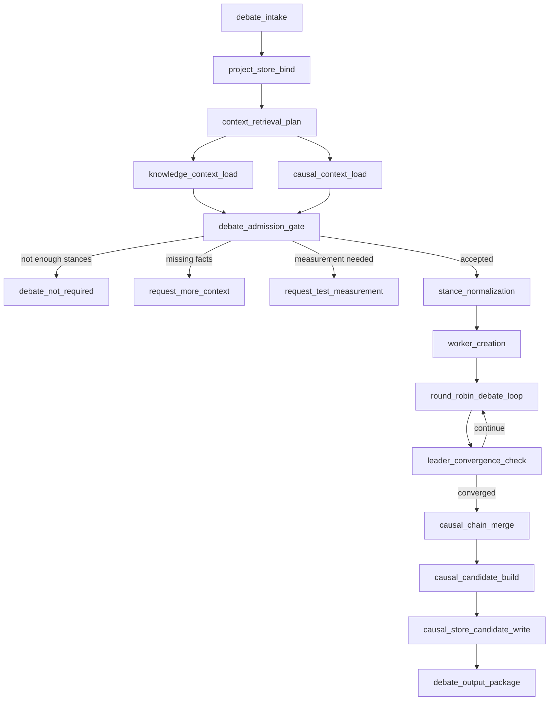

# Debate Subgraph v2 Design

## Conclusion

DebateSubgraph is not a free-form multi-agent chat system.

It is a structured causal adjudication module that uses the managed project's local Knowledge Store and Causal Store as inputs, runs bounded adversarial debate between stance-bound agents, and emits a Causal Store update candidate.

The Debate module must not write global causal truth directly.

## Project Store Assumption

Aegis defines store mechanisms and contracts. Store instances belong to the managed project.

Expected managed project layout:

```text
project-root/
  code/
    ...pure project code...
  artifacts/
    ...project artifact evidence...
  knowledge/
    ...project knowledge store instance...
  causal/
    ...project causal store instance...
```

Rules:

- `code/` contains project code only.
- Knowledge and Causal stores are siblings of `code/`.
- Aegis runtime reads and writes through project-local store interfaces.
- Aegis must not embed project store instances inside the Aegis repository.
- LangGraph state must carry refs and artifact paths, not long text bodies.

## Purpose

DebateSubgraph is used when a decision point has multiple defensible alternatives and cannot be resolved by direct fact lookup or one direct measurement.

It must:

- make implicit causal reasoning explicit;
- force alternatives to attack each other under verified factual constraints;
- allow workers to concede when genuinely defeated;
- prevent infinite argument extension;
- produce a merged causal chain suitable for Causal Store admission review.

## Non-Goals

DebateSubgraph must not:

- act as a generic chat room;
- optimize for user emotion or preference over project correctness;
- invent project facts;
- treat developer claims as Knowledge facts;
- treat Knowledge facts as causal truth without causal construction;
- mutate project code;
- write Knowledge or Causal truth directly;
- bypass Master or Causal admission governance;
- store long reports in LangGraph state.

## Highest-Level Invariants

1. Knowledge Store provides verified objective facts and hard constraints.
2. Causal Store provides existing causal nodes, existing chains, prior decisions, and invalidation conditions.
3. Debate Workers maintain local causal-chain drafts.
4. Debate Leader monitors every round and stops when the argument state converges.
5. Leader merges worker causal drafts into one explicit merged causal chain.
6. Debate output is a `causal_candidate`, not active global causal truth.
7. All long outputs are written to project-local artifacts.
8. Cross-module handoff uses refs and machine-readable package paths only.

## Module Boundary

### Input

DebateSubgraph accepts a `DebateInputPackage`.

Possible callers:

- Master requirement review;
- Execution route conflict;
- Final Review blocker;
- Causal review request.

Minimal shape:

```yaml
request_id: string
project_root: path
source_module: master|execution|final_review|causal_review
decision_problem: string
decision_scope: string
candidate_positions:
  - stance_id: string
    summary: string
    claimed_advantages: list[string]
    claimed_risks: list[string]
required_outcome: choose_one|rank|scope_split|reject_all|need_measurement
artifact_refs:
  requirement_doc: path|null
  review_doc: path|null
  execution_context: path|null
  test_evidence: path|null
knowledge_query_hints:
  subject_refs: list[string]
  applicability_terms: list[string]
  required_dimensions: list[string]
causal_query_hints:
  node_ids: list[uint64]
  semantic_terms: list[string]
  neighborhood_depth: int
hard_constraints:
  - source: string
    statement: string
    evidence_ref: string
```

Admission rules:

- If fewer than two defensible positions exist, Debate must not start.
- If missing information is contextual, return `request_more_context`.
- If missing information is measurable and decisive, return `request_test_measurement`.
- If the caller attempts to force an unsupported option as a hard constraint, Debate must classify it as unsupported unless Knowledge evidence or first-principles necessity exists.

### Output

DebateSubgraph returns a `DebateOutputPackage`.

```yaml
debate_id: string
status: completed|need_more_context|need_measurement|non_convergent|rejected
decision:
  selected_stance_id: string|null
  decision_label: accept|reject_all|scope_split|need_test|need_master
final_report_ref: path
causal_candidate_ref: path
causal_store_candidate_id: string|null
reused_causal_node_ids: list[uint64]
new_candidate_node_refs: list[string]
knowledge_refs_used: list[string]
worker_audit_refs: list[path]
leader_audit_ref: path
boundary:
  wrote_causal_truth: false
  wrote_knowledge_truth: false
  modified_code: false
```

## Subgraph Flow



## Store Usage Rules

### Knowledge Store

Knowledge Store provides:

- verified project facts;
- verified environment facts;
- verified platform constraints;
- customer-written constraints;
- dependency facts;
- known prohibitions;
- mandatory recall rules.

Correct use:

```text
Knowledge fact -> evidence_ref or constraint_ref for a causal node.
```

Incorrect use:

```text
Knowledge fact -> active causal truth without causal construction.
```

### Causal Store

Causal Store provides:

- prior causal nodes;
- existing chains;
- historical adjudications;
- rejected alternatives;
- invalidation conditions;
- reusable predecessor nodes.

Correct use:

- reuse existing causal nodes when semantically equivalent;
- reference existing predecessor nodes when they support a new chain;
- create only genuinely new candidate nodes.

Incorrect use:

- duplicate existing equivalent nodes;
- mutate active causal truth directly from Debate;
- treat worker-local drafts as admitted causal nodes.

## Context Retrieval

DebateSubgraph must not load the whole Knowledge Store or Causal Store into a worker prompt.

It builds a `DebateContextBundle`.

```yaml
context_bundle_id: string
knowledge_refs:
  - knowledge_id: string
    subject: string
    predicate: string
    object: string
    scope: string
    evidence_refs: list[string]
    applicability_reason: string
causal_refs:
  - node_id: uint64
    statement: string
    scope: string
    assumptions: list[string]
    confidence: high|medium|low
    reused_reason: string
causal_edges:
  - from_node_id: uint64
    to_node_id: uint64
    relation: string
    why: string
missing_knowledge_needs:
  - dimension: string
    why_needed: string
    blocking_level: blocking|non_blocking
retrieval_audit:
  semantic_queries: list[string]
  mandatory_rules_triggered: list[string]
  direct_refs_expanded: list[string]
  omitted_as_out_of_scope: list[string]
```

Retrieval order:

1. Expand explicit refs.
2. Apply Knowledge mandatory recall rules.
3. Run semantic or token lookup for relevant terms.
4. Expand Causal node neighborhoods.
5. Apply scope filter.
6. Emit missing knowledge needs instead of assuming missing facts.

## Worker Model

Each worker is stance-bound.

```yaml
DebateWorkerProfile:
  worker_id: string
  stance_id: string
  assigned_position: string
  allowed_context_bundle_ref: path
  forbidden_actions:
    - mutate_store_truth
    - invent_knowledge_fact
    - ignore_hard_constraint
    - concede_without_reason
    - defend_after_decisive_refutation
```

Worker rules:

- defend the assigned stance using Knowledge refs, Causal refs, and first-principles reasoning;
- attack alternatives with evidence-backed reasoning;
- maintain a local causal-chain draft;
- update the local chain after each attack, concession, or scope refinement;
- concede only when a decisive reason defeats a material premise;
- never claim local draft nodes are admitted Causal Store truth.

## Worker Turn Packet

Each worker turn writes a structured packet.

```yaml
turn_id: string
worker_id: string
stance_id: string
round_index: int
defense:
  claims: list[string]
  causal_nodes: list[object]
attacks:
  - target_stance_id: string
    attacked_claim: string
    attack_reason: string
    evidence_refs: list[string]
    causal_refs: list[uint64]
concessions:
  - conceded_point: string
    why_conceded: string
    impact_on_stance: string
chain_delta:
  added_local_nodes: list[object]
  added_edges: list[object]
  invalidated_local_nodes: list[string]
open_questions: list[string]
self_audit:
  knowledge_constraints_checked: true
  causal_refs_checked: true
  unsupported_claims: list[string]
```

## Leader Responsibilities

The Leader is an adjudicator, not a passive moderator.

Per round, Leader must produce:

```yaml
LeaderRoundAssessment:
  round_index: int
  active_stances: list[string]
  dominated_stances: list[string]
  newly_resolved_conflicts: list[string]
  unresolved_conflicts: list[string]
  decisive_constraints: list[string]
  worker_protocol_violations: list[string]
  convergence_score: float
  continue_reason: string|null
  stop_reason: string|null
```

Leader must stop when:

- a stance is defeated by a Knowledge hard constraint;
- a stance is defeated by an existing Causal node or chain;
- a stance concedes a material premise;
- no material new argument appears after a bounded number of rounds;
- a stable selected path exists;
- max rounds are reached and a scope-limited verdict is possible;
- a missing fact must be sent to Test or Master.

Leader must not stop because:

- all answers sound plausible;
- the user prefers one answer;
- one worker has more confident language;
- time pressure exists without a governance reason.

## Causal Chain Merge

Worker local chains are not simply concatenated.

Leader merges them into one `MergedCausalChain`.

```yaml
chain_id: string
source_debate_id: string
decision_problem: string
selected_stance_id: string
reused_node_ids: list[uint64]
proposed_nodes:
  - local_id: string
    node_id: uint64|null
    statement: string
    minimal_semantic_content: string
    created_from:
      worker_ids: list[string]
      turn_ids: list[string]
    knowledge_evidence_refs: list[string]
    causal_predecessor_node_ids: list[uint64]
    assumptions: list[string]
    scope: string
    confidence: high|medium|low
    invalidation_conditions: list[string]
edges:
  - from_node_ref: string|uint64
    to_node_ref: string|uint64
    relation: supports|contradicts|invalidates|narrows_scope|defeats_assumption|supports_selection|supports_rejection|reopens_if
    why: string
selected_path:
  - node_ref: string|uint64
rejected_paths:
  - stance_id: string
    rejection_node_refs: list[string|uint64]
    decisive_edge_refs: list[string]
unresolved_questions: list[string]
```

Important distinction:

- Worker draft nodes use local IDs.
- Causal Store assigns stable `uint64` node IDs.
- A debate output may contain proposed nodes before admission.

## Causal Store Update Candidate

Final Debate output creates a Causal Store update candidate.

```yaml
candidate_id: string
source_module: debate
source_debate_id: string
status: pending_admission
proposed_nodes: list[object]
proposed_edges: list[object]
reused_node_ids: list[uint64]
knowledge_evidence_refs: list[string]
assumptions: list[string]
scope: string
invalidation_conditions: list[string]
decision_summary:
  selected_stance_id: string
  rejected_stance_ids: list[string]
  why_selected: string
  why_rejected: map[string,string]
admission_requirements:
  requires_master_review: true
  requires_causal_review: true
```

This candidate belongs under the managed project's Causal Store instance, not under the Aegis repository.

## Artifact Layout

Recommended debate run layout:

```text
project-root/
  causal/
    candidates/
      debate/
        debate-20260623-001/
          README.md
          input_package.json
          context_bundle.json
          worker_packets/
            worker-s1-round-001.json
            worker-s2-round-001.json
          leader_round_assessments/
            round-001.json
          merged_causal_chain.json
          causal_store_update_candidate.json
          final_report.md
```

`README.md` must explain:

- what this artifact package contains;
- read order;
- whether the candidate was admitted;
- which files are machine-readable contract artifacts.

## LangGraph State Boundary

Allowed in state:

```yaml
debate_id: string
context_bundle_ref: path
final_report_ref: path
causal_candidate_ref: path
causal_store_candidate_id: string|null
status: string
```

Forbidden in state:

- full worker transcripts;
- full final report text;
- full Knowledge Store extracts;
- full Causal Store extracts;
- long causal-chain bodies.

## Error Semantics

```yaml
DebateError:
  code:
    - PROJECT_STORE_NOT_FOUND
    - KNOWLEDGE_STORE_UNAVAILABLE
    - CAUSAL_STORE_UNAVAILABLE
    - INSUFFICIENT_STANCES
    - MISSING_REQUIRED_CONTEXT
    - MEASUREMENT_REQUIRED_BEFORE_DEBATE
    - WORKER_PROTOCOL_VIOLATION
    - LEADER_NON_CONVERGENCE
    - CAUSAL_CANDIDATE_WRITE_FAILED
    - CAUSAL_ADMISSION_REJECTED
  message: string
  blocking: true|false
  recovery_action:
    - request_context
    - request_test
    - retry_debate
    - escalate_master
```

## Runtime Acceptance Tests

Required unit tests:

- Debate does not start with fewer than two defensible stances.
- Unsupported user preference cannot become a hard constraint.
- Knowledge facts are used only as evidence or constraints.
- Existing Causal nodes are reused when equivalent.
- Worker unsupported attacks are marked as protocol violations.
- Worker premature concession is marked as protocol violation.
- Leader stops on convergence.
- Leader does not stop merely because arguments sound balanced.
- Causal candidate is written to candidate area only.
- LangGraph state contains refs only, not long text.

Required integration tests:

- Master-triggered Debate uses project-local Knowledge and Causal stores.
- Execution-triggered Debate returns an adjudicated route.
- Debate output includes a merged causal chain.
- Causal Store can retrieve the candidate.
- Candidate is not active causal truth before admission.
- `project-root/code` is not polluted with governance files.

Required real-agent acceptance:

- Real Debate Leader is created.
- Real Debate Workers are created.
- Each Worker leaves proof.
- Each Worker produces structured turn packets.
- Leader produces round assessments.
- Final causal chain is traceable to worker turns, Knowledge refs, and Causal refs.
- Audit checks for:
  - unsupported invention;
  - dead-end over-defense;
  - premature concession;
  - ignored hard constraints;
  - candidate/truth confusion.

## Recommended Implementation Order

1. Define Debate schemas.
2. Implement project store binding.
3. Implement Knowledge and Causal context bundle construction.
4. Implement deterministic Debate runtime.
5. Implement causal chain merge.
6. Implement Causal Store candidate write.
7. Add integration tests against project-local stores.
8. Add real Leader and Worker agent adapter.
9. Run real-agent behavioral acceptance.

Do not start with prompts. Start with contracts, schemas, and state boundaries.

## Final Design Position

DebateSubgraph is a project-store-grounded causal adjudication engine.

Its purpose is to convert contested alternatives into explicit, traceable, reviewable causal candidates.

It must make the right behavior structurally easy and the wrong behavior structurally difficult:

- facts come from Knowledge;
- prior causal structure comes from Causal;
- debate produces candidate causal updates;
- admission remains governed;
- long texts stay in artifacts;
- LangGraph carries refs.
