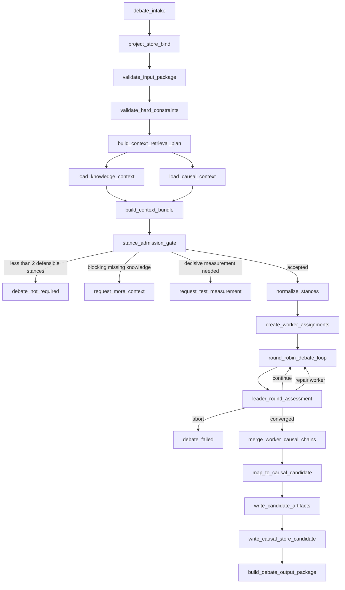

# Debate Subgraph v2 Implementation Plan

## Conclusion

DebateSubgraph v2 should be implemented as a bounded, project-store-grounded causal adjudication subgraph.

It must use the managed project's local Knowledge Store and Causal Store, run stance-bound adversarial workers under a Leader adjudicator, and produce a Causal Store update candidate. It must not write admitted causal truth directly.

This document turns the Debate design into an implementation-ready plan, including Leader and Worker skill design.

## Core Premise

Managed project layout:

```text
project-root/
  code/
    ...pure project code...
  archive/
  knowledge/
  causal/
```

Aegis provides runtime mechanisms and contracts. Store instances belong to the managed project.

Debate artifacts must be written under the managed project's Causal candidate area, not under `code/` and not inside the Aegis repository.

## Non-Negotiable Boundaries

- Debate reads verified facts from Knowledge Store.
- Debate reads existing causal nodes and chains from Causal Store.
- Debate produces `causal_candidate` artifacts only.
- Debate does not mutate admitted causal truth.
- Debate does not mutate Knowledge truth.
- Debate does not mutate project code.
- Debate does not place governance artifacts under `project-root/code`.
- LangGraph state carries only refs and small status fields.
- Long text, transcripts, causal chains, reports, and worker packets are artifact files.

## Recommended Repository Placement

Runtime code:

```text
src/aegis/modules/debate/
  __init__.py
  models.py
  graph.py
  store_binding.py
  context.py
  admission.py
  leader.py
  worker.py
  merge.py
  artifacts.py
  errors.py
  skills.py
```

Tests:

```text
tests/debate/
  test_debate_admission.py
  test_debate_context_bundle.py
  test_debate_leader_convergence.py
  test_debate_worker_protocol.py
  test_debate_causal_candidate_mapping.py
  test_debate_artifact_paths.py
  test_debate_resume_idempotency.py
  test_debate_subgraph_integration.py
```

Runtime evidence:

```text
module_test_reports/debate_subgraph_v2_*/
```

Optional local Codex skills after implementation:

```text
C:\Users\playm\.codex\skills\aegis-debate-leader-v2\
C:\Users\playm\.codex\skills\aegis-debate-worker-v2\
```

If project-local skills are preferred instead, place source skill templates under:

```text
src/aegis/modules/debate/skills/
  leader/SKILL.md
  worker/SKILL.md
```

and install/copy them into `$CODEX_HOME/skills` only during real-agent acceptance.

## Runtime Architecture



## State Model

LangGraph state must remain small.

```yaml
DebateSubgraphState:
  debate_id: string
  thread_id: string
  project_root: path
  input_package_ref: path
  project_store_binding_ref: path|null
  context_bundle_ref: path|null
  run_manifest_ref: path|null
  worker_assignment_refs: list[path]
  leader_assessment_refs: list[path]
  merged_causal_chain_ref: path|null
  causal_candidate_ref: path|null
  output_package_ref: path|null
  status:
    initialized|context_loaded|admitted|debating|merged|candidate_written|completed|failed
  error_code: string|null
```

Forbidden in state:

- full debate transcript;
- full worker turn bodies;
- full context bundle bodies;
- full causal chain bodies;
- full Knowledge or Causal extracts.

## Project Store Binding

```yaml
ProjectStoreBinding:
  project_root: path
  code_root: path
  archive_store_root: path
  knowledge_store_root: path
  causal_store_root: path
  debate_candidate_root: path
  path_policy:
    forbid_writes_under_code: true
    forbid_symlink_escape: true
    require_all_artifacts_under_candidate_root: true
```

Rules:

1. Canonicalize every path before use.
2. Reject paths outside `project_root`.
3. Reject writes under `code_root`.
4. Reject symlink escape.
5. Create `debate_candidate_root` under the project's Causal candidate area.
6. Never hard-code the store layout inside graph logic. Use `ProjectStoreBinding`.

## Input Contract

```yaml
DebateInputPackage:
  schema_version: "debate.input.v2"
  request_id: string
  source_module: master|execution|final_review|causal_review
  project_root: path
  decision_problem: string
  decision_scope: string
  required_outcome: choose_one|rank|scope_split|reject_all|need_measurement|need_master
  candidate_positions:
    - stance_id: string
      statement: string
      summary: string
      claimed_advantages: list[string]
      claimed_risks: list[string]
      source_artifact_refs: list[path]
  hard_constraints:
    - constraint_id: string
      statement: string
      source: user|master|execution|test|final_review|knowledge|causal
      evidence_ref: string|null
  knowledge_query_hints:
    subject_refs: list[string]
    applicability_terms: list[string]
    required_dimensions: list[string]
  causal_query_hints:
    node_ids: list[uint64]
    semantic_terms: list[string]
    neighborhood_depth: int
  artifact_refs:
    requirement_doc: path|null
    review_doc: path|null
    execution_context: path|null
    test_evidence: path|null
```

## Hard Constraint Validation

Input `hard_constraints` are claims until validated.

```yaml
HardConstraintValidation:
  constraint_id: string
  input_statement: string
  evidence_ref: string|null
  validation_status: verified|unsupported|conflicting|out_of_scope
  matched_knowledge_refs: list[string]
  matched_causal_refs: list[uint64]
  matched_test_evidence_refs: list[string]
  first_principles_necessity: string|null
  rejection_reason: string|null
```

Validation rules:

- User preference is not a hard constraint.
- Developer claim is not a hard constraint.
- A constraint is effective only when supported by admitted Knowledge, admitted Causal, Test evidence, accepted artifact evidence, or first-principles necessity.
- Unsupported constraints stay in the audit and cannot be used to defeat a stance.

## Context Bundle

```yaml
DebateContextBundle:
  schema_version: "debate.context.v2"
  context_bundle_id: string
  debate_id: string
  knowledge_refs:
    - knowledge_id: string
      subject: string
      predicate: string
      object: string
      scope: string
      evidence_refs: list[string]
      applicability_reason: string
  rejected_knowledge_refs:
    - knowledge_id: string
      reason: invalidated|superseded|out_of_scope|not_admitted|low_relevance
  causal_refs:
    - node_id: uint64
      statement: string
      scope: string
      assumptions: list[string]
      confidence: high|medium|low
      reused_reason: string
  rejected_causal_refs:
    - node_id: uint64
      reason: invalidated|superseded|out_of_scope|not_admitted|equivalent_but_inactive
  missing_knowledge_needs:
    - need_id: string
      dimension: string
      why_needed: string
      blocking_level:
        hard_block|needs_user_clarification|request_test_measurement|request_archive_lookup|advisory
  measurement_needs:
    - measurement_id: string
      question: string
      why_decisive: string
      suggested_test_scope: string
  degraded_recall_warnings:
    - store: knowledge|causal
      warning_code: string
      impact: string
  retrieval_audit:
    semantic_queries: list[string]
    mandatory_rules_triggered: list[string]
    direct_refs_expanded: list[string]
    omitted_as_out_of_scope: list[string]
    knowledge_query_plan_ref: path|null
    causal_query_plan_ref: path|null
```

Gate rules:

- `hard_block` missing knowledge prevents Debate.
- Decisive `request_test_measurement` prevents Debate and returns measurement request.
- Degraded recall on a critical dimension prevents strong verdict.
- Out-of-scope and invalidated refs must be visible to the Leader as rejected refs.

## Stance Admission

```yaml
StanceAdmissionRecord:
  stance_id: string
  status: admitted|rejected|needs_context|needs_measurement
  defensibility_basis:
    knowledge_refs: list[string]
    causal_refs: list[uint64]
    first_principles_claims:
      - statement: string
        depends_on_project_fact: bool
        project_fact_ref: string|null
        admissible: bool
    artifact_refs: list[path]
  unsupported_claims: list[string]
  duplicate_of_stance_id: string|null
  dominated_by_stance_id: string|null
  hard_constraint_conflicts: list[string]
  rejection_reason: string|null
```

Defensible stance requirements:

An admitted stance must satisfy at least one support condition:

- key premise supported by Knowledge refs;
- causal structure supported by Causal refs;
- artifact or test evidence supports the premise;
- first-principles reasoning is valid and does not depend on unstated project facts.

And all negative conditions must be false:

- not a semantic duplicate of another stance;
- not directly defeated by a verified hard constraint;
- not dependent on missing blocking knowledge;
- not dominated by another stance under the same scope.

Debate starts only when at least two stances are admitted.

## Worker Runtime Model

Each worker represents one stance.

```yaml
DebateWorkerAssignment:
  worker_id: string
  stance_id: string
  assigned_position: string
  context_bundle_ref: path
  input_package_ref: path
  output_dir: path
  max_turns: int
  forbidden_actions:
    - mutate_store_truth
    - invent_knowledge_fact
    - ignore_hard_constraint
    - concede_without_reason
    - defend_after_decisive_refutation
    - treat_candidate_as_truth
```

Worker output per turn:

```yaml
WorkerTurnPacket:
  schema_version: "debate.worker_turn.v2"
  turn_id: string
  debate_id: string
  worker_id: string
  stance_id: string
  round_index: int
  observed_canonical_transcript_ref: path
  defense:
    claims: list[string]
    supporting_knowledge_refs: list[string]
    supporting_causal_refs: list[uint64]
    local_causal_nodes: list[object]
  attacks:
    - target_stance_id: string
      attacked_claim: string
      attack_reason: string
      evidence_refs: list[string]
      causal_refs: list[uint64]
      materiality: decisive|material|minor
  concessions:
    - conceded_point: string
      why_conceded: string
      defeating_ref: string
      impact_on_stance: fatal|scope_limit|minor
  chain_delta:
    added_local_nodes: list[object]
    added_edges: list[object]
    invalidated_local_nodes: list[string]
  open_questions: list[string]
  self_audit:
    knowledge_constraints_checked: true
    causal_refs_checked: true
    unsupported_claims: list[string]
    possible_protocol_violations: list[string]
```

## Leader Runtime Model

The Leader is the adjudicator.

Leader responsibilities:

1. Validate input and context.
2. Decide which stances are admissible.
3. Create worker assignments.
4. Maintain canonical transcript.
5. Evaluate every worker turn.
6. Detect protocol violations.
7. Decide whether to continue, repair, abort, or stop.
8. Merge worker causal chains.
9. Produce Causal Store candidate artifacts.

## Convergence Signals

Leader must not rely on vague judgment alone.

```yaml
ConvergenceSignals:
  active_stance_count: int
  undefeated_stance_count: int
  unresolved_conflict_count: int
  new_material_argument_count: int
  decisive_constraint_count: int
  unresolved_blocking_missing_need_count: int
  worker_protocol_violation_count: int
  stable_selected_stance_rounds: int
```

Stop rules:

Leader may stop only when at least one is true:

- only one undefeated stance remains;
- every rejected stance has decisive rejection edges;
- selected stance is stable for the configured threshold;
- unresolved conflicts are zero and no new material argument appears;
- a blocking missing need requires context or Test;
- max rounds reached and only a scope-limited verdict is possible.

`convergence_score` may be reported, but must not be the only stop condition.

## Leader Round Assessment

```yaml
LeaderRoundAssessment:
  schema_version: "debate.leader_round.v2"
  debate_id: string
  round_index: int
  active_stances: list[string]
  dominated_stances: list[string]
  undefeated_stances: list[string]
  newly_resolved_conflicts: list[string]
  unresolved_conflicts: list[string]
  decisive_constraints: list[string]
  worker_protocol_violations: list[object]
  convergence_signals: ConvergenceSignals
  next_action: continue|request_worker_repair|leader_override|stop_converged|stop_need_context|stop_need_test|abort
  continue_reason: string|null
  stop_reason: string|null
```

## Worker Protocol Violations

```yaml
WorkerProtocolViolation:
  worker_id: string
  turn_id: string
  violation_type:
    - unsupported_invention
    - ignored_hard_constraint
    - premature_concession
    - dead_end_over_defense
    - candidate_truth_confusion
    - store_mutation_attempt
  severity: warning|material|fatal
  action:
    - mark_turn_unusable
    - request_worker_repair
    - leader_override
    - terminate_worker
    - abort_debate
  reason: string
```

Rules:

- Fatal violations are excluded from causal merge.
- Material violations require repair or Leader override.
- Unsupported invention cannot become a proposed causal node.
- Candidate/truth confusion must be corrected in the worker packet or excluded.
- Repeated fatal violation can terminate the worker.

## Causal Candidate Mapping

Merged debate output must map directly to Causal Store candidate structures.

```yaml
CausalCandidateNode:
  local_node_ref: string
  minimal_semantic_content: string
  semantic_summary: string
  semantic_keys: list[string]
  status: candidate
  dependency_groups:
    - group_id: string
      causal_dependencies:
        existing_node_ids: list[uint64]
        local_node_refs: list[string]
      knowledge_refs: list[string]
      evidence_refs: list[string]
      conditions: list[string]
      assumptions: list[string]
      scope: string
      confidence: high|medium|low
      invalidation_conditions: list[string]
  source:
    module: debate
    debate_id: string
    worker_turn_refs: list[path]
```

Candidate mapping rules:

- Before creating a candidate node, query Causal Store for equivalent admitted or deprecated nodes.
- If equivalent admitted node exists, reuse it.
- If equivalent deprecated node exists, reference it and explain why reopening is justified.
- Create a new candidate only for genuinely new causal substance.
- Rejected paths are preserved as negative causal material or audit refs, not active truth.

## Debate Run Manifest

Debate must be resumable and idempotent.

```yaml
DebateRunManifest:
  schema_version: "debate.run_manifest.v2"
  debate_id: string
  run_status:
    initialized|context_loaded|admitted|debating|merged|candidate_written|completed|failed
  created_at_utc: string
  updated_at_utc: string
  input_hash: string
  context_bundle_hash: string|null
  candidate_hash: string|null
  artifacts:
    - path: string
      sha256: string
      kind: string
```

Rules:

- Use atomic writes for artifact files.
- Use deterministic candidate IDs or input hash to prevent duplicate candidate creation.
- On resume, inspect manifest and continue from the last completed stage.
- Candidate write must be idempotent.

## Artifact Layout

```text
project-root/
  causal/
    candidates/
      debate/
        debate-<timestamp>-<short-id>/
          README.md
          manifest.json
          input_package.json
          hard_constraint_validations.json
          context_bundle.json
          stance_admission_records.json
          worker_assignments/
            worker-s1.json
            worker-s2.json
          canonical_transcript/
            round-001.md
            round-002.md
          worker_packets/
            worker-s1-round-001.json
            worker-s2-round-001.json
          leader_round_assessments/
            round-001.json
            round-002.json
          protocol_violations.json
          merged_causal_chain.json
          causal_store_update_candidate.json
          final_report.md
```

`README.md` must explain artifact purpose and reading order.

## Leader Skill Design

Recommended skill name:

```text
aegis-debate-leader-v2
```

Frontmatter:

```yaml
---
name: aegis-debate-leader-v2
description: Use when acting as Aegis Debate Leader v2 to admit or reject debate stances, supervise stance-bound Debate Workers, enforce Knowledge/Causal store constraints, detect worker protocol violations, decide convergence, merge worker causal chains, and produce Causal Store update candidates. Trigger for DebateSubgraph runtime, adversarial adjudication, causal candidate construction, and leader review of worker debate packets.
---
```

Core body instructions:

```markdown
# Aegis Debate Leader v2

## Role

Act as adjudicator, not moderator.

Your job is to decide whether Debate should start, supervise workers, stop debate when structurally converged, and produce a causal candidate. Do not optimize for user preference or emotional satisfaction.

## Required Inputs

Read only the provided artifact refs:
- DebateInputPackage
- ProjectStoreBinding
- HardConstraintValidation records
- DebateContextBundle
- StanceAdmissionRecord list
- WorkerTurnPacket files

Never assume unprovided project facts.

## Admission Gate

Admit a stance only if it has Knowledge refs, Causal refs, artifact/test evidence, or first-principles reasoning that does not depend on unstated project facts.

Reject duplicate, dominated, unsupported, or hard-constraint-defeated stances.

Start Debate only when at least two stances are admitted.

## Round Supervision

For each round:
1. read every worker packet;
2. validate claims against Knowledge/Causal refs;
3. mark unsupported invention;
4. mark premature concession;
5. mark over-defense after decisive refutation;
6. update convergence signals;
7. choose continue, repair, override, stop, request context, request test, or abort.

## Convergence

Stop only through structural criteria:
- one undefeated stance remains;
- all rejected stances have decisive rejection edges;
- stable selected stance threshold met;
- no unresolved conflicts and no new material argument;
- blocking missing knowledge or measurement need appears;
- max rounds reached and only scope-limited verdict is possible.

## Merge

Merge worker local causal chains into CausalCandidateNode records.

Reuse existing Causal Store nodes when equivalent.

Exclude unusable or fatal-violation turns from merge.

## Output

Write:
- LeaderRoundAssessment
- protocol_violations.json
- merged_causal_chain.json
- causal_store_update_candidate.json
- final_report.md

State clearly:
- candidate, not admitted truth;
- Knowledge refs used;
- Causal refs reused;
- rejected alternatives and why;
- invalidation conditions;
- unresolved questions.

## Forbidden

Never write admitted causal truth.
Never write Knowledge truth.
Never modify project code.
Never place artifacts under code/.
Never treat unsupported user preference as a hard constraint.
Never continue debate only because more perspectives are possible.
```

Leader bundled references:

```text
references/
  schemas.md
  convergence_rules.md
  violation_handling.md
  causal_candidate_mapping.md
```

Leader optional scripts:

```text
scripts/
  validate_debate_artifacts.py
  compute_convergence_signals.py
  validate_causal_candidate.py
```

## Worker Skill Design

Recommended skill name:

```text
aegis-debate-worker-v2
```

Frontmatter:

```yaml
---
name: aegis-debate-worker-v2
description: Use when acting as an Aegis Debate Worker v2 assigned to defend one stance in a DebateSubgraph run, attack competing stances with evidence-backed reasoning, maintain a local causal-chain draft, concede only when materially defeated, and emit structured WorkerTurnPacket artifacts under Leader supervision.
---
```

Core body instructions:

```markdown
# Aegis Debate Worker v2

## Role

Defend your assigned stance and attack alternatives.

You are not a free agent. You are stance-bound.

## Required Inputs

Read:
- DebateWorkerAssignment
- DebateInputPackage
- DebateContextBundle
- current canonical transcript
- your previous WorkerTurnPacket files

Use only provided Knowledge refs, Causal refs, artifact refs, and first-principles reasoning.

## Defense

Defend only claims that are supported by:
- Knowledge refs;
- Causal refs;
- artifact/test evidence;
- first-principles reasoning that does not depend on unstated project facts.

Maintain a local causal chain for your stance.

## Attack

Attack alternatives by identifying:
- false premise;
- unsupported project fact;
- conflict with Knowledge hard constraint;
- conflict with existing Causal node;
- weaker dependency closure;
- worse invalidation risk;
- narrower or less useful scope.

Every material attack must cite evidence refs or causal refs when available.

## Concession

Concede only when a material premise is defeated.

A concession must state:
- what was conceded;
- why it was conceded;
- which evidence or causal ref defeated it;
- how it changes your stance.

Do not concede merely because another worker sounds plausible.

## Output

Emit exactly one WorkerTurnPacket per turn.

Include:
- defense claims;
- attacks;
- concessions;
- chain_delta;
- open_questions;
- self_audit.

## Forbidden

Never invent project facts.
Never ignore hard constraints.
Never mutate stores.
Never claim candidate truth is admitted truth.
Never defend after decisive refutation unless you narrow scope or identify a valid unresolved assumption.
Never concede without a defeating reason.
```

Worker bundled references:

```text
references/
  worker_turn_packet_schema.md
  evidence_rules.md
  concession_rules.md
  local_causal_chain_rules.md
```

Worker optional scripts:

```text
scripts/
  validate_worker_turn_packet.py
```

## Deterministic Runtime Before Real Agents

First implement deterministic runtime:

1. deterministic context bundle builder;
2. deterministic stance admission;
3. deterministic fake workers;
4. deterministic leader convergence;
5. deterministic causal candidate writer.

Then implement real agent adapter:

```yaml
RealDebateAgentAdapter:
  create_leader(skill: aegis-debate-leader-v2)
  create_worker(skill: aegis-debate-worker-v2, assignment)
  collect_packet(worker_id, round_index)
  validate_packet(packet)
  repair_once_if_invalid(packet)
```

Real agent output must pass schema validation. Invalid output gets one repair attempt. Second failure marks the worker output unusable.

## Implementation Tasks

1. Add debate models.
   - Files: `src/aegis/modules/debate/models.py`
   - Verify: schema unit tests.

2. Add project store binding and path policy.
   - Files: `store_binding.py`, `artifacts.py`
   - Verify: path escape and `code/` pollution tests.

3. Add context bundle builder.
   - Files: `context.py`
   - Verify: missing knowledge, rejected refs, degraded recall tests.

4. Add stance admission.
   - Files: `admission.py`
   - Verify: defensible stance gate tests.

5. Add worker packet validation.
   - Files: `worker.py`
   - Verify: unsupported invention, premature concession, over-defense tests.

6. Add Leader convergence and assessment.
   - Files: `leader.py`
   - Verify: structural stop condition tests.

7. Add causal chain merge and candidate mapping.
   - Files: `merge.py`
   - Verify: CausalCandidateNode mapping and reuse tests.

8. Add LangGraph builder.
   - Files: `graph.py`
   - Verify: subgraph integration tests.

9. Add skill templates.
   - Files: `src/aegis/modules/debate/skills/leader/SKILL.md`, `src/aegis/modules/debate/skills/worker/SKILL.md`
   - Verify: skill lint and forward-test prompts.

10. Add real-agent acceptance.
   - Files: `tests/debate/test_debate_real_agent_acceptance.py` or manual evidence plan.
   - Verify: proof files, worker packets, leader assessments, final causal candidate.

## Test Matrix

### Unit

- `test_stance_admission_defensible_gate`
- `test_unsupported_hard_constraint_rejected`
- `test_context_bundle_degraded_recall_blocks_or_warns`
- `test_leader_convergence_structural_stop`
- `test_worker_protocol_violation_turn_unusable`
- `test_causal_candidate_maps_to_dependency_groups`
- `test_artifact_path_cannot_escape_project_root`
- `test_debate_idempotent_candidate_write`
- `test_langgraph_state_refs_only`

### Integration

- `test_master_triggered_debate_outputs_candidate`
- `test_execution_triggered_debate_returns_route`
- `test_missing_knowledge_hard_block_prevents_debate`
- `test_measurement_required_routes_to_test`
- `test_existing_causal_node_reused_not_duplicated`
- `test_rejected_paths_preserved_as_negative_material`
- `test_project_code_not_polluted_by_artifacts`
- `test_resume_after_worker_packets_written`

### Real Agent Acceptance

- real Leader created with Leader skill;
- real Workers created with Worker skill;
- worker invention detected;
- premature concession detected;
- over-defense detected;
- candidate/truth confusion detected;
- Leader does not stop on vague plausibility;
- final causal chain is traceable to worker turns and store refs.

## Acceptance Criteria

DebateSubgraph v2 is accepted only when:

1. Debate refuses to start with fewer than two defensible stances.
2. All hard constraints are validated before use.
3. Missing hard-block Knowledge prevents Debate.
4. Decisive measurement need returns `request_test_measurement`.
5. Leader stop conditions are structural.
6. Worker protocol violations affect merge eligibility.
7. Causal candidate maps to Causal Store candidate schema.
8. Debate writes candidate only, not admitted truth.
9. Artifact paths cannot escape candidate root.
10. `project-root/code` remains clean.
11. Debate runs are resumable and idempotent.
12. LangGraph state carries refs only.
13. Real-agent acceptance catches bad behavior, not only happy path.

## Final Position

The implementable DebateSubgraph v2 is a strict causal adjudication pipeline:

```text
project-local Knowledge/Causal context
-> stance admission
-> bounded adversarial debate
-> structural Leader adjudication
-> causal-chain merge
-> Causal Store update candidate
```

Leader and Worker skills are not enough by themselves. They are runtime behavior guides attached to hard schemas, path policies, validation gates, and artifact contracts.
