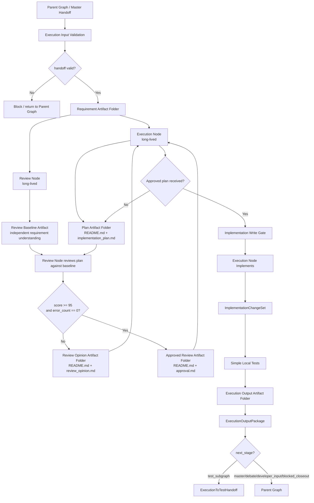

# Execution Subgraph v2 落地设计

状态：最终强化后的实现合同草案
日期：2026-06-24
适用分支：`v0.1.2-alpha-langgraph-reset`

## 结论

Execution Subgraph v2 采用两个长期存活的 LLM 节点：

1. `Execution Node`：负责理解需求、设计方案、根据通过审核的方案实现、执行简单本地验证、输出执行产物。
2. `Review Node`：负责独立理解需求、审核执行方案、输出结构化评分和审核意见。

两个节点都接收完整需求 artifact，但节点之间不传长文本，只传文件路径、hash、轮次、状态和短字段。审核通过后必须回到 `Execution Node`，只有 `Execution Node` 才能进入实现阶段。

该设计替代“执行节点临时派生 reviewer subagent”的方案。原因是长期节点更容易被 LangGraph 追踪、恢复、测试和审计，也更容易控制审核闭环，避免临时 subagent 生命周期不透明。

本版设计同时把 Execution 子图从“流程设计”强化为“实现合同”。入口 artifact 校验、Review Node 独立 baseline、scorecard 一致性、实现写入边界、tool governance、simple local test evidence、execution causal candidate 映射、terminal output package、node-level contract、失败恢复、命令级安全分析和真实 agent 负样本验收都是硬要求，不是建议。

## 设计目标

Execution Subgraph v2 的目标是把 Master 已准入的需求转化为可验证的实现产物。

它必须做到：

1. 接收 Master 下发的需求文档和评审文档。
2. 将需求文档完整同步给执行节点和审核节点。
3. 让执行节点先规划方案，不直接写代码。
4. 让审核节点基于同一份需求文档审核方案。
5. 方案与审核意见都通过 Markdown artifact 文件夹传递。
6. 审核分数达到 `>= 95` 且无 `error` 级问题后才放行。
7. 审核通过后仍必须回到执行节点，由执行节点执行实现。
8. 执行节点完成实现后执行简单本地测试。
9. 输出 implementation artifact、simple test evidence、known limits、execution causal candidate。
10. 不创建默认 Execution Group / Front / Back。
11. 不写 Archive / Knowledge / Causal admitted truth。
12. 不使用 LangGraph Store 保存项目长期事实。
13. 在进入 plan 前校验 Master handoff artifact 完整性。
14. 在审核方案前要求 Review Node 先产出独立需求理解 baseline。
15. 用机器校验 score、issue severity 和 decision 的一致性。
16. 用 changeset 证明实际改动和 approved plan 对齐。
17. 用结构化 tool audit 记录所有有副作用工具调用。
18. 用结构化 simple test evidence 记录命令、超时、退出码和日志引用。
19. 让 execution causal candidate 可被 Causal Review 消费。
20. 用真实 agent 正负样本验收验证行为，而不只验证 deterministic flow。
21. 所有 terminal path 都输出统一 `ExecutionOutputPackage`。
22. 每个 LangGraph node 都有输入、输出、错误、状态更新和幂等语义。
23. 实现失败后必须有明确 dirty tree / rollback / retry 策略。
24. Review policy violation 必须触发 repair、override、escalate 或 block，不得只记录。
25. 预期文件变更必须通过 `expected_file_changes.json` 机器表达。
26. shell command 必须经过 `CommandSafetyAnalysis`。
27. Causal candidate artifact 写入和 Causal Store DB candidate 写入必须区分。
28. Test Subgraph handoff 必须使用明确 refs，不允许扫目录猜输入。
29. 真实 agent 行为验收必须有独立 validator。
30. LangGraph serialized state 必须有大小限制，防止长正文进入状态。

## 非目标

本阶段不实现：

1. 多执行组调度。
2. Front Agent / Back Agent 拆分。
3. 生产级真实 nested-codex 编排。
4. Test Department 的完整验证职责。
5. Final Review 职责。
6. Archive / Knowledge / Causal truth admission。
7. 自动 push、PR、merge、release、deploy。

## 核心原则

### 1. 文件 artifact 优先

LangGraph 状态只保存短状态和引用，不传长文本。

允许在状态中传递：

- artifact folder path
- file path
- sha256
- status
- score
- round number
- issue count
- short decision label

禁止在状态中传递：

- 完整需求正文
- 完整方案正文
- 完整审核意见正文
- 大段代码 diff
- 长篇测试日志

长内容必须落到文件中。

### 2. `README.md` 是 artifact 入口

所有跨节点 artifact 文件夹必须包含 `README.md`。

如果文件夹内有多个文件，`README.md` 必须说明：

1. 该 artifact 的目的。
2. 文件清单。
3. 推荐阅读顺序。
4. 哪些文件是机器可读摘要。
5. 哪些文件是人类/LLM 可读正文。
6. artifact 的生产者节点。
7. artifact 对应的轮次和 hash。

### 3. 审核节点不是挑错机器

`Review Node` 的目标是判断方案是否足够正确、可执行、可维护、符合需求和第一性原理。

它不允许：

1. 为了挑错而挑错。
2. 用个人偏好阻塞可行方案。
3. 因非关键 warning 无限拉扯。
4. 要求超出 Master 准入需求范围的工作。
5. 在没有 error 级问题时阻塞 `>= 95` 分方案。

### 4. 审核通过也必须回到执行节点

`Review Node` 只负责审核，不负责实现。

即使方案通过，也必须输出 approved review artifact，并返回给 `Execution Node`。

只有 `Execution Node` 收到 approved review artifact 后，才能从 planning mode 进入 implementation mode。

### 5. 防无限循环

方案审核闭环必须有硬停止条件。

默认规则：

- `max_review_rounds = 3`
- 如果第 3 轮仍存在 `error` 级问题，则输出 `execution_plan_blocked`，返回 Master 或请求 Debate。
- 如果只有 warning，且分数 `>= 95`，审核必须通过。
- 如果分数 `< 95` 但没有 error，审核节点必须明确说明扣分理由是否属于可阻塞问题；否则不得阻塞。

### 6. 执行节点不绕过审核

`Execution Node` 在未收到 approved review artifact 前不得：

1. 写代码。
2. 修改项目文件。
3. 执行破坏性命令。
4. 生成 implementation artifact。
5. 声称任务完成。

### 7. 机器可校验合同优先

所有关键边界必须有机器可校验结构，不能只依赖 skill 或自然语言约束。

必须可校验：

1. 输入 artifact 是否完整。
2. `README.md` 是否存在。
3. artifact hash 是否匹配。
4. Review baseline 是否先于 plan review 产生。
5. scorecard 是否自洽。
6. approved review 是否回到 Execution Node。
7. 实际 changed files 是否在允许范围内。
8. tool action 是否被治理。
9. simple test 是否有命令级证据。
10. causal candidate 是否是 candidate，而不是 admitted truth。

### 8. Path policy 是硬边界

所有 artifact 路径和代码写入路径必须 canonicalize。

必须禁止：

1. symlink escape。
2. `..` 逃逸。
3. 写入 `code_root` 外的项目文件。
4. 写入 Archive / Knowledge / Causal admitted truth。
5. 把 runtime artifact 写进 `code/`。

允许：

1. artifact 写入 `.aegis/artifacts/execution/<run_id>/`。
2. 审核通过后，按 approved plan 修改 `code_root` 内文件。
3. 写入三库 candidate package，而不是 admitted truth。

### 9. Terminal output package 是父图唯一入口

Execution Subgraph 的所有终态路径都必须生成 `ExecutionOutputPackage`。

Parent Graph 不得从 Markdown 正文、零散 state 字段或 artifact 目录结构里猜测 Execution 结果。它只能读取 `ExecutionOutputPackage` 决定下一跳。

终态路径包括：

1. completed。
2. blocked。
3. failed。
4. request_debate。
5. request_test。
6. request_developer_input。
7. accepted_with_scope_limits。

### 10. Node-level contract 是测试边界

每个 LangGraph node 必须声明：

1. inputs。
2. outputs。
3. artifacts written。
4. possible errors。
5. state updates。
6. idempotency behavior。

每个 node 必须返回 `ExecutionNodeResult`。大流程测试不能替代 node-level contract 测试。

### 11. State size limit 是硬约束

Execution Subgraph state 必须只保存 refs 和短字段。

默认限制：

```text
serialized_state_size <= 64 KiB
```

超过限制时必须 block 或截断为 artifact ref，不允许把长正文继续塞进 LangGraph state。

## 子图拓扑



## 节点职责

### Execution Node

职责：

1. 读取 Master handoff artifact。
2. 读取 requirement document、review document、accepted constraints、rejected constraints、known limits。
3. 加载必要的 Knowledge / Causal refs。
4. 拆分 objective、deliverable、hard constraints、preferences、technical path requests。
5. 生成实现方案 artifact。
6. 根据 Review Node 意见修订方案。
7. 在方案被审核通过后执行实现。
8. 执行简单本地测试。
9. 输出 execution result artifact。
10. 生成 execution causal candidate package。

禁止：

1. 未经审核直接实现。
2. 把用户无证据技术偏好当硬约束。
3. 为了速度跳过方案阶段。
4. 直接写 Archive / Knowledge / Causal admitted truth。
5. 自动执行 remote push / PR / merge / release / deploy。
6. 默认创建 Execution Group / Front / Back。

### Review Node

职责：

1. 读取同一份 Master handoff artifact。
2. 在读取 Execution plan 前，独立建立需求理解和审核标准。
3. 输出 review baseline artifact。
4. 等待 Execution Node 的 plan artifact。
5. 审核方案是否满足需求、约束、第一性原理、可验证性和项目结构。
6. 输出评分、error、warning、suggestion。
7. 在方案足够可行时批准，不得因非阻塞细节无限拉扯。

禁止：

1. 实现代码。
2. 运行测试。
3. 修改项目文件。
4. 扩大需求范围。
5. 用个人偏好阻塞可行方案。
6. 直接写三大库 truth。

## 状态模型

### `ExecutionSubgraphState`

建议字段：

```text
run_id: str
thread_id: str
subgraph_thread_id: str
project_root: str
code_root: str
store_root_refs: ProjectStoreRefs
master_handoff_ref: ArtifactRef
input_validation: ExecutionInputValidation | null
requirement_artifact_ref: ArtifactRef
master_review_artifact_ref: ArtifactRef
review_baseline_ref: ArtifactRef | null
execution_phase: planning|reviewing|implementing|testing|completed|blocked
review_round: int
max_review_rounds: int
current_plan_ref: ArtifactRef | null
current_review_ref: ArtifactRef | null
approved_review_ref: ArtifactRef | null
implementation_changeset_ref: ArtifactRef | null
implementation_artifact_ref: ArtifactRef | null
simple_test_evidence_ref: ArtifactRef | null
execution_causal_candidate_ref: ArtifactRef | null
execution_output_package_ref: ArtifactRef | null
execution_to_test_handoff_ref: ArtifactRef | null
blocker: ExecutionBlocker | null
serialized_state_size_bytes: int
audit_trail: list[ArtifactRef]
```

### `ArtifactRef`

```text
artifact_id: str
artifact_type: str
path: str
readme_path: str
sha256: str
created_by_node: str
created_at_utc: str
round: int | null
```

### `ProjectStoreRefs`

```text
archive_store_root: str
knowledge_store_root: str
causal_store_root: str
archive_read_mode: readonly
knowledge_read_mode: readonly
causal_read_mode: readonly_or_candidate_write
candidate_write_root: str
```

### `ExecutionInputValidation`

```text
master_handoff_ref: ArtifactRef
required_files_present: bool
readme_valid: bool
hashes_valid: bool
accepted_constraints_valid: bool
rejected_constraints_valid: bool
evidence_refs_valid: bool
requirement_review_valid: bool
status: accepted|blocked
blocker: ExecutionBlocker | null
```

输入校验必须在 Execution Node 和 Review Node 开始业务处理前完成。

必须 block：

1. Master handoff artifact 缺 `README.md`。
2. 缺 `requirement_document.md`。
3. 缺 `requirement_review_document.md`。
4. `accepted_constraints.json` 格式错误。
5. `rejected_constraints.json` 格式错误。
6. artifact hash 不匹配。
7. `evidence_refs.json` 无法解析。

### `ReviewBaseline`

```text
baseline_id: str
requirement_understanding_ref: ArtifactRef
review_criteria_ref: ArtifactRef
hard_constraints_summary_ref: ArtifactRef
non_goals_summary_ref: ArtifactRef
created_before_plan_review: bool
```

Review baseline 必须先于 `round_01` plan review 生成。

后续 scorecard 必须引用 `review_criteria.json`。

### `ReviewScorecard`

```text
decision: approved|changes_required|blocked|request_debate
score: int
dimensions: dict[str, int]
error_count: int
warning_count: int
suggestion_count: int
blocking_issues: list[ReviewIssue]
non_blocking_issues: list[ReviewIssue]
policy_violations: list[str]
baseline_ref: ArtifactRef
review_artifact_ref: ArtifactRef
```

### `ReviewIssue`

```text
issue_id: str
severity: error|warning|suggestion
requirement_refs: list[str]
evidence_refs: list[str]
explanation: str
required_change: str | null
blocking: bool
```

### `ExecutionBlocker`

```text
label:
  - plan_not_approved
  - max_review_rounds_exceeded
  - cross_project_scope
  - missing_required_evidence
  - unsafe_tool_request
  - requires_debate
  - unsupported_runtime_environment
reason: str
evidence_refs: list[str]
next_action: master|debate|developer_input|test|blocked_closeout
parent_route_label: str
required_payload_ref: ArtifactRef | null
retry_allowed: bool
```

### `ImplementationChangeSet`

```text
run_id: str
approved_plan_ref: ArtifactRef
expected_file_changes_ref: ArtifactRef
before_tree_hash: str
after_tree_hash: str
changed_files:
  - path: str
    change_type: added|modified|deleted
    within_code_root: bool
    expected_by_plan: bool
    sha256_before: str | null
    sha256_after: str | null
unexpected_changes: list[str]
forbidden_changes: list[str]
status: accepted|blocked
```

### `ToolActionPlan`

```text
action_id: str
tool_name: str
intent: str
target_paths: list[str]
side_effect_level: none|read_only|local_write|destructive|external_write|remote_publish
requires_interrupt: bool
approved_by: str | null
expected_outputs: list[str]
```

### `ToolExecutionRecord`

```text
action_id: str
status: skipped|executed|blocked|failed
command_or_tool_ref: str
started_at_utc: str
ended_at_utc: str
exit_code: int | null
stdout_ref: ArtifactRef | null
stderr_ref: ArtifactRef | null
changed_files: list[str]
error: str | null
```

### `SimpleTestEvidence`

```text
run_id: str
test_plan_ref: ArtifactRef
commands:
  - command_id: str
    command: str
    cwd: str
    timeout_seconds: int
    exit_code: int
    stdout_ref: ArtifactRef
    stderr_ref: ArtifactRef
    duration_ms: int
    status: passed|failed|skipped|timeout
summary_status: passed|failed|partial|not_run
failure_reason: str | null
```

### `ExecutionCausalCandidate`

```text
candidate_id: str
source_module: execution
source_run_id: str
source_artifact_ref: ArtifactRef
proposed_nodes:
  - local_node_ref: str
    minimal_semantic_content: str
    semantic_summary: str
    semantic_keys: list[str]
    dependency_groups:
      - group_id: str
        causal_dependencies:
          existing_node_ids: list[int]
          local_node_refs: list[str]
        knowledge_refs: list[str]
        evidence_refs: list[str]
        conditions: list[str]
        assumptions: list[str]
        scope: str
        confidence: high|medium|low
        invalidation_conditions: list[str]
admission_requirements:
  requires_master_review: true
  requires_causal_review: true
```

### `ExecutionOutputPackage`

```text
schema_version: execution.output.v2
run_id: str
status: completed|blocked|failed|request_debate|request_test|request_developer_input|accepted_with_scope_limits
phase: planning|reviewing|implementing|testing|completed|blocked
master_handoff_ref: ArtifactRef
input_validation_ref: ArtifactRef
review_baseline_ref: ArtifactRef | null
approved_review_ref: ArtifactRef | null
implementation_artifact_ref: ArtifactRef | null
implementation_changeset_ref: ArtifactRef | null
simple_test_evidence_ref: ArtifactRef | null
execution_causal_candidate_ref: ArtifactRef | null
execution_causal_candidate_write_result_ref: ArtifactRef | null
blocker: ExecutionBlocker | null
known_limits_ref: ArtifactRef | null
boundary:
  wrote_archive_truth: false
  wrote_knowledge_truth: false
  wrote_causal_truth: false
  remote_published: false
next_stage: test_subgraph|master|debate|developer_input|blocked_closeout
execution_to_test_handoff_ref: ArtifactRef | null
evidence_index_ref: ArtifactRef
```

所有 terminal path 必须写 `ExecutionOutputPackage`。Parent Graph 只能通过该 package 做路由。

### `ExecutionNodeResult`

```text
node_name: str
status: ok|terminal|failed
updated_state_fields: dict
artifact_refs: list[ArtifactRef]
error:
  code: str | null
  message: str | null
  blocking: bool
  recovery_action: str | null
idempotency_key: str | null
safe_to_retry: bool
```

每个 LangGraph node 必须返回该结构或可等价映射到该结构。

### `ImplementationFailurePolicy`

```text
on_failure: preserve_dirty_tree_for_debug|rollback_to_before_tree|block_and_request_developer_input
retry_allowed: bool
max_in_plan_repair_attempts: int
dirty_tree_snapshot_ref: ArtifactRef | null
rollback_evidence_ref: ArtifactRef | null
dirty_tree_status: clean|dirty_preserved|rolled_back|unknown
```

默认策略：

```text
个人本地项目：preserve_dirty_tree_for_debug，并记录 dirty tree status。
生产验证 fixture：使用临时 worktree 或 rollback，确保测试可重复。
```

### `ReviewPolicyViolation`

```text
violation_type: warning_only_blocked|suggestion_blocked|out_of_scope_requirement|preference_as_error|scorecard_inconsistent
severity: warning|material|fatal
action: auto_override_to_approved|request_review_repair|escalate_master|request_debate|block
rationale: str
source_review_ref: ArtifactRef
repair_attempted: bool
```

推荐处理：

1. warning-only 且 score >= 95 被阻塞：request_review_repair 一次。
2. repair 后仍阻塞：escalate_master 或 auto_override_to_approved。
3. scorecard inconsistent：repair 一次，仍不一致则 block 或 escalate。
4. out-of-scope requirement as error：request_review_repair。

### `ExpectedFileChange`

```text
change_id: str
path: str
allowed_change_types: list[added|modified|deleted]
requirement_refs: list[str]
rationale: str
```

`ImplementationChangeSet.changed_files` 必须能映射到 `expected_change_id`。

`ImplementationChangeSet.changed_files` 最终形态：

```text
path: str
change_type: added|modified|deleted
within_code_root: bool
expected_by_plan: bool
expected_change_id: str | null
sha256_before: str | null
sha256_after: str | null
```

### `CommandSafetyAnalysis`

```text
command_id: str
command: str
cwd: str
parsed_risk: read_only|local_write|destructive|external_write|remote_publish|unknown
touches_paths: list[str]
network_access_expected: bool
requires_interrupt: bool
allowed_by_approved_plan: bool
```

规则：

1. unknown risk 必须 interrupt 或 block。
2. cwd 在 project_root 外必须 block。
3. `git push`、PR、deploy 归类为 `remote_publish`。
4. `rm -rf`、reset、bulk delete 归类为 `destructive`。
5. network write 归类为 `external_write`。

### `ExecutionCausalCandidateWriteResult`

```text
package_candidate_id: str
artifact_ref: ArtifactRef
db_candidate_node_ids: list[int]
reused_node_ids: list[int]
skipped_duplicate_refs: list[dict]
write_status: written|artifact_only|already_exists|failed
error: str | null
```

如果 DB candidate write 不执行，必须明确 `artifact_only`。如果 DB candidate write 失败，不得声称 fully persisted。

### `ExecutionToTestHandoff`

```text
run_id: str
implementation_artifact_ref: ArtifactRef
implementation_changeset_ref: ArtifactRef
changed_files_ref: ArtifactRef
simple_test_evidence_ref: ArtifactRef
known_limits_ref: ArtifactRef
execution_causal_candidate_ref: ArtifactRef
approved_review_ref: ArtifactRef
requirement_mapping_ref: ArtifactRef
```

Test Subgraph 不得自行扫 execution artifact 目录猜输入。Parent Graph 必须通过 handoff package 传递 refs。

### `RealAgentValidationResult`

```text
validator_name: RealAgentExecutionValidator|RealAgentReviewValidator
thread_id: str
status: passed|failed|accepted_with_scope_limits
checked_artifacts: list[ArtifactRef]
policy_violations: list[ReviewPolicyViolation]
behavior_findings_ref: ArtifactRef
```

真实 agent 验收不能只依赖人工读报告，必须由 independent validator 读取 artifacts 后产出机器结果。

### `StateSizePolicy`

```text
max_serialized_state_bytes: 65536
on_exceed: block|write_artifact_and_replace_with_ref
```

默认值为 64 KiB。实现必须测试 state 只包含 refs 和短字段。

## Artifact 结构

### Master handoff artifact

输入路径示例：

```text
<project-root>/.aegis/artifacts/master_handoff/<handoff_id>/
  README.md
  requirement_document.md
  requirement_review_document.md
  accepted_constraints.json
  rejected_constraints.json
  evidence_refs.json
  known_limits.md
```

### Input validation artifact

由入口校验生成：

```text
<project-root>/.aegis/artifacts/execution/<run_id>/input_validation/
  README.md
  execution_input_validation.json
  handoff_file_manifest.json
  hash_verification_report.md
```

如果该 artifact 的 status 不是 `accepted`，子图不得进入 planning。

### Review baseline artifact

由 `Review Node` 在读取 plan 前输出：

```text
<project-root>/.aegis/artifacts/execution/<run_id>/review_baseline/
  README.md
  independent_requirement_understanding.md
  review_criteria.json
  hard_constraints_summary.json
  non_goals_summary.md
```

该 artifact 用来证明 Review Node 不是只依赖 Execution Node 的方案摘要进行审核。

### Plan artifact

由 `Execution Node` 输出：

```text
<project-root>/.aegis/artifacts/execution/<run_id>/plans/round_01/
  README.md
  implementation_plan.md
  requirement_mapping.json
  risk_assessment.md
  tool_plan.json
  expected_file_changes.md
  expected_file_changes.json
  simple_test_plan.md
```

最低要求：

1. `implementation_plan.md` 必须说明实现目标、范围、非目标、方案、接口、文件变更、测试方式。
2. `requirement_mapping.json` 必须把方案条目映射回需求条目。
3. `tool_plan.json` 必须列出预计使用的工具及副作用等级。
4. `expected_file_changes.json` 必须列出机器可校验的 expected change ids。
5. `simple_test_plan.md` 必须说明执行节点自己能做的简单验证。

### Review artifact

由 `Review Node` 输出：

```text
<project-root>/.aegis/artifacts/execution/<run_id>/reviews/round_01/
  README.md
  review_opinion.md
  scorecard.json
  blocking_errors.md
  warnings.md
  required_changes.md
```

最低要求：

1. `scorecard.json` 必须包含 score、error_count、warning_count、decision。
2. `blocking_errors.md` 只允许写真正阻塞实现的问题。
3. `warnings.md` 记录可接受风险，不阻塞通过。
4. `review_opinion.md` 必须明确是否通过。
5. `scorecard.json` 必须引用 review baseline。
6. `blocking_errors.md` 只能包含 severity 为 `error` 的 issue。

### Approved review artifact

通过时输出：

```text
<project-root>/.aegis/artifacts/execution/<run_id>/approval/round_02/
  README.md
  approval.md
  scorecard.json
  accepted_warnings.md
  implementation_conditions.md
```

通过条件：

```text
score >= 95
error_count == 0
decision == approved
```

### Execution output artifact

由 `Execution Node` 输出：

```text
<project-root>/.aegis/artifacts/execution/<run_id>/output/
  README.md
  execution_output_package.json
  implementation_summary.md
  changed_files.json
  simple_test_evidence.md
  known_limits.md
  execution_causal_candidate.json
  tool_audit.json
  evidence_index.json
```

`execution_output_package.json` 是 Execution Subgraph 返回 Parent Graph 的唯一机器可读终态包。

### Node result artifacts

每个 LangGraph node 必须写 node result artifact：

```text
<project-root>/.aegis/artifacts/execution/<run_id>/node_results/
  README.md
  input_validation_result.json
  review_baseline_result.json
  plan_result_round_01.json
  review_result_round_01.json
  approval_gate_result.json
  implementation_gate_result.json
  implement_result.json
  simple_test_result.json
  candidate_build_result.json
  closeout_result.json
```

这些文件必须符合 `ExecutionNodeResult` 或等价结构。

### Implementation changeset artifact

由实现写入 gate 和 Execution Node 共同输出：

```text
<project-root>/.aegis/artifacts/execution/<run_id>/implementation/
  README.md
  before_tree_hash.txt
  after_tree_hash.txt
  implementation_changeset.json
  expected_file_changes.json
  implementation_failure_policy.json
  dirty_tree_status.json
  unexpected_changes.json
  forbidden_changes.json
```

必须规则：

1. 实现前记录 `code_root` tree hash。
2. 实现后记录 `changed_files`。
3. 所有 changed files 必须在 `code_root` 内，除非是 `.aegis/artifacts/execution/<run_id>/` 下的 artifact。
4. 实际 changed files 必须被 approved plan 或 `expected_file_changes.md` 允许。
5. 实际 changed files 必须映射到 `expected_file_changes.json` 中的 `change_id`。
6. 修改三库 admitted truth、`.aegis` store truth 或 `code_root` 外文件必须 block。

### Tool audit artifact

```text
<project-root>/.aegis/artifacts/execution/<run_id>/tool_audit/
  README.md
  tool_action_plan.json
  command_safety_analysis.jsonl
  tool_execution_records.jsonl
  blocked_actions.json
```

### Simple test evidence artifact

```text
<project-root>/.aegis/artifacts/execution/<run_id>/tests/
  README.md
  simple_test_evidence.json
  stdout/
  stderr/
```

### Causal candidate artifact

```text
<project-root>/.aegis/artifacts/execution/<run_id>/causal_candidate/
  README.md
  execution_causal_candidate.json
  execution_causal_candidate_write_result.json
  causal_candidate_mapping_report.json
```

该 artifact 必须是 candidate package，不得写入 admitted causal truth。

### Execution to Test handoff artifact

```text
<project-root>/.aegis/artifacts/execution/<run_id>/handoff_to_test/
  README.md
  execution_to_test_handoff.json
```

该 artifact 是 Test Subgraph 的唯一输入包。Test Subgraph 不应扫描 Execution artifact 目录推断输入。

### Real-agent validation artifacts

```text
<project-root>/.aegis/artifacts/execution/<run_id>/real_agent_validation/
  README.md
  real_agent_behavior_validation_results.json
  real_agent_policy_violation_results.json
  execution_node_behavior_report.md
  review_node_behavior_report.md
```

## Review 评分规则

评分范围：`0-100`

建议维度：

| 维度 | 分值 |
| --- | ---: |
| 需求覆盖 | 20 |
| 约束合规 | 20 |
| 第一性合理性 | 15 |
| 实现简洁性 | 15 |
| 可维护性 | 10 |
| 可测试性 | 10 |
| 风险识别 | 5 |
| 工具副作用可控 | 5 |

通过条件：

```text
score >= 95
error_count == 0
```

`warning` 不阻塞通过。

Scorecard 一致性规则：

1. `decision=approved` 必须满足 `score >= 95` 且 `error_count == 0`。
2. `error_count > 0` 时 `decision` 不得为 `approved`。
3. `score < 95` 且 `error_count == 0` 时，Review 必须给出足以阻塞的非 error 理由；否则记录 `review_policy_violation`。
4. warning-only 且 `score >= 95` 时必须 approved。
5. suggestion 永不阻塞。
6. `blocking_errors.md` 只能包含 `severity=error` 的 issue。
7. 所有 error 必须引用需求条目或证据条目。
8. 所有阻塞结论必须引用 review baseline criteria。

`error` 定义：

1. 方案无法满足已准入需求。
2. 违反已接受硬约束。
3. 把无证据 preference 当 hard constraint。
4. 缺少必要的验证路径。
5. 会产生未授权外部副作用。
6. 涉及跨项目/多仓库但未 block。
7. 需要 Debate 但直接选边。
8. 方案会破坏项目结构或三库边界。

`warning` 定义：

1. 非关键实现细节有更优选择。
2. 有可接受的维护成本。
3. 测试覆盖可以更强但不影响简单闭环。
4. 存在已记录且可接受的 known limits。

## Graph node-level contracts

所有节点都必须输出 `ExecutionNodeResult`。

### `input_validation`

Inputs:

1. `master_handoff_ref`
2. `project_root`
3. `code_root`
4. `store_root_refs`

Outputs:

1. `ExecutionInputValidation`
2. input validation artifact

Possible errors:

1. missing required file
2. invalid JSON
3. hash mismatch
4. invalid path

Idempotency:

同一 handoff hash 下可安全重跑；输出应复用或覆盖同一 validation artifact。

### `review_baseline`

Inputs:

1. validated handoff artifact
2. requirement document
3. requirement review document

Outputs:

1. `ReviewBaseline`
2. review baseline artifact

Possible errors:

1. missing validated input
2. unable to produce review criteria
3. state size violation

Idempotency:

同一 input hash 下可安全重跑；baseline hash 应稳定或显式记录变化。

### `planning`

Inputs:

1. validated handoff artifact
2. review baseline ref
3. previous review opinion ref, if any

Outputs:

1. plan artifact
2. expected file changes JSON
3. tool action plan draft

Possible errors:

1. missing review baseline
2. unsupported scope
3. requires debate
4. state size violation

Idempotency:

同一 input + review round 只写该 round 的 plan artifact。

### `review`

Inputs:

1. review baseline artifact
2. plan artifact
3. expected file changes JSON

Outputs:

1. review artifact
2. scorecard
3. review policy violation artifact, if any

Possible errors:

1. scorecard inconsistent
2. review baseline missing
3. out-of-scope review
4. state size violation

Idempotency:

同一 plan hash 下可安全重跑；repair 必须生成新 round 或新 repair artifact。

### `approval_gate`

Inputs:

1. scorecard
2. review artifact
3. review policy violation records

Outputs:

1. approved review artifact, or
2. changes required artifact, or
3. blocker

Possible errors:

1. inconsistent scorecard
2. policy violation unresolved
3. max review rounds exceeded

Idempotency:

纯判定节点，不应产生业务副作用。

### `implementation_write_gate`

Inputs:

1. approved review artifact
2. approved plan artifact
3. expected file changes JSON
4. tool action plan

Outputs:

1. before tree hash
2. write permission decision
3. implementation gate result

Possible errors:

1. no approval
2. invalid expected file changes
3. forbidden write target
4. unsafe tool action

Idempotency:

无代码写入；可安全重跑。

### `implement`

Inputs:

1. approved plan
2. implementation gate result
3. expected file changes JSON

Outputs:

1. implementation artifact
2. implementation changeset
3. tool execution records

Possible errors:

1. implementation failed
2. dirty tree violation
3. forbidden changes
4. command safety violation

Idempotency:

非幂等。重试必须引用 `ImplementationFailurePolicy`，不得盲目重复写入。

### `simple_tests`

Inputs:

1. implementation artifact
2. simple test plan
3. command safety analysis

Outputs:

1. simple test evidence artifact

Possible errors:

1. command failed
2. timeout
3. unsupported runtime environment
4. stdout/stderr artifact write failure

Idempotency:

可重跑，但每次 test run 必须有独立 command ids 和日志 refs。

### `candidate_build`

Inputs:

1. implementation artifact
2. changeset
3. simple test evidence
4. requirement mapping

Outputs:

1. execution causal candidate artifact
2. candidate write result

Possible errors:

1. invalid candidate schema
2. DB candidate write failed
3. duplicate candidate

Idempotency:

必须支持 duplicate detection；重复写入不得产生重复 admitted truth。

### `closeout`

Inputs:

1. all terminal artifact refs
2. blocker, if any
3. boundary flags

Outputs:

1. `ExecutionOutputPackage`
2. `ExecutionToTestHandoff`, if next stage is Test
3. evidence index

Possible errors:

1. missing required terminal artifact
2. boundary flag violation
3. inconsistent next_stage

Idempotency:

同一 terminal state 下可安全重跑；output package hash 应稳定或记录 revision。

## 路由规则

### 初始进入

```text
Parent Graph -> Execution Subgraph
```

必要输入：

1. Master handoff artifact path。
2. Requirement document path。
3. Requirement review document path。
4. Project root。
5. Code root。
6. Store binding refs。

进入条件：

1. `ExecutionInputValidation.status == accepted`。
2. 所有 required file 的 hash 校验通过。
3. `ProjectStoreRefs` 可解析。
4. `code_root` 在 managed project root 内。

### Planning

```text
Execution Node -> plan artifact -> Review Node
```

条件：

1. Execution Node 已读取需求 artifact。
2. 未存在 approved review artifact。
3. 当前 review round 未超过上限。
4. Review baseline 已存在。

### Review rejected

```text
Review Node -> review opinion artifact -> Execution Node
```

条件：

1. `score < 95` 或 `error_count > 0`。
2. Review Node 必须给出阻塞问题和修改要求。

### Review approved

```text
Review Node -> approved review artifact -> Execution Node
```

条件：

1. `score >= 95`
2. `error_count == 0`

### Implementation

```text
Execution Node -> implementation -> simple tests -> output artifact
```

条件：

1. Approved review artifact 已存在。
2. artifact hash 校验通过。
3. 工具调用经过 Tool Governance。
4. implementation write gate 校验通过。
5. approved plan 和 expected file changes 可解析。

### Block

```text
Execution Subgraph -> Parent Graph / Master
```

触发：

1. 超过最大审核轮次且仍有 error。
2. 需求跨项目或多仓库。
3. 缺少必要证据。
4. 工具风险需要开发者授权。
5. 方案争议需要 Debate。
6. 环境不支持。

### Closeout

```text
Execution Subgraph -> ExecutionOutputPackage -> Parent Graph
```

所有 terminal path 都必须进入 Closeout。Closeout 负责：

1. 汇总 input validation、review baseline、approval、implementation、changeset、simple test、candidate、known limits。
2. 写 `execution_output_package.json`。
3. 写 `evidence_index.json`。
4. 如果下一跳是 Test Subgraph，写 `execution_to_test_handoff.json`。
5. 明确 boundary flags 全部为 false：不写三库 truth，不 remote publish。

Parent Graph 只读取 `ExecutionOutputPackage.next_stage` 做下一跳。

## Tool Governance

Execution Node 的所有有副作用工具调用必须经过统一治理。

工具治理顺序：

```text
capability check
-> intent assessment
-> risk gate
-> optional interrupt
-> execute
-> result audit
```

必须 interrupt 的动作：

1. remote push
2. PR
3. merge
4. release
5. deploy
6. 删除项目目录
7. 跨项目写入
8. 修改三库 admitted truth

风险等级：

```text
none: 不访问外部系统，不读写文件。
read_only: 只读本地文件或状态。
local_write: 写入 approved code_root 或 execution artifact root。
destructive: 删除、覆盖、批量移动、重置。
external_write: 写入外部服务、远端接口、非本项目路径。
remote_publish: push、PR、merge、release、deploy。
```

硬规则：

1. `read_only` 可在 planning/review 阶段使用。
2. `local_write` 只有在 approved review artifact 后才允许。
3. `destructive` 必须 block 或 developer interrupt。
4. `external_write` 必须 developer interrupt。
5. `remote_publish` 必须 developer interrupt，不得自动执行。
6. 修改三库 admitted truth 必须 block。
7. 每个 tool action 必须产生 `ToolExecutionRecord`。
8. shell command 必须先产生 `CommandSafetyAnalysis`。
9. `parsed_risk=unknown` 必须 interrupt 或 block。
10. command cwd 在 project root 外必须 block。
11. `git push`、PR、deploy 必须归类为 `remote_publish`。
12. `rm -rf`、reset、bulk delete 必须归类为 `destructive`。

允许在审核通过后执行的动作：

1. 修改 `code/` 下与需求相关的文件。
2. 新增必要测试文件。
3. 运行本地简单测试。
4. 生成 `.aegis/artifacts/execution/` 下的 artifact。
5. 写入 candidate package，而不是 truth。

## 三库边界

Execution Subgraph 可以读取：

1. Knowledge Store 的相关事实约束。
2. Causal Store 的相关因果候选或已准入因果节点。
3. Archive Store 的必要历史记录 refs。

Execution Subgraph 可以写入：

1. execution causal candidate。
2. run archive candidate。

Execution Subgraph 不可以写入：

1. Knowledge admitted truth。
2. Causal admitted truth。
3. Archive final truth。

Execution causal candidate 必须满足：

1. `source_module == execution`。
2. `source_artifact_ref` 指向 Execution output artifact。
3. proposed nodes 使用 local refs 或 existing causal node ids。
4. knowledge refs 必须指向 Knowledge Store 中可解析的事实约束。
5. candidate status 只能是 pending / proposed，不得是 admitted。
6. admission requirements 必须声明需要 Master Review 和 Causal Review。

Execution causal candidate 写入分两层：

1. `execution_causal_candidate.json` 是必产出的 artifact package。
2. Causal Store DB candidate rows 是可选写入。

写入结果必须记录为 `ExecutionCausalCandidateWriteResult`：

1. 如果只产出 artifact，`write_status=artifact_only`。
2. 如果 DB 写入成功，`write_status=written`，并记录 `db_candidate_node_ids`。
3. 如果命中重复，`write_status=already_exists` 或记录 `skipped_duplicate_refs`。
4. 如果 DB 写入失败，`write_status=failed`，不得声称 candidate fully persisted。
5. artifact 和 DB candidate rows 必须通过 `source_artifact_ref` 双向追踪。

Execution simple test evidence 不是 Test Subgraph 的替代品。它只证明 Execution Node 完成了基础 sanity check，不能被标记为 production verification passed。

## Debate 触发规则

Execution Node 不应把所有争议都交给 Review Node 反复拉扯。

需要 Debate 的情况：

1. 存在多个非支配有效实现路线。
2. 每条路线都有明确优劣。
3. 缺失信息不能通过直接测试或用户补充解决。
4. Review Node 与 Execution Node 在路线选择上形成合理分歧。
5. 争议影响核心架构或长期维护成本。

不需要 Debate 的情况：

1. 某路线明显违反需求或硬约束。
2. 某路线明显工程上占优。
3. 缺失事实可以通过直接测量解决。
4. 分歧只是编码风格或局部偏好。

输出：

```text
Execution Subgraph -> request_debate blocker -> Parent Graph
```

Debate 返回后，Execution Node 必须绑定 Debate causal candidate，再重新生成或修订方案。

## 错误与恢复

### Artifact 丢失

如果状态中的 artifact path 不存在：

1. 标记 `artifact_missing`。
2. 尝试从 checkpoint 或 audit trail 找到最近 artifact。
3. 找不到则 block，不能凭记忆继续。

### Artifact hash 不匹配

如果 hash 不匹配：

1. 标记 `artifact_integrity_error`。
2. block。
3. 返回 Master 或 developer input。

### Review baseline 缺失

如果 Review Node 未在审核 plan 前生成 baseline：

1. 标记 `review_baseline_missing`。
2. block 当前 review。
3. 记录 review policy violation。
4. 不允许用 plan summary 反推 baseline。

### Scorecard 不一致

如果 scorecard 与 severity / decision 不一致：

1. 标记 `scorecard_inconsistent`。
2. block 当前 review result。
3. 要求 Review Node repair 一次。
4. repair 后仍不一致则返回 Master 或 block。

### Review 无限拉扯

如果超过 `max_review_rounds`：

1. 有 error：block 或 request_debate。
2. 只有 warning：强制通过。
3. Review Node 仍阻塞 warning-only 方案时，记录 review policy violation。

### Review policy violation

Review policy violation 不得只记录不处理。

处理规则：

1. warning-only 且 score >= 95 被阻塞：request_review_repair 一次。
2. repair 后仍阻塞：escalate_master 或 auto_override_to_approved。
3. suggestion 被作为 blocker：request_review_repair。
4. out-of-scope requirement as error：request_review_repair。
5. preference_as_error：request_review_repair；如果仍不修复，escalate_master。
6. scorecard_inconsistent：repair 一次；仍不一致则 block 或 escalate_master。

每次处理都必须写 `ReviewPolicyViolation` artifact。

### 实现失败

如果实现失败：

1. 输出 failed implementation artifact。
2. 记录失败命令、错误、相关文件。
3. 如果失败是方案问题，回到 planning。
4. 如果失败是环境问题，block。
5. 如果失败是可修复代码问题，Execution Node 可在同一 approved plan 范围内修复一次。
6. 必须应用 `ImplementationFailurePolicy`。
7. 如果保留 dirty tree，必须写 `dirty_tree_status.json`。
8. 如果 rollback，必须写 `rollback_evidence_ref`。
9. failed implementation 不得进入 Test Subgraph。
10. retry 必须显式引用上一次 failed artifact 和 dirty tree policy。

### 写入越界

如果 implementation changeset 出现 forbidden changes：

1. 标记 `implementation_boundary_violation`。
2. block completed status。
3. 输出 failed implementation artifact。
4. 不得继续到 Test Subgraph。

### State size 超限

如果 serialized state 超过 `StateSizePolicy.max_serialized_state_bytes`：

1. 若可写 artifact，则把长内容写入 artifact 并替换为 `ArtifactRef`。
2. 若不可安全写 artifact，则 block。
3. 不允许继续携带长正文进入下一节点。

## 目录规划

Runtime 代码：

```text
src/aegis/modules/execution/
  __init__.py
  models.py
  errors.py
  config.py
  graph.py
  artifacts.py
  contracts.py
  execution_node.py
  review_node.py
  scoring.py
  store_binding.py
  tool_policy.py
  input_validation.py
  path_policy.py
  changeset.py
  expected_changes.py
  command_safety.py
  test_evidence.py
  candidate_writer.py
  output_package.py
  handoff.py
  validators.py
  skills/
    execution_node/SKILL.md
    review_node/SKILL.md
```

测试：

```text
tests/execution/
  test_execution_models.py
  test_execution_artifacts.py
  test_execution_review_scoring.py
  test_execution_plan_review_loop.py
  test_execution_review_anti_nitpick.py
  test_execution_approval_gate.py
  test_execution_tool_governance.py
  test_execution_store_boundary.py
  test_execution_debate_trigger.py
  test_execution_input_validation.py
  test_execution_review_baseline.py
  test_execution_changeset.py
  test_execution_expected_changes.py
  test_execution_command_safety.py
  test_execution_simple_test_evidence.py
  test_execution_causal_candidate.py
  test_execution_output_package.py
  test_execution_node_contracts.py
  test_execution_failure_policy.py
  test_execution_to_test_handoff.py
  test_execution_real_agent_validators.py
```

报告：

```text
module_test_reports/execution_v2/
  reports/
  evidence/
  artifacts/
```

## Skill 设计

### Execution Node Skill

目标：

让执行节点严格执行：

```text
understand -> plan -> submit for review -> revise if needed -> implement after approval -> simple test -> artifact closeout
```

必须强调：

1. 不得跳过审核。
2. 不得因用户技术偏好直接锁定方案。
3. 不得写代码前没有方案。
4. 不得把 warning 当 blocker。
5. 不得产生外部不可逆副作用。
6. 不得写三库 truth。

### Review Node Skill

目标：

让审核节点严格执行：

```text
understand requirement -> review plan -> classify issues -> score -> approve or request changes
```

必须强调：

1. 审核不是挑刺。
2. 可行方案不要因非关键细节阻塞。
3. warning 只记录，不阻塞。
4. error 必须有明确证据和需求映射。
5. score >= 95 且无 error 时必须通过。
6. 不允许实现代码。

## 测试计划

### 单元测试

1. `ExecutionSubgraphState` schema 校验。
2. `ArtifactRef` 必须包含 path、readme_path、sha256。
3. 缺少 `README.md` 的 artifact 不允许传递。
4. Master handoff 缺 required file 必须 block。
5. handoff hash mismatch 必须 block。
6. invalid accepted constraints 必须 block。
7. Review baseline 必须先于 plan review 产生。
8. score `>= 95` 且 `error_count == 0` 时必须 approved。
9. warning-only 且 `score >= 95` 必须 approved。
10. error 存在时必须阻塞。
11. scorecard 自相矛盾必须 block。
12. 超过最大审核轮次后不能继续循环。
13. 未 approved 时 Execution Node 不能 implementation。
14. approved artifact 必须回到 Execution Node。
15. implementation changeset 必须匹配 approved plan。
16. 写入 `code_root` 外必须 block。
17. remote publish 必须 interrupt。
18. simple test 失败不得 completed。
19. execution causal candidate 必须符合 candidate schema。
20. LangGraph state 不允许保存长正文。
21. 所有 terminal path 必须写 `ExecutionOutputPackage`。
22. 每个 node 必须返回 `ExecutionNodeResult`。
23. failed implementation 必须记录 dirty tree policy。
24. warning-only blocked 必须触发 ReviewPolicyViolation 处理动作。
25. 每个 changed file 必须映射到 `expected_change_id`。
26. unknown shell command 必须 interrupt 或 block。
27. command cwd 在 project root 外必须 block。
28. Causal candidate DB 未写入时必须标记 `artifact_only`。
29. Test handoff package 必须包含所有必需 refs。
30. serialized state 必须低于 configured limit。

### 集成测试

1. 正常路径：plan -> review approved -> implementation -> simple tests -> output。
2. 一轮修改：plan -> review changes_required -> revised plan -> approved -> implementation。
3. warning-only：review 给 warning 但 score >= 95，必须通过。
4. error：review 给 error，必须返回 Execution Node 修订。
5. 三轮仍 error：block。
6. 多路线争议：request_debate。
7. 未授权外部动作：interrupt。
8. store boundary：只写 candidate，不写 truth。
9. 未 approved 写代码尝试被 graph gate 阻止。
10. Review Node 扩大需求范围被记录为 policy violation。
11. Execution Node 把 preference 当 hard constraint 时 Review Node 必须给 error。
12. simple test evidence 记录命令、cwd、timeout、exit code、stdout/stderr refs。
13. failed implementation 不得进入 Test Subgraph。
14. retry after failed implementation 必须引用 failure policy。
15. `git push` 必须被归类为 remote_publish 并 interrupt。
16. destructive command 必须 block 或 interrupt。
17. ExecutionOutputPackage 是 Parent Graph 路由唯一依据。
18. Test Subgraph 只接收 ExecutionToTestHandoff，不扫目录猜输入。

### 真实 Agent 行为验收

必须至少验证：

1. Execution Node 是否真实先规划再实现。
2. Review Node 是否真实独立阅读需求。
3. Review Node 是否避免为挑错而挑错。
4. warning-only 是否放行。
5. error 是否给出需求映射和证据。
6. 方案通过后是否回到 Execution Node 实现。
7. 是否没有创建默认 Front / Back / Execution Group。
8. Execution Node 试图未 approved 直接实现时是否被阻止。
9. Review Node 对 warning-only 方案无限阻塞时是否被记录为 violation。
10. Execution Node 试图 remote push 时是否触发 interrupt。
11. Execution Node 试图写三库 truth 时是否被阻止。
12. independent validator 是否能识别先实现后补方案的违规行为。
13. independent validator 是否能识别 Review baseline 缺失。
14. independent validator 是否能识别默认创建 Front / Back / Group。

真实 agent 验收必须保存：

```text
thread_id
agent input artifact refs
agent output artifact refs
review scorecard
approval artifact hash
implementation artifact hash
behavior observation report
real_agent_behavior_validation_results.json
policy_violation_records.json
real_agent_schema_validation_results.json
```

如果真实 agent 没有运行，则只能标记为：

```text
accepted_with_scope_limits
```

不能标记为完整通过。

## 验收标准

Execution Subgraph v2 只有同时满足以下条件，才算通过：

1. 所有 deterministic 单元测试通过。
2. 所有 deterministic 集成测试通过。
3. artifact 传递全部通过路径和 hash 完成。
4. 未 approved 时无法实现。
5. approved 后必须回到 Execution Node 再实现。
6. warning-only 不阻塞。
7. error 有明确证据和需求映射。
8. 超过最大审核轮次会 block 或 request_debate。
9. 无默认 Front / Back / Execution Group。
10. 无 LangGraph Store 项目事实写入。
11. 无三库 admitted truth 写入。
12. 真实 agent 行为验收完成，或明确标记 scope-limited。
13. Master handoff artifact 完整性被校验。
14. Review Node 在审核 plan 前产出独立 requirement understanding。
15. scorecard 决策与 score/error/warning 一致。
16. approved plan 与实际 changed files 可对齐。
17. Tool Governance 对副作用动作有风险等级和 interrupt contract。
18. simple local test 有结构化 evidence。
19. failed implementation 不会标记 completed。
20. execution causal candidate 可被 Causal Review 消费。
21. artifact path / hash / README contract 可机器校验。
22. 所有 terminal path 都有 `ExecutionOutputPackage`。
23. 每个 graph node 有 input/output/error/state update/idempotency 合同。
24. Review policy violation 会触发 repair / override / escalate / block。
25. failed implementation 的 dirty tree / rollback / retry 策略明确且可测。
26. 每个 changed file 都能映射到 `expected_change_id`。
27. shell command 有 `CommandSafetyAnalysis`，不只看 tool name。
28. execution causal candidate artifact 和 DB write 语义清楚。
29. Test Subgraph handoff payload 清楚。
30. real-agent behavior 有独立 validator。
31. LangGraph state size / long body 由机器检查。

## 后续实现顺序

建议顺序：

1. 建立 `src/aegis/modules/execution/` 目录和 schema。
2. 在 `models.py` 补齐 `ExecutionOutputPackage`、`ExecutionNodeResult`、`ImplementationFailurePolicy`、`ReviewPolicyViolation`、`ExecutionCausalCandidateWriteResult`、`ExecutionToTestHandoff`。
3. 实现 artifact contract、path policy 和 hash 校验。
4. 实现 `ExecutionInputValidation`。
5. 实现 Review baseline artifact。
6. 实现 `ReviewScorecard` validator。
7. 实现 `expected_file_changes.json` 和 expected change id 校验。
8. 实现 deterministic Execution Node。
9. 实现 deterministic Review Node。
10. 实现 plan-review loop。
11. 实现 approval gate。
12. 实现 implementation write gate 和 changeset。
13. 实现 `ImplementationFailurePolicy`。
14. 实现 `ToolActionPlan`、`CommandSafetyAnalysis`、`ToolExecutionRecord`。
15. 实现 simple test evidence output。
16. 实现 execution causal candidate package 和 optional DB write result。
17. 实现 `ExecutionOutputPackage` 和 `ExecutionToTestHandoff` closeout。
18. 实现 real-agent independent validators。
19. 实现 skills。
20. 补齐 deterministic tests。
21. 做真实 agent 行为验收。

## 关键设计决定

1. 使用双长期节点，而不是临时 subagent。
2. 审核通过后必须回到执行节点。
3. 评分阈值是硬门槛，但 warning 不阻塞。
4. artifact 文件夹是跨节点长内容传递的唯一方式。
5. LangGraph state 只保存 refs 和短状态。
6. Execution v2 默认不拆 Front / Back / Group。
7. Debate 是路线争议解决机制，不是普通审核循环。
8. Test Subgraph 才负责正式验证，Execution Node 只做简单本地测试。
9. Review baseline 是审核独立性的硬证据。
10. Scorecard validator 是 Review Node 不自相矛盾的硬门禁。
11. ImplementationChangeSet 是防止越界写入和未计划改动的硬证据。
12. ToolActionPlan / ToolExecutionRecord 是工具治理可测试化的最小合同。
13. Execution causal candidate 必须能进入 Causal Review，而不是只作为普通 JSON 附件存在。
14. ExecutionOutputPackage 是父图理解 Execution 子图终态的唯一合同。
15. Node-level contract 是实现和测试的最小边界。
16. expected file changes 必须 JSON 化，Markdown 只作为阅读辅助。
17. shell command 风险必须解析 command 字符串，不能只看工具名。
18. Causal candidate 写入必须区分 artifact package 与 DB candidate rows。
19. Real-agent validator 是行为验收的一部分，不是可选报告美化。
