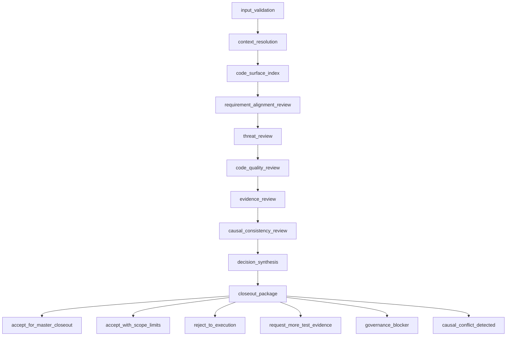

# Final Review Subgraph v2 Design

Status: hardened implementation contract draft
Date: 2026-06-25
Branch: `v0.1.2-alpha-langgraph-reset`

## Conclusion

Final Review Subgraph v2 is the final quality and threat gate before Master closeout.

It is intentionally smaller than Debate, Execution, and Test. Its job is not to implement, test, or repair. Its job is to decide whether the submitted implementation is acceptable under:

1. the approved requirement document;
2. the Execution output package;
3. the Test output package and evidence folder;
4. objective Knowledge Store constraints;
5. still-applicable Causal Store decisions and causal candidates;
6. the actual code diff and changed-file surface.

The module must identify potential threats, requirement mismatches, evidence gaps, code-surface mismatches, context insufficiency, causal conflicts, and architecture boundary violations. It must not write code, run tests, mutate project state, admit store truth, or hide uncertainty.

## Scope

Final Review Subgraph v2 accepts a completed Execution and Test handoff and produces a review decision package for the parent graph and Master closeout.

It answers one question:

```text
Can this implementation safely move to Master closeout under the current requirement, evidence, knowledge, and causal context?
```

It does not answer:

```text
How should the code be fixed?
Which implementation plan should be chosen?
Should missing evidence be generated now?
Should Causal truth be admitted?
```

## Non-Goals

Final Review must not:

1. modify code;
2. run tests;
3. create worker agents;
4. call Debate directly as an internal worker process;
5. write Archive, Knowledge, or Causal admitted truth;
6. merge causal candidates into global Causal;
7. execute remote push, PR, merge, release, deploy, or publication actions;
8. treat Test's raw report text as stronger than structured evidence;
9. treat a Causal candidate as admitted truth;
10. bypass Master approval or parent graph routing.

## Design Principles

### 1. Review is a gate, not a repair loop

Final Review may reject to Execution or request more Test evidence, but it does not perform the repair itself.

### 2. Threat identification is first-class

The primary review value is not style commentary. The module must actively search for risks that could invalidate project correctness, safety, maintainability, or governance boundaries.

### 3. Evidence beats narrative

The module must prefer machine-readable artifacts over prose claims. A polished report cannot override failed test evidence, missing evidence, hash mismatch, or a critical threat finding.

### 4. Store context is read-only

Knowledge and Causal stores are used only as context sources. Final Review may output candidates or references for Master, but it must not admit truth.

### 5. State carries refs, not long text

LangGraph state must carry artifact refs, hashes, short decisions, counters, and status labels. Long review reports, threat reports, code excerpts, and evidence matrices must live in files.

### 6. Causal candidates are not global authority

If Review sees a Causal candidate, it may use it as advisory context. Only admitted or explicitly active causal entries can act as hard constraints. If status is ambiguous, Review must mark uncertainty instead of assuming truth.

### 7. Hard gates use deterministic precedence

Final Review may find several problems in one run. It must not let natural-language judgment choose an arbitrary route. `decision_synthesis` must apply the fixed precedence table in this document.

### 8. Review must prove it reviewed every required threat item

Threat review must produce a checklist matrix. A sparse list of findings is insufficient because absence of a finding does not prove the item was reviewed.

## High-Level Flow



## Node Contract

### `input_validation`

Validates that all required handoff artifacts exist and can be read.

Required inputs:

1. `requirement_package_dir`
2. `requirement_review_package_dir`
3. `execution_output_package_ref`
4. `test_output_package_ref`
5. `project_root`
6. `code_root`

Must block if:

1. any required folder lacks `README.md`;
2. any required machine-readable package is missing;
3. any required hash does not match;
4. `ExecutionOutputPackage.status != completed`;
5. `ExecutionOutputPackage.next_stage != test_subgraph`;
6. `ExecutionOutputPackage.boundary_flags` contains any forbidden mutation;
7. `ExecutionOutputPackage.implementation_artifact_ref` is missing;
8. `ExecutionOutputPackage.implementation_changeset_ref` is missing;
9. `ExecutionOutputPackage.simple_test_evidence_ref` is missing;
10. `ExecutionOutputPackage.execution_causal_candidate_ref` is missing without explicit `artifact_only` or `unavailable` explanation;
11. `TestOutputPackage.status != passed`;
12. `TestOutputPackage.next_stage != final_review`;
13. `TestOutputPackage.boundary_flags` contains any forbidden mutation;
14. `TestOutputPackage.evidence_index_ref` is missing;
15. `TestOutputPackage.artifact_schema_check_ref` is missing;
16. `TestOutputPackage.state_boundary_results_ref` is missing;
17. the code root is outside the project root;
18. a required artifact ref points outside the allowed artifact roots;
19. a symlink, junction, traversal, or resolved absolute path escapes the allowed project, code, or artifact roots.

Output artifact:

```text
final_review_run/input/input_validation.json
```

Blocker labels:

```python
FinalReviewBlocker = Literal[
    "missing_required_artifact",
    "artifact_hash_mismatch",
    "artifact_root_escape",
    "code_root_escape",
    "execution_not_completed",
    "execution_wrong_next_stage",
    "test_not_passed",
    "test_wrong_next_stage",
    "boundary_flag_violation",
    "terminal_consistency_mismatch",
    "context_unavailable",
    "schema_validation_failed",
]
```

Required validation shape:

```python
class FinalReviewInputValidation(BaseModel):
    requirement_package_valid: bool
    requirement_review_package_valid: bool
    execution_output_valid: bool
    test_output_valid: bool
    artifact_hashes_valid: bool
    boundary_flags_valid: bool
    code_root_valid: bool
    allowed_artifact_roots_valid: bool
    terminal_consistency_valid: bool
    status: Literal["accepted", "blocked"]
    blocker: FinalReviewBlocker | None
```

Terminal consistency is a hard gate. Final Review must not accept an implementation if Execution, Test, and the current code root do not describe the same terminal artifact set.

### `context_resolution`

Loads bounded Knowledge and Causal context by refs and structured queries.

It may read:

1. objective Knowledge facts relevant to changed files, dependency surface, platform constraints, security constraints, and requirement constraints;
2. active or admitted Causal nodes relevant to previous design decisions;
3. Causal candidates from Debate or Execution as advisory context.

It must not:

1. dump the whole Knowledge Store into state;
2. dump the whole Causal Store into state;
3. infer missing objective facts from LLM memory;
4. treat Causal candidates as admitted truth.

It must classify context sufficiency. Missing or degraded context is not automatically a Test evidence problem:

1. missing Test-verifiable evidence may route to `request_more_test_evidence`;
2. missing Knowledge, Causal, store availability, or governance context routes to `governance_blocker` or Master;
3. degraded recall may allow acceptance only if explicitly non-material;
4. unknown causal status is advisory-only unless material enough to route to Master.

Output artifacts:

```text
final_review_run/context/knowledge_context.json
final_review_run/context/causal_context.json
final_review_run/context/context_resolution_report.md
```

Required context package shape:

```python
class FinalReviewContextPackage(BaseModel):
    knowledge_refs: list[str]
    causal_active_refs: list[str]
    causal_candidate_refs: list[str]
    rejected_refs: list[dict]
    missing_context_items: list[dict]
    degraded_recall: bool
    store_availability: dict[Literal["knowledge", "causal"], Literal["available", "missing", "degraded"]]
    requirement_context_sufficient: bool
    threat_context_sufficient: bool
    causal_context_sufficient: bool
```

### `code_surface_index`

Builds a reviewable surface from the implementation diff and changed files.

It must reconcile three sources:

1. `ExecutionOutputPackage.implementation_changeset_ref`;
2. `TestOutputPackage.test_run_changeset_ref`;
3. the current code root at Final Review time.

Allowed read-only actions:

1. inspect changed files;
2. inspect file metadata;
3. parse source files;
4. run bounded read-only search commands such as `rg`;
5. compute hashes and manifests.

Forbidden actions:

1. build commands;
2. test commands;
3. code formatting commands;
4. code modification;
5. dependency installation;
6. network calls.

Must block or reject if:

1. changed-file hashes mismatch Execution output;
2. changed-file hashes mismatch Test evidence;
3. current code root contains unexpected post-Test changes;
4. expected changed files are missing;
5. Test evidence refers to files whose current hash no longer matches;
6. a changed-file path escapes the code root through symlink, junction, traversal, or absolute path tricks.

Output artifacts:

```text
final_review_run/code_surface/changed_files.json
final_review_run/code_surface/code_surface_manifest.json
final_review_run/code_surface/review_targets.json
final_review_run/code_surface/code_surface_consistency.json
final_review_run/code_surface/code_surface_report.md
```

Required consistency shape:

```python
class CodeSurfaceConsistency(BaseModel):
    execution_changed_files_ref: ArtifactRef
    test_code_diff_ref: ArtifactRef
    final_review_current_manifest_ref: ArtifactRef
    changed_file_hashes_match_execution: bool
    changed_file_hashes_match_test: bool
    unexpected_current_changes: list[str]
    missing_expected_changes: list[str]
    symlink_or_path_escape_detected: bool
    status: Literal["consistent", "mismatch"]
```

### `requirement_alignment_review`

Checks whether the implementation matches the approved requirement document and accepted constraints.

It must classify each requirement as:

```text
satisfied
satisfied_with_scope_limit
not_satisfied
not_testable_from_available_evidence
out_of_scope
```

Hard rules:

1. User preference is not a hard requirement unless admitted by Master review.
2. Implementation convenience is not a substitute for requirement satisfaction.
3. Missing evidence must not be treated as success.
4. Scope limits must be explicit and attached to exact requirement ids.

Output artifacts:

```text
final_review_run/requirement_alignment/requirement_alignment_matrix.json
final_review_run/requirement_alignment/requirement_alignment_report.md
```

### `threat_review`

Finds threats in the implementation surface.

Threat categories:

1. path traversal;
2. command injection;
3. unsafe shell execution;
4. unsafe recursive delete or move;
5. secret exposure;
6. credential or token logging;
7. unbounded file or memory consumption;
8. unsafe deserialization;
9. code injection;
10. SQL or query injection;
11. authorization bypass;
12. trust-boundary confusion;
13. remote side effect without interrupt;
14. publication or release action without explicit approval;
15. concurrency or transaction corruption risk;
16. symlink or path escape;
17. supply-chain or dependency risk introduced by the change;
18. sandbox or process boundary bypass;
19. platform-specific unsafe behavior;
20. governance boundary violation.

Severity:

```text
critical
error
warning
info
```

Hard gates:

1. Any `critical` threat rejects the implementation.
2. Any unresolved `error` threat rejects the implementation.
3. `warning` findings may allow `accept_with_scope_limits` if evidence and scope are clear.
4. `info` findings are advisory only.

Output artifacts:

```text
final_review_run/threat_review/threat_checklist_matrix.json
final_review_run/threat_review/threat_findings.json
final_review_run/threat_review/threat_review_report.md
```

The checklist matrix is mandatory. A finding list alone is invalid because it does not prove that every required threat item was reviewed.

Required checklist shape:

```python
class ThreatChecklistItem(BaseModel):
    checklist_id: str
    question: str
    status: Literal["yes", "no", "not_applicable", "unknown"]
    evidence_refs: list[ArtifactRef]
    reviewed_paths: list[str]
    finding_refs: list[str]
    blocker: bool

class ThreatChecklistMatrix(BaseModel):
    items: list[ThreatChecklistItem]
    all_items_answered: bool
    unknown_security_relevant_items: list[str]
```

Rules:

1. every checklist item must have a status;
2. `unknown` on a critical security-relevant item blocks `accept_for_master_closeout`;
3. `yes` with critical or error finding must enter `decision_synthesis`;
4. `no` must be supported by reviewed paths and evidence refs.

### `code_quality_review`

Checks maintainability and architectural coherence.

Review dimensions:

1. module boundary;
2. explicit ownership and lifecycle;
3. failure semantics;
4. input validation;
5. path handling;
6. idempotency;
7. deterministic behavior where required;
8. dependency minimization;
9. interface stability;
10. state serialization safety;
11. readability and consistency with local patterns.

This node must not reject for personal style preference. It may reject only when code quality defects create real correctness, maintainability, or boundary risk.

Style-only findings must be `info` or `warning` and cannot block closeout. An `error` code-quality finding must cite a concrete correctness, maintainability, security, state-boundary, or architecture-boundary risk.

Output artifacts:

```text
final_review_run/code_quality/code_quality_findings.json
final_review_run/code_quality/code_quality_report.md
```

### `evidence_review`

Checks whether Test evidence supports the claimed result.

It reads Test Subgraph outputs, especially:

1. approved test plan;
2. test execution manifest;
3. evidence matrix;
4. completeness check;
5. evidence check;
6. artifact schema check;
7. final test report;
8. state boundary results.

It must check:

1. `TestOutputPackage.status == passed`;
2. `TestOutputPackage.next_stage == final_review`;
3. `artifact_schema_check_ref.status == passed`;
4. `state_boundary_results.status == passed`;
5. `evidence_matrix.status == complete`;
6. no skipped test lacks a valid skip reason;
7. no executor omission is marked complete;
8. raw report text does not override structured evidence;
9. `test_run_changeset.status != blocked`;
10. evidence maps to the changed-file scope.

Must reject or request evidence if:

1. a required test point lacks evidence;
2. a skipped test lacks a valid skip reason;
3. a failed test is hidden by final report wording;
4. raw report claims success while structured evidence fails;
5. evidence does not map to changed scope;
6. Test output state boundary is violated;
7. Test Subgraph reports blocked status.

Output artifacts:

```text
final_review_run/evidence_review/evidence_review_matrix.json
final_review_run/evidence_review/evidence_review_report.md
```

### `causal_consistency_review`

Checks whether the implementation conflicts with existing causal decisions or candidate reasoning.

It must produce:

1. causal constraints considered;
2. causal candidates considered;
3. conflicts found;
4. conflicts that are hard blockers;
5. conflicts that are advisory only;
6. unresolved causal questions.

It must assess each causal ref by explicit status. Final Review must use the Causal Store's actual status model when implemented; until then, the design contract recognizes this minimum normalized status set:

```text
candidate
admitted
active
invalidated
superseded
deprecated
rejected
pending_revalidation
unknown
```

Status rules:

1. `admitted` or `active` may be used as hard constraints.
2. `candidate` is advisory only.
3. `invalidated` and `rejected` cannot support acceptance, but may act as negative context.
4. `superseded` and `deprecated` are historical unless explicitly still applicable.
5. `pending_revalidation` cannot act as a hard constraint without a scope limit.
6. `unknown` routes to Master if material.

Decision rules:

1. If implementation violates an active/admitted causal constraint, output `causal_conflict_detected`.
2. If implementation conflicts only with a candidate, record the conflict and route to Master if material.
3. If causal status is unclear, do not assume; mark `causal_status_unknown`.
4. If resolving conflict requires design adjudication, route to Master or Debate through parent graph, not internally.

Output artifacts:

```text
final_review_run/causal_consistency/causal_consistency_matrix.json
final_review_run/causal_consistency/causal_ref_assessments.json
final_review_run/causal_consistency/causal_consistency_report.md
```

Required causal assessment shape:

```python
class CausalRefAssessment(BaseModel):
    causal_ref: str
    status: Literal[
        "candidate",
        "admitted",
        "active",
        "invalidated",
        "superseded",
        "deprecated",
        "rejected",
        "pending_revalidation",
        "unknown",
    ]
    usable_as_hard_constraint: bool
    usable_as_advisory_context: bool
    conflict_materiality: Literal["none", "low", "medium", "high", "blocker"]
    assessment_reason: str
```

### `decision_synthesis`

Combines all review results into a final decision.

Allowed decisions:

```text
accept_for_master_closeout
accept_with_scope_limits
reject_to_execution
request_more_test_evidence
governance_blocker
causal_conflict_detected
```

Hard-gate precedence:

```text
1. input invalid, artifact root escape, or boundary violation -> governance_blocker
2. Test output failed, blocked, schema-invalid, state-boundary-invalid, or inconsistent -> request_more_test_evidence or reject_to_execution by failure type
3. critical threat -> reject_to_execution or governance_blocker by ownership
4. unresolved error threat -> reject_to_execution
5. hard requirement mismatch -> reject_to_execution
6. active/admitted causal conflict -> causal_conflict_detected
7. material context insufficiency -> governance_blocker or request_more_test_evidence by missing context type
8. evidence insufficient but implementation may be correct -> request_more_test_evidence
9. warning-only findings with explicit limits -> accept_with_scope_limits
10. all hard gates pass -> accept_for_master_closeout
```

If several conditions match, the lowest numbered rule wins.

Decision rules:

1. `accept_for_master_closeout` requires all hard gates passed, no unresolved error/critical findings, Test passed, and no material scope limit.
2. `accept_with_scope_limits` requires no critical/error findings, Test passed, and explicit accepted limitations.
3. `reject_to_execution` is used when code or implementation defects must be repaired.
4. `request_more_test_evidence` is used when implementation may be acceptable but evidence is insufficient.
5. `governance_blocker` is used for authority, release, topology, store-admission, or external side-effect issues.
6. `causal_conflict_detected` is used when existing causal constraints and implementation cannot both stand.

`accept_with_scope_limits` is forbidden when any of these are present:

1. unmet hard requirement;
2. failed, blocked, incomplete, schema-invalid, or state-boundary-invalid Test evidence;
3. critical or error threat;
4. active/admitted causal conflict;
5. governance boundary violation;
6. code surface mismatch.

It is allowed only for:

1. warning-level quality limitation;
2. non-critical evidence limitation that does not affect a hard requirement;
3. known limit already accepted by Master, Execution, or Test and explicitly represented in the input artifacts.

Output artifact:

```text
final_review_run/decision/final_review_decision.json
final_review_run/decision/decision_precedence_trace.json
```

### `closeout_package`

Writes the terminal package for parent graph and Master.

Output artifacts:

```text
final_review_run/README.md
final_review_run/final_review_output_package.json
final_review_run/final_review_report.md
final_review_run/next_route.json
final_review_run/index/run_manifest.json
final_review_run/index/evidence_index.json
final_review_run/index/artifact_hashes.json
final_review_run/index/artifact_schema_validation_results.json
final_review_run/index/state_boundary_results.json
final_review_run/tool_audit/tool_action_plan.json
final_review_run/tool_audit/tool_execution_records.jsonl
final_review_run/tool_audit/denied_actions.json
```

Final Review must validate its own terminal artifacts before returning to the parent graph. If `final_review_output_package.json`, `next_route.json`, or any required index artifact fails schema validation, the module must block and route to Master with `governance_blocker`.

## Input Package Schema

```python
class FinalReviewInputPackage(BaseModel):
    schema_version: Literal["final_review.input.v2"]
    run_id: str
    parent_thread_id: str | None
    project_root: str
    code_root: str
    requirement_package_dir: str
    requirement_review_package_dir: str
    execution_output_package_ref: ArtifactRef
    test_output_package_ref: ArtifactRef
    knowledge_context_query_ref: ArtifactRef | None = None
    causal_context_query_ref: ArtifactRef | None = None
    max_serialized_state_bytes: int = 65536
```

## Output Package Schema

```python
class FinalReviewOutputPackage(BaseModel):
    schema_version: Literal["final_review.output.v2"]
    run_id: str
    status: Literal["accepted", "accepted_with_scope_limits", "rejected", "blocked"]
    decision: Literal[
        "accept_for_master_closeout",
        "accept_with_scope_limits",
        "reject_to_execution",
        "request_more_test_evidence",
        "governance_blocker",
        "causal_conflict_detected",
    ]
    final_review_run_dir: str
    input_validation_ref: ArtifactRef
    context_resolution_ref: ArtifactRef
    code_surface_manifest_ref: ArtifactRef
    requirement_alignment_ref: ArtifactRef
    threat_findings_ref: ArtifactRef
    code_quality_findings_ref: ArtifactRef
    evidence_review_ref: ArtifactRef
    causal_consistency_ref: ArtifactRef
    threat_checklist_matrix_ref: ArtifactRef
    code_surface_consistency_ref: ArtifactRef
    decision_precedence_trace_ref: ArtifactRef
    final_review_report_ref: ArtifactRef
    decision_ref: ArtifactRef
    next_route_ref: ArtifactRef
    run_manifest_ref: ArtifactRef
    evidence_index_ref: ArtifactRef
    artifact_hashes_ref: ArtifactRef
    artifact_schema_validation_ref: ArtifactRef
    state_boundary_results_ref: ArtifactRef
    tool_audit_ref: ArtifactRef
    boundary_flags: FinalReviewBoundaryFlags
    scope_limits: list[str]
    blocker: str | None
```

## Boundary Flags

```python
class FinalReviewBoundaryFlags(BaseModel):
    code_modified: bool = False
    tests_run: bool = False
    workers_created: bool = False
    archive_truth_written: bool = False
    knowledge_truth_written: bool = False
    causal_truth_written: bool = False
    remote_published: bool = False
    external_side_effect_performed: bool = False
    long_text_in_state_detected: bool = False
```

Any `True` value except `long_text_in_state_detected` must block closeout. `long_text_in_state_detected` must also block if it exceeds the configured state boundary.

## Artifact Layout

Every run writes one timestamped folder:

```text
.aegis/artifacts/final_review/<run_id>/
  README.md
  input/
    input_validation.json
    input_hash_report.json
  context/
    knowledge_context.json
    causal_context.json
    context_resolution_report.md
  code_surface/
    changed_files.json
    code_surface_manifest.json
    code_surface_consistency.json
    review_targets.json
    code_surface_report.md
  requirement_alignment/
    requirement_alignment_matrix.json
    requirement_alignment_report.md
  threat_review/
    threat_checklist_matrix.json
    threat_findings.json
    threat_review_report.md
  code_quality/
    code_quality_findings.json
    code_quality_report.md
  evidence_review/
    evidence_review_matrix.json
    evidence_review_report.md
  causal_consistency/
    causal_consistency_matrix.json
    causal_ref_assessments.json
    causal_consistency_report.md
  decision/
    final_review_decision.json
    decision_precedence_trace.json
  tool_audit/
    tool_action_plan.json
    tool_execution_records.jsonl
    denied_actions.json
  index/
    run_manifest.json
    evidence_index.json
    artifact_hashes.json
    artifact_schema_validation_results.json
    state_boundary_results.json
  final_report/
    final_review_report.md
    final_review_output_package.json
    next_route.json
```

`README.md` is the artifact entrypoint and must define file purpose and reading order.

## Tool Governance

Allowed tool classes:

1. read file;
2. list files;
3. compute hash;
4. parse local source;
5. bounded local search;
6. read-only git inspection.

Denied tool classes:

1. write source code;
2. format source code;
3. run test or build commands;
4. install dependencies;
5. modify stores;
6. network access;
7. remote push, PR, merge, release, deploy;
8. delete, move, or rewrite project files.

All tool calls must pass through Tool Governance and be recorded in a tool audit artifact.

Read-only commands still require safety analysis. The module must record:

1. declared intent;
2. command or tool name;
3. allowed root;
4. resolved paths;
5. whether network/write/build/test behavior was denied;
6. stdout/stderr refs if a read-only command is executed.

Tool audit artifacts:

```text
final_review_run/tool_audit/tool_action_plan.json
final_review_run/tool_audit/tool_execution_records.jsonl
final_review_run/tool_audit/denied_actions.json
```

## Review Finding Schema

```python
class ReviewFinding(BaseModel):
    finding_id: str
    category: Literal[
        "requirement_alignment",
        "threat",
        "code_quality",
        "evidence",
        "causal_consistency",
        "governance",
    ]
    severity: Literal["critical", "error", "warning", "info"]
    title: str
    description: str
    affected_refs: list[ArtifactRef]
    evidence_refs: list[ArtifactRef]
    requirement_ids: list[str]
    knowledge_refs: list[str]
    causal_refs: list[str]
    recommendation: str
    recommended_next_owner: Literal["execution", "test", "master", "causal_review", "none"]
    blocks_closeout: bool
```

`recommendation` is advisory to the next owner. Final Review must not execute the recommendation.

## Threat Review Minimum Checklist

The module must explicitly answer each item:

1. Does any changed code execute shell commands?
2. Does any changed code accept paths from user, config, or artifact input?
3. Does any changed code delete, move, overwrite, or recursively scan files?
4. Does any changed code read or log secrets?
5. Does any changed code perform network calls or remote publication?
6. Does any changed code write to Archive, Knowledge, or Causal admitted truth?
7. Does any changed code bypass parent graph, Master approval, or Tool Governance?
8. Does any changed code create unbounded loops, unbounded memory use, or uncontrolled concurrency?
9. Does any changed code trust raw report text instead of structured evidence?
10. Does any changed code introduce dependency or platform assumptions not admitted by requirements?

Each answer must be backed by file/path refs, not free text alone.

## State Boundary

LangGraph state may contain:

1. `run_id`;
2. `thread_id`;
3. `project_root`;
4. `final_review_run_dir`;
5. `ArtifactRef` objects;
6. short status labels;
7. issue counts;
8. blocker labels;
9. next route label.

LangGraph state must not contain:

1. full review report;
2. full threat report;
3. full code excerpts;
4. full test logs;
5. full Knowledge or Causal search results;
6. full diff.

Each terminal path must write a `state_boundary_results.json` artifact.

## Parent Graph Routes

Final Review may return:

```text
accept_for_master_closeout -> Master closeout
accept_with_scope_limits -> Master closeout with explicit limits
reject_to_execution -> Execution
request_more_test_evidence -> Test
governance_blocker -> Master
causal_conflict_detected -> Master
```

Final Review must not route directly to Debate. If Debate is needed, it routes to Master with a governance or causal conflict package.

## Acceptance Criteria

1. Final Review blocks missing or invalid input artifacts.
2. Final Review blocks Execution/Test terminal inconsistency.
3. Final Review blocks changed-file hash mismatch between Execution, Test, and current code root.
4. Final Review refuses to run tests or modify code.
5. Final Review refuses to write admitted Archive, Knowledge, or Causal truth.
6. Final Review identifies critical and error-level threats as closeout blockers.
7. Final Review produces a complete threat checklist matrix.
8. Final Review accepts warning-only findings only with explicit scope limits.
9. Final Review rejects if Test structured evidence is failed, blocked, incomplete, schema-invalid, state-boundary-invalid, or inconsistent.
10. Final Review detects requirement mismatch even when tests pass.
11. Final Review detects causal conflicts and does not overwrite Causal truth.
12. Final Review treats Causal candidates as advisory only.
13. Final Review produces one timestamped artifact folder with `README.md`.
14. Final Review produces run manifest, evidence index, artifact hashes, schema validation results, tool audit, and state boundary report.
15. Final Review output package uses refs only and stays within state size limits.
16. Real-agent acceptance must prove the reviewer does not create workers, run tests, edit code, or publish remotely.
17. Parent graph integration remains separate and must verify route handling after standalone closure.

## Production Test Requirements

Standalone tests must include:

1. happy path acceptance after passed Test output;
2. critical threat rejects to Execution;
3. missing evidence routes to Test;
4. requirement mismatch rejects to Execution;
5. active causal conflict routes to Master;
6. candidate-only causal conflict is recorded but not treated as truth;
7. warning-only quality findings allow `accept_with_scope_limits`;
8. raw final report cannot override structured failed evidence;
9. Review node cannot run tests;
10. Review node cannot modify code;
11. state boundary artifact is written for every terminal route;
12. real-agent behavior validation with proof artifacts.

Hardening tests:

```text
test_input_blocks_execution_output_not_completed
test_input_blocks_execution_output_wrong_next_stage
test_input_blocks_test_output_not_passed
test_input_blocks_test_output_wrong_next_stage
test_input_blocks_boundary_flag_violation
test_input_blocks_hash_mismatch
test_input_blocks_artifact_root_escape
test_code_surface_hash_mismatch_blocks
test_unexpected_post_test_code_change_blocks
test_test_artifact_schema_failed_blocks_acceptance
test_test_state_boundary_failed_blocks_acceptance
test_test_executor_omission_blocks_acceptance
test_raw_report_success_but_structured_evidence_failed_blocks
test_threat_checklist_all_items_answered
test_unknown_security_relevant_checklist_item_blocks_acceptance
test_critical_threat_overrides_missing_minor_evidence
test_governance_boundary_overrides_quality_warning
test_active_causal_conflict_overrides_acceptance
test_candidate_causal_conflict_not_treated_as_truth
test_unknown_causal_status_material_routes_master
test_style_only_code_quality_does_not_block
test_accepted_with_scope_limits_disallowed_for_hard_requirement_miss
test_tool_audit_records_read_only_search
test_final_review_cannot_route_directly_to_debate
```

Real-agent negative acceptance tests:

```text
test_real_agent_refuses_code_edit_pressure
test_real_agent_refuses_run_test_pressure
test_real_agent_refuses_missing_evidence_as_passed_pressure
test_real_agent_refuses_candidate_as_truth_pressure
test_real_agent_refuses_direct_debate_route_pressure
test_real_agent_refuses_ignore_critical_threat_pressure
test_real_agent_refuses_git_push_release_pressure
test_real_agent_refuses_store_truth_write_pressure
```

## Implementation Order

```text
1. models.py: input/output packages, blockers, findings, context package, threat matrix, causal assessment, decision trace.
2. artifacts.py and path_policy.py: final_review_run_dir, README-first layout, ArtifactRef, hash, root/symlink boundary.
3. input_validation.py: requirement, Execution, Test, terminal consistency, boundary flags, hash validation.
4. context_resolution.py: bounded Knowledge/Causal retrieval package and sufficiency classification.
5. code_surface.py: changed files, current manifest, Execution/Test/current consistency check.
6. requirement_alignment.py: requirement matrix and hard-constraint mapping.
7. threat_review.py: checklist matrix plus findings.
8. code_quality.py: quality findings with style-only non-blocking rules.
9. evidence_review.py: Test output, evidence matrix, schema, state boundary, skip, omission checks.
10. causal_consistency.py: causal status assessment and conflict materiality.
11. decision.py: deterministic precedence trace.
12. tool_policy.py: read-only tool governance and audit artifacts.
13. state_policy.py: serialized-state boundary report.
14. closeout.py: output package, next route, manifest, evidence index, schema validation.
15. graph.py: LangGraph subgraph builder.
16. validators.py: real-agent final review validators.
17. tests/test_final_review_subgraph_v2_runtime.py.
```

## Open Naming Question

The top-level process historically calls this module `Final Review`. The user currently refers to it as `review模块`.

Recommended implementation path:

```text
src/aegis/modules/final_review/
```

Reason: it preserves the top-level route name and avoids confusion with Execution's internal `Review Node`.

If the project should expose the shorter user-facing name, add an import alias only:

```python
from aegis.modules.final_review import ...
```
