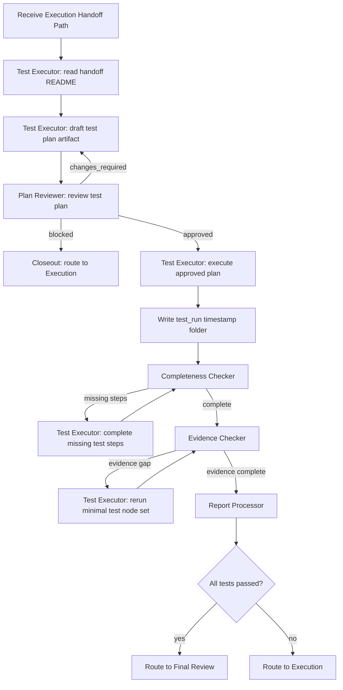

# Test Subgraph v2 落地设计

状态：设计合同草案
日期：2026-06-25
适用分支：`v0.1.2-alpha-langgraph-reset`

## 结论

Test Subgraph v2 不是单个测试节点，而是一个独立可运行、可恢复、可审计的测试子图。

它的核心闭环是：

```text
测试执行者出方案
  -> 方案审核者审核
  -> 测试执行者按已批准方案执行
  -> 流程完整性检查
  -> 证据检查
  -> 报告处理
  -> Review 或 Execution
```

所有跨节点信息流只传路径，不传大段正文。测试方案、测试证据、测试报告、检查记录全部写入一个带时间戳的测试产物文件夹。State 中只保存该文件夹路径、短状态、短决策和 artifact refs。

## 设计目标

Test Subgraph v2 必须完成以下目标：

1. 接收 Execution handoff 文件夹路径。
2. 测试执行者先生成测试方案，不直接执行测试。
3. 方案审核者审核测试方案，未通过则回到测试执行者修正方案。
4. 测试执行者只能严格执行已批准测试方案。
5. 每次测试运行必须生成一个新的 timestamp 测试产物文件夹。
6. 测试方案、测试证据、原始测试报告、最终测试报告必须在同一个测试产物文件夹内。
7. 流程完整性检查者检查测试方案环节是否完整执行。
8. 证据检查者检查每个测试点证据是否闭环、合理、可追溯。
9. 证据缺漏时，测试执行者只重测最小测试节点集合。
10. 报告处理者只基于已批准测试方案和证据生成最终报告，不重新测试。
11. 所有测试通过时，流转给 Final Review。
12. 任一测试失败或阻塞时，流转回 Execution。

## 非目标

Test Subgraph v2 不做以下事情：

1. 不修改业务代码。
2. 不修复测试失败。
3. 不把测试结果直接写入 Project history、Knowledge 或 Causal truth。
4. 不执行远程发布、push、merge、release、deploy。
5. 不在 LangGraph State 中传递长文。
6. 不让报告处理者补测或补证据。
7. 不让证据检查者扩大成新的测试方案设计者。
8. 不用“测试整体通过”掩盖局部证据缺失。

## 模块边界

### 上游输入

来自 Execution Subgraph 的输入只允许是短状态和文件夹路径：

```json
{
  "execution_handoff_dir": "C:/.../.aegis/artifacts/execution/<run_id>/handoff_to_test",
  "parent_thread_id": "...",
  "source_run_id": "...",
  "project_root": "C:/.../managed-project"
}
```

`execution_handoff_dir` 必须包含 `README.md`。测试执行者必须先读 `README.md`，再按 README 的阅读顺序读取其他文件。

### 下游输出

Test Subgraph 输出只传测试产物文件夹路径：

```json
{
  "test_run_dir": "C:/.../.aegis/artifacts/test/test_run_20260625_153012",
  "status": "passed",
  "next_stage": "final_review"
}
```

或失败时：

```json
{
  "test_run_dir": "C:/.../.aegis/artifacts/test/test_run_20260625_153012",
  "status": "failed",
  "next_stage": "execution"
}
```

## 角色与职责

### 测试执行者

测试执行者是测试模块的行动节点，负责：

1. 读取 Execution handoff。
2. 理解实现范围、变更文件、已知限制、执行模块自测证据。
3. 生成测试方案。
4. 根据方案审核意见修正测试方案。
5. 在方案批准后执行测试。
6. 记录命令、输入、输出、日志、截图或其他证据。
7. 对流程完整性遗漏执行补测。
8. 对证据检查者要求的最小测试节点集合执行重测。

测试执行者禁止：

1. 未经方案批准直接执行测试。
2. 修改业务代码。
3. 因为时间压力跳过证据。
4. 将失败测试伪装成通过。
5. 传递大段测试日志到 State。

### 方案审核者

方案审核者负责审核测试方案是否足够覆盖 Execution handoff 的验证需求。

审核维度：

1. 是否覆盖 Execution 声称完成的所有变更。
2. 是否覆盖 accepted constraints。
3. 是否覆盖 known limits。
4. 是否覆盖风险点。
5. 是否包含正向、负向、边界、回归测试。
6. 是否定义每个测试点的证据要求。
7. 是否避免无意义扩大测试范围。
8. 是否避免把实现偏好当作测试硬约束。

方案审核者输出：

```text
approved | changes_required | blocked
```

方案审核者禁止：

1. 为挑错而挑错。
2. 要求与需求无关的测试。
3. 在方案已经可行时陷入无限细节拉锯。
4. 直接执行测试。

### 流程完整性检查者

流程完整性检查者负责对照批准后的测试方案，检查测试执行是否遗漏流程环节。

它只回答一个问题：

```text
测试方案中声明的测试步骤是否全部被执行？
```

如果存在遗漏：

1. 生成 `completeness_rework_request.md`。
2. 指出遗漏的测试步骤 ID。
3. 流转回测试执行者补测。
4. 补测完成后再次回到流程完整性检查者。

如果无遗漏：

1. 写入 `completeness_check_report.md`。
2. 流转给证据检查者。

流程完整性检查者不判断证据质量。证据质量属于证据检查者。

### 证据检查者

证据检查者负责判断每个测试点的证据是否闭环、合理、可追溯。

证据闭环最低要求：

1. 测试点 ID。
2. 对应测试方案条目。
3. 执行命令或操作说明。
4. 输入或环境引用。
5. 原始输出或日志引用。
6. 实际结果。
7. 预期结果。
8. pass/fail/block 判定。
9. 判定理由。
10. 证据文件 sha256。

如果证据不足，证据检查者必须选择最小测试节点集合重测。

最小测试节点集合定义：

```text
为了补足当前证据缺口，必须一起重跑的最小测试步骤集合。
```

选择原则：

1. 如果单个测试点可独立复现，只重跑该测试点。
2. 如果该测试点依赖前置初始化，包含前置初始化节点。
3. 如果该测试点输出被后续验证消费，包含必要的后续验证节点。
4. 不因为一个证据缺口重跑整套测试，除非依赖关系无法切分。
5. 不用孤立截图或孤立日志替代必要的前后文证据。

证据补充完成后直接回到证据检查者，不再回流程完整性检查者。

### 报告处理者

报告处理者负责生成最终测试报告。

输入：

1. 已批准测试方案路径。
2. 完整测试证据路径。
3. 流程完整性检查报告路径。
4. 证据检查报告路径。
5. 原始测试报告路径。

输出：

1. `final_test_report.md`
2. `test_result_summary.json`
3. `next_route.json`

报告处理者禁止：

1. 重新测试。
2. 补证据。
3. 修改测试方案。
4. 修改业务代码。
5. 将失败说成通过。

## 子图流程



## 状态契约

LangGraph State 只允许保存短字段：

```python
class TestSubgraphState(TypedDict, total=False):
    input_package: dict
    project_root: str
    execution_handoff_dir: str
    test_run_dir: str
    plan_status: str
    completeness_status: str
    evidence_status: str
    final_status: str
    next_stage: str
    blocker: dict
    refs: dict
```

禁止在 State 中保存：

1. 完整测试方案正文。
2. 完整测试报告正文。
3. 原始 stdout/stderr 长日志。
4. 截图二进制。
5. 大型 JSON 原文。
6. 测试证据正文集合。

长内容必须写入文件，然后在 State 中保存路径或 `ArtifactRef`。

## 产物目录结构

每次测试运行创建一个新的目录：

```text
.aegis/artifacts/test/
  test_run_YYYYMMDD_HHMMSS_<short_run_id>/
    README.md
    input/
      README.md
      execution_handoff_ref.json
      input_validation.json
    test_plan/
      README.md
      draft_test_plan.md
      approved_test_plan.md
      plan_review_record.md
      plan_review_scorecard.json
    execution/
      README.md
      test_execution_manifest.json
      raw_test_report.md
      commands/
        README.md
        <test_id>/
          command.txt
          stdout.txt
          stderr.txt
          exit_code.txt
          duration_ms.txt
          evidence.json
      artifacts/
        README.md
        <test_id>/
          ...
    completeness_check/
      README.md
      completeness_check_report.md
      missing_steps.json
      completeness_rework_requests/
        ...
    evidence_check/
      README.md
      evidence_check_report.md
      evidence_matrix.json
      minimal_retest_requests/
        ...
    final_report/
      README.md
      final_test_report.md
      test_result_summary.json
      next_route.json
    index/
      README.md
      evidence_index.json
      artifact_hashes.json
```

根 `README.md` 必须说明：

1. 本次测试目标。
2. 输入 handoff 路径。
3. 推荐阅读顺序。
4. 每个子目录的含义。
5. 最终报告路径。
6. 当前 next route。

## 核心数据模型

### TestInputPackage

```python
class TestInputPackage(BaseModel):
    run_id: str
    parent_thread_id: str | None
    project_root: Path
    execution_handoff_dir: Path
```

### TestPlan

```python
class TestPlan(BaseModel):
    plan_id: str
    source_handoff_dir: str
    test_nodes: list[TestNode]
    coverage_matrix: list[CoverageItem]
    evidence_requirements: list[EvidenceRequirement]
    known_limits: list[str]
```

### TestNode

```python
class TestNode(BaseModel):
    test_id: str
    purpose: str
    preconditions: list[str]
    command_or_operation: str
    expected_result: str
    evidence_required: list[str]
    depends_on: list[str]
    can_rerun_independently: bool
```

### PlanReviewResult

```python
class PlanReviewResult(BaseModel):
    decision: Literal["approved", "changes_required", "blocked"]
    score: int
    error_count: int
    warning_count: int
    required_changes: list[str]
    review_report_ref: ArtifactRef
```

通过规则：

```text
score >= 95 且 error_count == 0 -> approved
warning 不阻断
error 必须阻断
```

### TestExecutionEvidence

```python
class TestExecutionEvidence(BaseModel):
    test_id: str
    status: Literal["passed", "failed", "blocked", "skipped", "timeout"]
    command_ref: ArtifactRef | None
    stdout_ref: ArtifactRef | None
    stderr_ref: ArtifactRef | None
    artifact_refs: list[ArtifactRef]
    expected_result: str
    actual_result: str
    verdict_reason: str
    sha256_refs: dict[str, str]
```

### CompletenessCheckResult

```python
class CompletenessCheckResult(BaseModel):
    status: Literal["complete", "missing_steps"]
    missing_test_ids: list[str]
    rework_request_ref: ArtifactRef | None
    report_ref: ArtifactRef
```

### EvidenceCheckResult

```python
class EvidenceCheckResult(BaseModel):
    status: Literal["complete", "evidence_gap"]
    gap_items: list[EvidenceGap]
    minimal_retest_request_ref: ArtifactRef | None
    report_ref: ArtifactRef
```

### MinimalRetestRequest

```python
class MinimalRetestRequest(BaseModel):
    request_id: str
    target_gap_ids: list[str]
    test_node_ids_to_rerun: list[str]
    dependency_reasoning: str
    expected_new_evidence: list[str]
```

### TestOutputPackage

```python
class TestOutputPackage(BaseModel):
    schema_version: Literal["test.output.v2"]
    run_id: str
    status: Literal["passed", "failed", "blocked"]
    test_run_dir: str
    approved_test_plan_ref: ArtifactRef
    final_test_report_ref: ArtifactRef
    evidence_index_ref: ArtifactRef
    next_stage: Literal["final_review", "execution"]
    boundary: TestBoundaryFlags
```

### TestBoundaryFlags

```python
class TestBoundaryFlags(BaseModel):
    modified_code: bool = False
        wrote_knowledge_truth: bool = False
    wrote_causal_truth: bool = False
    remote_published: bool = False
```

任何字段为 `true` 都是硬错误。

## 路由规则

### 方案审核路由

```text
approved -> execute_tests
changes_required -> draft_test_plan
blocked -> closeout_to_execution
```

### 流程完整性路由

```text
complete -> evidence_check
missing_steps -> execute_missing_steps -> completeness_check
```

### 证据检查路由

```text
complete -> report_processor
evidence_gap -> execute_minimal_retest_set -> evidence_check
```

### 最终路由

```text
all tests passed -> final_review
any failed/blocked test -> execution
```

## 最小重测集合算法

最小重测集合必须基于测试计划中的依赖关系，而不是人工随意选择。

输入：

1. 证据缺口对应的 `test_id`。
2. `TestPlan.test_nodes`。
3. 每个测试节点的 `depends_on`。
4. 每个测试节点的产物消费者关系。

步骤：

1. 找到证据缺口对应的目标测试节点。
2. 递归加入其必要前置节点，直到前置状态可由现有证据证明。
3. 如果目标节点输出被后续判定节点消费，加入最小必要消费者节点。
4. 排除与该证据缺口无关的并行测试节点。
5. 生成 `minimal_retest_request.md` 和 `minimal_retest_request.json`。

示例：

```text
setup_database -> run_api_test -> verify_api_log
```

如果 `run_api_test` 的 stdout 证据缺失，但 `setup_database` 的状态无法由现有证据证明，则最小重测集合是：

```text
setup_database, run_api_test, verify_api_log
```

如果 `setup_database` 的证据仍有效，则最小重测集合是：

```text
run_api_test, verify_api_log
```

## 测试执行原则

测试执行者必须遵守：

1. 只执行 approved test plan 中声明的测试节点。
2. 每个测试节点独立记录证据。
3. 命令 stdout/stderr 写文件，不进 State。
4. 长日志必须落文件，并记录 sha256。
5. 失败测试必须保留原始失败证据。
6. timeout 必须记录 timeout 秒数、开始时间、结束时间、已捕获输出。
7. skipped 必须记录跳过原因。
8. blocked 必须记录阻塞条件和所需上游修复。

## 报告生成原则

最终测试报告必须包含：

1. 测试目标。
2. 输入 handoff。
3. 测试方案摘要。
4. 测试环境。
5. 测试矩阵。
6. 每个测试点的结果。
7. 每个失败点的证据路径。
8. 流程完整性检查结论。
9. 证据检查结论。
10. 已补测记录。
11. 已知限制。
12. 最终路由。

最终报告不能只写“通过/失败”，必须能从每个结论追溯到证据文件。

## 错误处理

### 方案长期不过

如果方案审核反复失败并达到 `max_plan_review_rounds`：

```text
status = blocked
next_stage = execution
reason = test_plan_not_approvable
```

### 流程补测长期不完整

如果流程完整性检查多次发现遗漏：

```text
status = blocked
next_stage = execution
reason = test_execution_incomplete
```

### 证据补强长期失败

如果证据检查多次无法闭环：

```text
status = blocked
next_stage = execution
reason = evidence_not_closable
```

### 测试工具不可用

如果测试工具缺失：

```text
status = blocked
next_stage = execution
reason = test_environment_unavailable
```

工具不可用不能伪装成测试失败，也不能伪装成测试通过。

## 持久化边界

Test Subgraph 可以写：

1. `.aegis/artifacts/test/<test_run_id>/`
2. 测试模块自己的运行证据。
3. 候选性质的测试结论 artifact。

Test Subgraph 不可以写：

1. `code/` 业务代码。
2. Knowledge/Causal admitted truth。
3. Knowledge admitted fact。
4. Causal admitted truth。
5. 远端仓库。

## 可实现任务拆解

### Task 1: 测试模块 schema

实现：

1. `TestInputPackage`
2. `TestPlan`
3. `TestNode`
4. `PlanReviewResult`
5. `TestExecutionEvidence`
6. `CompletenessCheckResult`
7. `EvidenceCheckResult`
8. `MinimalRetestRequest`
9. `TestOutputPackage`

验收：

1. Pydantic 校验通过。
2. 长文本字段不得进入 State schema。
3. boundary flag 任一违规为 true 时拒绝。

### Task 2: 测试产物 writer

实现：

1. timestamp 测试目录创建。
2. README-first 目录结构。
3. ArtifactRef 生成。
4. sha256 记录。
5. 路径必须在测试 artifact root 内。

验收：

1. 不能写入 `code/`。
2. 每个子目录有 README。
3. 每个证据文件可通过 evidence index 找到。

### Task 3: 方案生成和方案审核节点

实现：

1. 测试执行者生成 draft plan。
2. 方案审核者输出 scorecard。
3. 未批准则回到方案生成。
4. 达到最大轮次则 block。

验收：

1. 未 approval 不执行测试。
2. warning-only 不阻断。
3. error 阻断。

### Task 4: 测试执行节点

实现：

1. 读取 approved test plan。
2. 按 test node 执行。
3. 记录 stdout/stderr/exit_code/duration。
4. 生成 raw_test_report。

验收：

1. 只执行 approved plan 内测试节点。
2. 失败证据保留。
3. timeout 证据保留。

### Task 5: 流程完整性检查节点

实现：

1. 对照 approved plan 检查执行 manifest。
2. 发现遗漏生成 rework request。
3. 补测后再次检查。

验收：

1. 漏测不能进入证据检查。
2. 补测记录必须进入产物目录。

### Task 6: 证据检查节点

实现：

1. 生成 evidence matrix。
2. 检查每个测试点证据闭环。
3. 生成 minimal retest request。
4. 补证后直接回证据检查。

验收：

1. 缺证据不能进入最终报告。
2. 最小重测集合不能扩大成全量重测，除非依赖不可切分。

### Task 7: 报告处理节点

实现：

1. 生成 final_test_report。
2. 生成 test_result_summary。
3. 生成 next_route。

验收：

1. 全部通过路由 Final Review。
2. 任一失败路由 Execution。
3. 报告结论可追溯证据。

### Task 8: 子图 builder

实现：

1. `build_test_subgraph`
2. 条件边。
3. terminal closeout。

验收：

1. normal pass path。
2. failed path。
3. completeness rework path。
4. evidence retest path。

## 最低测试计划

实现后至少需要以下测试：

1. 完整方案通过后才能执行测试。
2. 方案未通过时不会执行测试。
3. 测试失败时最终路由 Execution。
4. 测试全通过时最终路由 Final Review。
5. 流程完整性遗漏会回测试执行者补测。
6. 证据缺漏会触发最小测试节点集合重测。
7. 证据补强后直接回证据检查者。
8. 报告处理者不会执行测试。
9. State 中不包含长文。
10. 测试产物目录包含 README、方案、证据、报告。
11. `code/` 不被测试模块修改。
12. Knowledge/Causal truth 不被测试模块写入。

## 生产级验收标准

Test Subgraph v2 可被接受的最低标准：

1. 单元测试通过。
2. 子图集成测试通过。
3. 失败路径测试通过。
4. 证据缺漏路径测试通过。
5. 流程遗漏路径测试通过。
6. artifact schema 校验通过。
7. CRLF scan 通过。
8. `git diff --check` 通过。
9. 真实 agent 行为验收通过。
10. 最终报告明确区分：
    - 流程通过；
    - 证据通过；
    - 测试结论通过；
    - 是否可交给 Final Review。

如果未做真实 agent 行为验收，只能标记为 deterministic accepted，不能标记为 production accepted。
