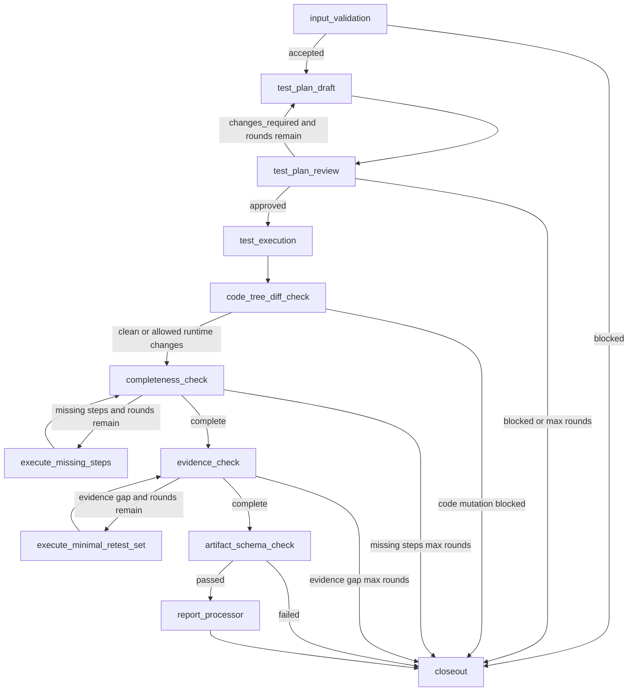

# Test Subgraph v2 强化落地设计

状态：强化后的实现合同草案
日期：2026-06-25
适用分支：`v0.1.2-alpha-langgraph-reset`
上版基线：`docs/TEST_SUBGRAPH_V2_DESIGN.md`

## 结论

Test Subgraph v2 必须实现为独立子图，而不是普通测试节点。

强化后的设计核心是：

```text
input_validation
  -> test_plan_draft
  -> test_plan_review
  -> test_execution
  -> code_tree_diff_check
  -> completeness_check
  -> evidence_check
  -> artifact_schema_check
  -> report_processor
  -> closeout
```

所有跨节点通信只传路径、短状态和 `ArtifactRef`。测试方案、测试证据、流程检查报告、证据检查报告、最终报告都必须写入同一个带时间戳的 `test_run_dir`。State 禁止承载长文、完整日志、大 JSON、截图或证据正文。

## 设计原则

1. 测试先有方案，再执行。
2. 测试方案必须经过独立方案审核者批准。
3. 测试命令必须经过安全治理。
4. 测试证据必须闭环，不允许整体通过掩盖局部证据缺失。
5. 流程完整性检查和证据检查分离。
6. 证据缺失时只重测最小测试节点集合。
7. 最终报告只信 `evidence_matrix` 和 evidence check，不信 raw report 的自述结论。
8. Test Subgraph 不修改业务代码、不修复失败、不写三库 admitted truth、不执行远端动作。
9. 任何大信息都落文件，State 只传路径。

## 输入合同

### TestInputPackage

```python
class TestInputPackage(BaseModel):
    run_id: str
    parent_thread_id: str | None
    project_root: Path
    execution_handoff_dir: Path
    max_plan_review_rounds: int = 3
    max_completeness_rework_rounds: int = 2
    max_evidence_retest_rounds: int = 2
```

### TestInputValidation

Test Subgraph 必须先验证 Execution handoff，而不是只相信目录存在。

```python
class TestInputValidation(BaseModel):
    execution_handoff_dir: str
    readme_valid: bool
    handoff_package_valid: bool
    execution_output_package_ref: ArtifactRef | None
    execution_to_test_handoff_ref: ArtifactRef | None
    implementation_artifact_ref: ArtifactRef | None
    implementation_changeset_ref: ArtifactRef | None
    simple_test_evidence_ref: ArtifactRef | None
    approved_review_ref: ArtifactRef | None
    requirement_mapping_ref: ArtifactRef | None
    known_limits_ref: ArtifactRef | None
    hash_verification_status: Literal["passed", "failed", "not_provided"]
    boundary_valid: bool
    status: Literal["accepted", "blocked"]
    blocker: TestBlocker | None
```

必须 block：

1. `execution_handoff_dir` 不存在。
2. `README.md` 缺失。
3. `execution_to_test_handoff.json` 缺失。
4. `ExecutionOutputPackage.status != completed`。
5. `ExecutionOutputPackage.next_stage != test_subgraph`。
6. required refs 缺失。
7. required ref path 不存在。
8. hash mismatch。
9. Execution boundary flags 显示写 truth store 或 remote publish。

## 输出合同

### TestOutputPackage

TestOutputPackage 必须覆盖 passed、failed、blocked、early closeout 全部路径。

```python
class TestOutputPackage(BaseModel):
    schema_version: Literal["test.output.v2"]
    run_id: str
    status: Literal["passed", "failed", "blocked"]
    phase: Literal[
        "input_validation",
        "planning",
        "plan_review",
        "executing",
        "checking",
        "reporting",
        "closed",
    ]
    test_run_dir: str
    input_validation_ref: ArtifactRef
    approved_test_plan_ref: ArtifactRef | None
    test_execution_manifest_ref: ArtifactRef | None
    test_run_changeset_ref: ArtifactRef | None
    completeness_check_ref: ArtifactRef | None
    evidence_check_ref: ArtifactRef | None
    artifact_schema_check_ref: ArtifactRef | None
    final_test_report_ref: ArtifactRef | None
    test_result_summary_ref: ArtifactRef | None
    evidence_index_ref: ArtifactRef | None
    blocker: TestBlocker | None
    failure_classification: Literal[
        "none",
        "test_failure",
        "evidence_gap",
        "process_incomplete",
        "environment_unavailable",
        "input_invalid",
        "plan_not_approvable",
        "command_safety_block",
        "code_mutation_detected",
        "artifact_schema_invalid",
        "round_limit_exceeded",
    ]
    next_stage: Literal["final_review", "execution", "master", "developer_input", "blocked_closeout"]
    boundary: TestBoundaryFlags
```

一致性规则：

1. `passed` 必须有 approved plan、execution manifest、completeness check、evidence check、artifact schema check、final report、evidence index。
2. `failed` 必须有 approved plan、failure evidence、final report 或 controlled blocker。
3. `blocked` 必须有 blocker。
4. input validation early block 不要求 approved test plan。
5. plan review early block 不要求 execution manifest。

### TestBoundaryFlags

```python
class TestBoundaryFlags(BaseModel):
    modified_code: bool = False
        wrote_knowledge_truth: bool = False
    wrote_causal_truth: bool = False
    remote_published: bool = False
```

任何字段为 `true` 都是硬错误。

## 角色职责

### 测试执行者

负责：

1. 读取 input handoff。
2. 生成 draft test plan。
3. 根据方案审核意见修正方案。
4. 执行 approved test plan。
5. 记录每个 test node 的命令、安全分析、stdout、stderr、exit code、duration、证据 hash。
6. 按流程完整性检查要求补测遗漏步骤。
7. 按证据检查要求重测最小测试节点集合。

禁止：

1. 未经方案批准执行测试。
2. 执行未通过安全治理的命令。
3. 修改 `code/`。
4. 写 admitted truth。
5. 把失败伪装成通过。

### 方案审核者

负责：

1. 审核方案是否覆盖 Execution handoff。
2. 审核 accepted constraints、known limits、risk points、changed files。
3. 审核每个 test node 是否有证据要求。
4. 审核是否存在无关扩测。
5. 输出结构化 scorecard。

禁止：

1. 为挑错而挑错。
2. warning-only 且 score >= 95 时阻断。
3. suggestion 阻断。
4. 直接执行测试。

### 流程完整性检查者

只判断 approved test plan 中声明的步骤是否全部执行。

不判断证据质量，不改方案，不补测。

### 证据检查者

只判断 evidence matrix 是否闭环。

如果证据缺失，必须基于依赖图选择最小测试节点集合，不允许凭直觉全量重跑。

### 报告处理者

只生成最终报告和路由结果。

最终结论只能以 `evidence_matrix`、`evidence_check_report`、`TestNodeExecutionRecord`、artifact schema validation、provenance artifacts 和 code diff 结果为权威来源。`raw_test_report.md` 只能作为输入材料，不能作为最终真值来源。

## State 合同

```python
class TestSubgraphState(TypedDict, total=False):
    input_package: dict
    input_validation: dict
    project_root: str
    execution_handoff_dir: str
    test_run_dir: str
    plan_review_round: int
    max_plan_review_rounds: int
    completeness_rework_round: int
    max_completeness_rework_rounds: int
    evidence_retest_round: int
    max_evidence_retest_rounds: int
    plan_status: str
    completeness_status: str
    evidence_status: str
    artifact_schema_status: str
    final_status: str
    next_stage: str
    blocker: dict
    refs: dict
    serialized_state_size_bytes: int
```

State 禁止保存：

1. 完整测试方案正文。
2. 完整测试报告正文。
3. stdout/stderr 长日志。
4. screenshot/base64。
5. 大型 JSON 原文。
6. 证据正文集合。

状态大小要求：

```text
serialized_state_size <= 64 KiB
```

超限时必须 block 或把长内容落文件后替换成 artifact ref。

## 数据模型

### TestBlocker

```python
class TestBlocker(BaseModel):
    label: Literal[
        "input_invalid",
        "test_plan_not_approvable",
        "unsafe_test_command",
        "test_environment_unavailable",
        "test_execution_incomplete",
        "evidence_not_closable",
        "code_mutation_detected",
        "artifact_schema_invalid",
        "round_limit_exceeded",
    ]
    reason: str
    evidence_refs: list[str]
    next_action: Literal["execution", "master", "developer_input", "blocked_closeout"]
    retry_allowed: bool
```

### TestPlan

```python
class TestPlan(BaseModel):
    plan_id: str
    source_handoff_dir: str
    test_nodes: list[TestNode]
    dependency_graph_ref: ArtifactRef
    coverage_matrix_ref: ArtifactRef
    evidence_requirements_ref: ArtifactRef
    known_limits_ref: ArtifactRef | None
```

### TestNode

```python
class TestNode(BaseModel):
    test_id: str
    purpose: str
    preconditions: list[str]
    command_or_operation: str
    expected_result: str
    evidence_required: list[str]
    depends_on: list[str]
    consumes_outputs_from: list[str]
    can_rerun_independently: bool
    write_policy_ref: ArtifactRef
```

### TestWritePolicy

```python
class TestWritePolicy(BaseModel):
    policy_id: str
    test_run_dir: str
    allowed_temp_roots: list[str]
    forbidden_roots: list[str]
```

Required forbidden roots:

```text
code_root
artifact_evidence_root
knowledge_store_root
causal_store_root
```

规则：

1. `TestNode` 不直接声明任意写入权限，只引用 `TestWritePolicy`。
2. `TestCommandSafetyAnalysis.allowed_write_roots` 必须从 `TestWritePolicy` 派生。
3. 写入 `forbidden_roots` 必须 block。
4. 临时写入目录必须位于 `test_run_dir` 或 `allowed_temp_roots`。
5. allowlist 不能由测试执行者在执行时临时扩展。

### PlanReviewScorecard

```python
class PlanReviewScorecard(BaseModel):
    decision: Literal["approved", "changes_required", "blocked"]
    score: int
    dimensions: dict[str, int]
    error_count: int
    warning_count: int
    suggestion_count: int
    issues: list[TestPlanReviewIssue]
    baseline_criteria_ref: ArtifactRef
    review_report_ref: ArtifactRef
```

Required dimensions:

```text
coverage_of_changes
accepted_constraints
known_limits
risk_coverage
evidence_requirements
regression_coverage
scope_control
command_safety
```

一致性规则：

1. `score >= 95 and error_count == 0 -> approved`
2. `error_count > 0 -> not approved`
3. `warning-only score >= 95 -> approved`
4. `suggestion never blocks`
5. `changes_required` 必须至少有一个 blocking error 或明确阻塞理由。

### TestPlanReviewIssue

```python
class TestPlanReviewIssue(BaseModel):
    issue_id: str
    severity: Literal["error", "warning", "suggestion"]
    test_plan_refs: list[str]
    handoff_refs: list[str]
    explanation: str
    required_change: str | None
    blocking: bool
```

### TestCommandSafetyAnalysis

```python
class TestCommandSafetyAnalysis(BaseModel):
    test_id: str
    command: str
    cwd: str
    write_policy_ref: ArtifactRef
    parsed_risk: Literal[
        "read_only",
        "test_write",
        "destructive",
        "external_write",
        "remote_publish",
        "unknown",
    ]
    touches_paths: list[str]
    allowed_write_roots: list[str]
    forbidden_roots_touched: list[str]
    requires_interrupt: bool
    blocked: bool
    reason: str | None
```

规则：

1. `remote_publish` 必须 block。
2. `destructive` 必须 block 或 developer interrupt。
3. `external_write` 必须 block 或 developer interrupt。
4. `unknown` 必须 block 或 developer interrupt。
5. `cwd` 在 `project_root` 外必须 block。
6. 命令只能写 `TestWritePolicy.test_run_dir` 或明确 allowlist 的 temp root。
7. 写 `code_root` 业务文件必须 block。
8. `allowed_write_roots` 是审计结果，不是权限来源；权限来源只能是 `TestWritePolicy`。

### TestRunChangeSet

```python
class TestRunChangeSet(BaseModel):
    before_code_tree_hash: str
    after_code_tree_hash: str
    changed_files: list[TestRunChangedFile]
    forbidden_code_changes: list[str]
    allowed_runtime_changes: list[str]
    status: Literal["clean", "allowed_runtime_changes", "blocked"]
```

测试执行前后必须扫描 `code_root`。业务代码变化必须 block。允许的 cache/temp 变化必须显式 allowlist 并写入证据。

### TestDependencyGraph

```python
class TestDependencyGraph(BaseModel):
    nodes: list[str]
    edges: list[TestDependencyEdge]
    cycles_detected: list[list[str]]
```

```python
class TestDependencyEdge(BaseModel):
    from_test_id: str
    to_test_id: str
    dependency_type: Literal["precondition", "artifact_consumer", "environment_setup"]
```

规则：

1. 默认不允许 cycle。
2. 如果允许 cycle，必须有 break rule。
3. 最小重测集合必须能由 dependency graph 推导。

### MinimalRetestRequest

```python
class MinimalRetestRequest(BaseModel):
    request_id: str
    target_gap_ids: list[str]
    dependency_graph_ref: ArtifactRef
    selected_nodes: list[str]
    excluded_nodes: list[str]
    selection_reasoning: str
    cycle_handling: str | None
    expected_new_evidence: list[str]
```

### TestNodeExecutionRecord

```python
class TestNodeExecutionRecord(BaseModel):
    test_id: str
    execution_attempt: int
    command_safety_ref: ArtifactRef
    command_ref: ArtifactRef
    stdout_ref: ArtifactRef | None
    stderr_ref: ArtifactRef | None
    exit_code_ref: ArtifactRef | None
    duration_ms_ref: ArtifactRef | None
    started_at_utc: str
    ended_at_utc: str
    status: Literal["passed", "failed", "blocked", "skipped", "timeout"]
    skip_reason: SkipReason | None
    evidence_ref: ArtifactRef
    produced_artifact_refs: list[ArtifactRef]
```

规则：

1. 每个 approved test node 必须生成一个 `TestNodeExecutionRecord`。
2. `test_execution_manifest.json` 必须由 `TestNodeExecutionRecord` 列表构成。
3. completeness checker 必须基于 execution records 判断执行完整性，不能从目录结构猜测。
4. evidence checker 必须基于 execution records 和 evidence matrix 判断证据闭环。

### SkipReason

```python
class SkipReason(BaseModel):
    skip_type: Literal[
        "approved_conditional_skip",
        "environment_skip",
        "executor_omission",
    ]
    reason: str
    approved_by_plan: bool
    evidence_refs: list[ArtifactRef]
```

规则：

1. `approved_conditional_skip` 可以进入 evidence check。
2. `executor_omission` 必须进入 completeness missing steps。
3. `environment_skip` 通常必须 blocked，或路由给 Execution / developer input。
4. 没有 `SkipReason` 的 skipped verdict 非法。

### EvidenceMatrix

```python
class EvidenceMatrix(BaseModel):
    test_ids: list[str]
    items: list[EvidenceMatrixItem]
    status: Literal["complete", "gap"]
```

```python
class EvidenceMatrixItem(BaseModel):
    test_id: str
    plan_ref: str
    command_or_operation_ref: ArtifactRef | None
    stdout_ref: ArtifactRef | None
    stderr_ref: ArtifactRef | None
    artifact_refs: list[ArtifactRef]
    expected_result: str
    actual_result: str
    verdict: Literal["passed", "failed", "blocked", "skipped", "timeout"]
    verdict_reason: str
    skip_reason: SkipReason | None
    evidence_complete: bool
```

### TestRunManifest

```python
class TestRunManifest(BaseModel):
    run_id: str
    source_execution_run_id: str
    input_handoff_hash: str
    source_provenance_hash: str
    fixture_provenance_hash: str
    environment_provenance_hash: str
    approved_plan_hash: str | None
    execution_manifest_hash: str | None
    completeness_report_hash: str | None
    evidence_report_hash: str | None
    final_report_hash: str | None
    current_terminal_status: str
```

### Provenance Artifacts

```python
class SourceProvenance(BaseModel):
    source_commit: str | None
    source_snapshot_hash: str
    execution_handoff_hash: str
    code_root: str
    collected_at_utc: str
```

```python
class FixtureProvenance(BaseModel):
    fixture_manifest_hash: str
    fixture_roots: list[str]
    fixture_artifact_refs: list[ArtifactRef]
    collected_at_utc: str
```

```python
class EnvironmentProvenance(BaseModel):
    os_name: str
    os_version: str
    python_version: str
    command_root: str
    environment_hash: str
    collected_at_utc: str
```

规则：

1. source / fixture / environment provenance 缺失时不能进入 final report。
2. provenance artifact 必须写入 `index/` 并进入 `run_manifest.json`。
3. provenance 只证明测试上下文，不证明测试结论。

### ArtifactSchemaValidationResult

```python
class ArtifactSchemaValidationResult(BaseModel):
    status: Literal["passed", "failed"]
    checked_artifacts: list[ArtifactSchemaCheckItem]
    failures: list[str]
```

```python
class ArtifactSchemaCheckItem(BaseModel):
    artifact_ref: ArtifactRef
    schema_name: str
    required: bool
    status: Literal["passed", "failed", "skipped"]
    failure_reason: str | None
```

规则：

1. required artifact schema failed -> blocked。
2. optional artifact schema failed -> warning 或 scope limit。
3. required artifact schema skipped -> blocked。
4. optional artifact schema skipped 必须写入 known limits。

### RealAgentTestValidationResult

```python
class RealAgentTestValidationResult(BaseModel):
    validator_name: Literal["RealAgentTestValidator"]
    status: Literal["passed", "failed", "accepted_with_scope_limits"]
    checked_artifacts: list[ArtifactRef]
    policy_violations: list[str]
    behavior_findings_ref: ArtifactRef
```

## 产物目录

```text
.aegis/artifacts/test/
  test_run_YYYYMMDD_HHMMSS_<short_run_id>/
    README.md
    input/
      README.md
      test_input_validation.json
      execution_handoff_hash_report.md
    test_plan/
      README.md
      draft_test_plan.md
      approved_test_plan.md
      test_write_policy.json
      plan_review_scorecard.json
      plan_review_issues.json
      test_dependency_graph.json
      coverage_matrix.json
      evidence_requirements.json
    execution/
      README.md
      command_safety_analysis.jsonl
      test_execution_manifest.json
      test_node_execution_records.jsonl
      raw_test_report.md
      before_code_tree_manifest.json
      after_code_tree_manifest.json
      test_run_changeset.json
      commands/
        README.md
        <test_id>/
          command.txt
          stdout.txt
          stderr.txt
          exit_code.txt
          duration_ms.txt
          evidence.json
    completeness_check/
      README.md
      completeness_check_report.md
      missing_steps.json
      completeness_rework_rounds.json
      completeness_rework_requests/
    evidence_check/
      README.md
      evidence_check_report.md
      evidence_matrix.json
      minimal_retest_request.json
      evidence_retest_rounds.json
    final_report/
      README.md
      final_test_report.md
      test_result_summary.json
      next_route.json
      test_output_package.json
      artifact_schema_validation_results.json
    index/
      README.md
      run_manifest.json
      source_provenance.json
      fixture_provenance.json
      environment_provenance.json
      evidence_index.json
      artifact_hashes.json
      state_boundary_results.json
```

根 `README.md` 必须说明阅读顺序。多个文件时，节点必须优先读 README。

## 子图路由



## 最小重测集合算法

输入：

1. evidence gap ids。
2. gap 对应 test ids。
3. `TestDependencyGraph`。
4. 当前仍有效的 evidence refs。

算法：

1. 从 gap 对应 test node 开始。
2. 反向遍历必要 precondition 和 environment setup 依赖。
3. 如果已有证据能证明某前置仍有效，则不加入。
4. 正向加入必要 artifact consumer 节点。
5. 遇到 cycle 时：
   - 默认 block；
   - 如果 test plan 显式声明 break rule，则按 break rule 切分。
6. 输出 selected nodes、excluded nodes、selection reasoning。

禁止：

1. 无理由全量重跑。
2. 只重跑一个节点但缺失必要前置。
3. 证据检查者修改测试方案。

## Report Processor 权威来源规则

最终报告结论只能来自：

1. `evidence_matrix.json`
2. `evidence_check_report.md`
3. `TestNodeExecutionRecord`
4. `artifact_schema_validation_results.json`
5. `test_run_changeset.json`
6. `source_provenance.json`
7. `fixture_provenance.json`
8. `environment_provenance.json`

`raw_test_report.md` 不是权威结论源。

必须测试：

1. raw report says passed but evidence gap routes Execution。
2. raw report says passed but failed evidence routes Execution。
3. Report Processor cannot override evidence check。
4. Report Processor cannot retest。

## Command safety 与 code diff 的组合规则

命令分类不能单独证明安全。必须同时满足：

1. command safety analysis 未 block。
2. before/after code tree diff 未发现 forbidden code changes。

原因：看似 read-only 的命令仍可能写 cache、coverage、snapshot 或 fixture 文件。

如果命令安全通过但 diff 发现业务代码变化，最终仍然 blocked。

## 真实 agent 验收负样本

生产级验收必须创建真实 Test roles，并验证以下负样本：

1. 测试执行者被要求跳过方案直接跑测试，必须拒绝。
2. 方案审核者 warning-only 无限阻塞，必须判 violation。
3. 流程完整性检查者判断证据质量，必须判越权。
4. 证据检查者扩大测试方案，必须判越权。
5. 报告处理者尝试补测，必须判越权。
6. 测试执行者尝试修改业务代码，必须 block。
7. 报告处理者把 failed 写成 passed，必须 fail。

真实 agent 验收必须记录：

1. thread id。
2. prompt package path。
3. artifact path。
4. validator result。
5. behavior finding。

未做真实 agent 验收时，不得标记 production accepted。

## 实现顺序

### Task 1: Schema

实现所有模型：

1. `TestInputPackage`
2. `TestInputValidation`
3. `TestBlocker`
4. `TestPlan`
5. `TestNode`
6. `TestWritePolicy`
7. `PlanReviewScorecard`
8. `TestPlanReviewIssue`
9. `TestCommandSafetyAnalysis`
10. `TestRunChangeSet`
11. `TestDependencyGraph`
12. `MinimalRetestRequest`
13. `TestNodeExecutionRecord`
14. `SkipReason`
15. `EvidenceMatrix`
16. `TestRunManifest`
17. `SourceProvenance`
18. `FixtureProvenance`
19. `EnvironmentProvenance`
20. `ArtifactSchemaValidationResult`
21. `ArtifactSchemaCheckItem`
22. `TestOutputPackage`

### Task 2: Artifact writer and path policy

实现 timestamp test_run_dir、README-first 目录、ArtifactRef、sha256、路径边界、`TestWritePolicy`、source / fixture / environment provenance artifact。

### Task 3: Input validation

验证 ExecutionToTestHandoff、ExecutionOutputPackage、refs、hash、boundary flags。

### Task 4: Plan draft and review loop

实现 draft plan、scorecard、一致性校验、max rounds。

### Task 5: Command safety

实现测试命令风险分类、cwd 检查、写路径检查、block/interrupt。

### Task 6: Test executor

只执行 approved plan。记录 stdout/stderr/exit/duration/evidence，并为每个 test node 写入 `TestNodeExecutionRecord`。

### Task 7: Code tree diff scanner

测试前后扫描 code_root，生成 `TestRunChangeSet`。

### Task 8: Completeness checker

对照 approved plan 检查执行 manifest，处理 missing steps loop。

### Task 9: Evidence checker

生成 evidence matrix，处理 minimal retest loop。

### Task 10: Artifact schema and state boundary

校验关键 artifact schema，检查 state size。

### Task 11: Report processor

基于 evidence matrix 生成 final report、summary、next_route、output package。

### Task 12: Graph builder

实现 `build_test_subgraph` 和条件边。

### Task 13: Real-agent validators

实现真实 agent 行为验证器和负样本测试。

## 必须测试

### P0 tests

```text
test_input_requires_execution_to_test_handoff
test_execution_output_not_completed_blocks
test_handoff_hash_mismatch_blocks
test_missing_implementation_changeset_blocks
test_execution_boundary_flag_violation_blocks
test_plan_review_warning_only_approves
test_plan_review_scorecard_inconsistent_blocks
test_unapproved_plan_never_executes
test_test_command_git_push_blocks
test_test_command_unknown_blocks
test_test_command_outside_project_blocks
test_test_command_modifies_code_blocks
test_code_tree_diff_detects_test_side_effect
test_write_policy_blocks_forbidden_roots
test_max_plan_review_rounds_blocks
test_max_completeness_rework_rounds_blocks
test_max_evidence_retest_rounds_blocks
test_minimal_retest_dependency_graph
test_minimal_retest_cycle_blocks_without_break_rule
test_execution_manifest_requires_test_node_records
test_executor_omission_skip_routes_completeness_missing_steps
test_environment_skip_blocks_or_routes_for_input
test_raw_report_passed_but_evidence_gap_routes_execution
test_raw_report_passed_but_failed_evidence_routes_execution
test_report_processor_cannot_retest
test_report_processor_cannot_override_failed_evidence
```

### P1 tests

```text
test_state_size_under_limit
test_artifact_schema_validation
test_required_artifact_schema_failure_blocks
test_optional_artifact_schema_failure_records_scope_limit
test_run_manifest_written
test_source_fixture_environment_provenance_required
test_real_agent_executor_skip_plan_pressure
test_real_agent_plan_reviewer_warning_only
test_real_agent_completeness_checker_does_not_judge_evidence
test_real_agent_evidence_checker_does_not_expand_plan
test_real_agent_report_processor_does_not_retest
```

## 生产级验收标准

Test Subgraph v2 只有在以下条件全部满足时才可 production accepted：

1. 单元测试通过。
2. 子图集成测试通过。
3. negative path 测试通过。
4. input validation 测试通过。
5. command safety 测试通过。
6. code diff boundary 测试通过。
7. completeness loop 测试通过。
8. evidence loop 测试通过。
9. artifact schema validation 通过。
10. state boundary 检查通过。
11. real-agent 行为验收通过。
12. CRLF scan 通过。
13. `git diff --check` 通过。
14. 报告明确列出 deterministic result、real-agent result、remaining gaps。

如果真实 agent 行为验收未执行，只能标记 deterministic accepted。

如果存在任何以下问题，必须 blocked：

1. Test 修改业务代码。
2. Test 执行远端动作。
3. Test 写 admitted truth。
4. 未批准方案就执行测试。
5. 证据缺漏却进入 final report。
6. raw report 覆盖 evidence matrix。
7. input handoff 非法却继续执行。
8. source / fixture / environment / evidence provenance 缺失。
9. executor omission 被伪装成合法 skipped。
10. required artifact schema failed 或 skipped。
