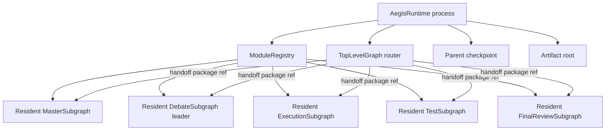
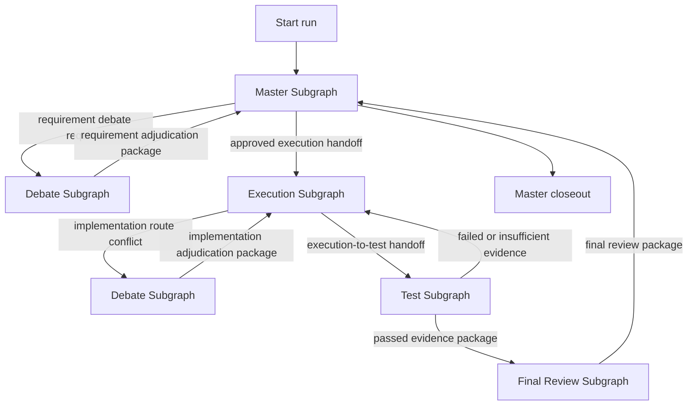

# Top-Level Graph v2 Design

## Status

Proposed for implementation.

## Date

2026-06-26

## Summary

Top-Level Graph v2 is the Aegis runtime router. It does not implement Master,
Debate, Execution, Test, or Final Review business logic. It owns one resident
instance of each core subgraph for a single Aegis process and routes artifact
handoff references between them.

An Aegis process is equivalent to one independent executable runtime bound to
one project working directory. Multiple Aegis processes may run in parallel as
long as they use different working directories. Project-local Project history,
Knowledge, and Causal stores follow the project directory, so Top-Level Graph v2
does not coordinate cross-project store access.

## Core Decision

Use a thin resident router architecture:

- One Aegis runtime process owns one project root.
- The runtime must acquire a project-local runtime lock before entering
  `ready`.
- The runtime constructs exactly one resident instance of each core subgraph at
  startup.
- Each resident subgraph owns its long-lived internal agents.
- The parent graph only routes machine-readable package references.
- The parent graph never performs module business judgment.
- Any resident subgraph or resident agent failure stops the whole Aegis runtime
  after preserving evidence.

## Implementation Contract Hardening

Before source implementation, the parent router contract must harden these
points:

1. Same-project runtime lock is mandatory.
2. Handoff package hashing is deterministic and manifest-based.
3. Route decisions are validated against a route schema registry.
4. Current-phase failure detection is limited to observable runtime failures.
5. Restart/resume semantics distinguish recovered metadata from verified live
   agents.
6. Runtime terminal status is reserved for Master closeout.
7. Developer interrupts use a machine-readable interrupt package.
8. Parent route history is bounded in graph state and fully persisted as a log
   artifact.
9. Source-level tests guard the parent graph from importing or executing module
   business logic.
10. Parent runtime evidence has a fixed artifact layout.

## Design Goals

1. Compose already completed subgraphs without moving their internal logic into
   the parent graph.
2. Keep every core module resident for the lifetime of an Aegis instance.
3. Enforce module-level route contracts and handoff package validation.
4. Preserve file-path-only transfer for large content.
5. Support checkpoint and resume at the parent graph level.
6. Stop safely on resident lifecycle failure instead of silently rebuilding
   modules.
7. Leave agent vital-sign monitoring for a separate future monitor module.

## Non-Goals

- Do not implement business review inside the parent graph.
- Do not inspect long-form requirement, plan, evidence, report, or causal-chain
  text inside the parent graph.
- Do not write Knowledge or Causal truth from the parent graph.
- Do not create Debate workers at parent graph scope.
- Do not auto-recover resident agents after failure.
- Do not solve Codex CLI global resource contention.
- Do not implement the future lifecycle/token monitor in this phase.

## Runtime Model

### Aegis Process

An Aegis runtime process has these fixed properties:

- `aegis_instance_id`: stable identity for this process.
- `project_root`: the project working directory.
- `code_root`: the code directory inside the project when applicable.
- `store_root`: project-local Knowledge and Causal store root.
- `runtime_root`: project-local `.aegis/runtime` directory for checkpoints and
  runtime metadata.
- `artifact_root`: project-local `.aegis/artifacts` directory for handoff
  packages.
- `runtime_lock`: project-local lock file that prevents another active Aegis
  process from binding the same canonical project root.

The process may be restarted. After restart, it may recover the same logical
module instance identities from persisted registry data, but it must not pretend
that old in-memory agents are still alive unless their actual external
thread/session identity is verified by the future monitor layer.

### Project Runtime Lock

The runtime must acquire a project-local lock before constructing resident
modules:

```text
.aegis/runtime/aegis_runtime.lock
.aegis/runtime/runtime_instance.json
```

`runtime_instance.json` must record:

```yaml
schema_version: top_level.runtime_instance.v1
aegis_instance_id: string
project_root_resolved: string
process_id: integer
lock_owner_host: string
created_at_utc: string
runtime_status: initializing|ready|stopped|failed
```

Lock rules:

- `project_root` must be canonicalized before lock acquisition.
- Canonicalization must resolve symlinks, junctions, relative segments, and
  Windows path casing as far as the platform allows.
- A second active runtime for the same canonical project root is rejected.
- A stale lock must not be silently stolen.
- Stale-lock recovery requires an explicit future recovery command or user
  approval; it is not part of automatic startup.
- If lock acquisition fails, no resident subgraph or resident agent may be
  created.

### Resident Subgraphs

At startup, the runtime constructs exactly these resident subgraph instances:

| Module | Resident instance | Resident agents |
| --- | --- | --- |
| Master | `master:default` | Master PM and requirement review agents |
| Debate | `debate:default` | Debate Leader only |
| Execution | `execution:default` | Execution node and Review node |
| Test | `test:default` | Test executor, plan reviewer, flow completeness checker, evidence checker, report handler |
| Final Review | `final_review:default` | Final Review leader |

Debate workers are excluded from the global resident module registry. They are
created dynamically by the Debate Leader for a specific debate and their
lifecycle is owned by the Debate Leader.

### Resident State vs Run State

Resident subgraphs must separate:

- Resident state: module identity, resident agent identities, capability
  profile, local checkpoint handle, and health status.
- Run state: current handoff package, current artifacts, current route result,
  blockers, and terminal output for a specific top-level run.

Resident state may outlive a run. Run state must be isolated by `run_id`.

## High-Level Architecture



## Module-Level Flow



Important routing distinction:

- Master-triggered Debate returns to Master because it belongs to requirement
  review.
- Execution-triggered Debate returns to Execution because it belongs to
  implementation-route selection.

## Parent Graph Responsibility Boundary

The parent graph may:

- Check that a module output package exists.
- Validate that the package is parseable as the expected schema.
- Check the output package status.
- Check the declared next route.
- Check that required artifact references are present.
- Check that handoff paths stay inside allowed project/runtime artifact roots.
- Advance the route to the next resident subgraph.
- Stop the runtime on resident lifecycle failure.

The parent graph must not:

- Read long-form document bodies to decide correctness.
- Decide whether a requirement is reasonable.
- Decide whether a Debate causal chain is true.
- Decide whether implementation quality is acceptable.
- Decide whether Test evidence is scientifically sufficient.
- Decide whether Final Review findings are right.
- Perform code edits.
- Run tests.
- Create pull requests, push, merge, release, or deploy.
- Mutate Knowledge or Causal truth.

## Parent State Model

The parent state must be small and JSON-safe.

Required fields:

| Field | Purpose |
| --- | --- |
| `aegis_instance_id` | Stable runtime identity |
| `project_root` | Bound project directory |
| `run_id` | Current top-level run identity |
| `thread_id` | Parent LangGraph checkpoint thread |
| `current_module` | Module currently receiving control |
| `resident_modules` | Module instance registry refs |
| `active_handoff_ref` | Current package reference passed between modules |
| `route_history_tail` | Last bounded route events only |
| `route_history_log_ref` | Full route history JSONL artifact ref |
| `route_count` | Total number of route events |
| `pending_interrupt_ref` | Path/ref to developer interrupt package |
| `blockers` | Structural blockers only |
| `terminal_status` | Parent run terminal status |
| `closeout_package_ref` | Master closeout package ref |

Forbidden parent state content:

- Full requirement documents.
- Full review reports.
- Full execution plans.
- Full test reports.
- Full causal chains.
- Full code diffs.
- Full agent transcripts.
- Full store contents.

Large content must live in files or package folders. The parent state stores only
paths, artifact IDs, hashes, and compact route metadata.

`route_history_tail` must be bounded. The complete history is written to:

```text
.aegis/runtime/top_level/<run_id>/route_history.jsonl
```

The parent state may store only a tail window, the full log ref, and event count.

## Common Handoff Envelope

Each module-to-module handoff should be wrapped by a compact envelope:

```json
{
  "schema_version": "top_level_handoff_v1",
  "run_id": "run-...",
  "source_module": "execution",
  "target_module": "test",
  "source_module_instance_id": "execution:default",
  "target_module_instance_id": "test:default",
  "handoff_kind": "execution_to_test",
  "package_path": ".aegis/artifacts/execution/.../README.md",
  "package_manifest_path": ".aegis/artifacts/execution/.../handoff_manifest.json",
  "package_sha256": "...",
  "declared_next_route": "test",
  "created_at_utc": "2026-06-26T00:00:00Z"
}
```

Envelope rules:

- `package_path` must point to a folder or `README.md` that explains reading
  order.
- Large content must not be copied into the envelope.
- `package_sha256` must equal `sha256(package_manifest.json bytes)`.
- `source_module` and `target_module` must match an allowed route edge.
- A handoff with an unknown `declared_next_route` is invalid.
- A handoff path outside the project runtime/artifact boundary is invalid.

## Package Manifest Contract

Every routed handoff package must provide a deterministic manifest:

```yaml
schema_version: top_level.package_manifest.v1
run_id: string
package_root: string
readme_path: string
producer_module: master|debate|execution|test|final_review
producer_module_instance_id: string
created_at_utc: string
files:
  - rel_path: string
    sha256: string
    size_bytes: integer
    required: boolean
```

Parent graph validation is limited to machine-readable package structure:

1. `envelope.package_sha256 == sha256(package_manifest.json bytes)`.
2. `package_manifest.run_id == envelope.run_id`.
3. `package_manifest.producer_module == envelope.source_module`.
4. `package_root` is inside the allowed project artifact/runtime roots.
5. `README.md` exists.
6. Required manifest files exist and match recorded hashes.

The parent graph must not read long-form package bodies to decide whether the
package is semantically correct.

## Route Contract

Allowed parent-level routes:

| Source | Target | Meaning |
| --- | --- | --- |
| Master | Debate | Requirement review needs adjudication |
| Debate | Master | Requirement-level adjudication returned |
| Master | Execution | User-approved requirement and review handoff |
| Execution | Debate | Multiple valid implementation routes remain non-dominated |
| Debate | Execution | Implementation-route adjudication returned |
| Execution | Test | Implementation package ready for validation |
| Test | Execution | Failed, inconclusive, or insufficient evidence requires rework |
| Test | Final Review | Passed evidence package is complete |
| Final Review | Master | Final review package returned for closeout |
| Master | Closeout | Master closes the run |

Forbidden examples:

- Debate to Test.
- Test to Master.
- Execution to Final Review without Test.
- Master to Test.
- Final Review to Execution directly.
- Any module to Knowledge or Causal truth.

## Route Schema Registry

The parent router must validate each edge with a route schema registry:

```yaml
source_module: string
target_module: string
handoff_kind: string
expected_envelope_schema: string
expected_package_schema: string
allowed_next_route_values: list[string]
```

Required route schema entries:

| Source | Target | Handoff kind | Expected package |
| --- | --- | --- | --- |
| Master | Debate | `master_requirement_to_debate` | Requirement debate package |
| Debate | Master | `debate_requirement_to_master` | Requirement adjudication package |
| Master | Execution | `master_to_execution` | Execution handoff package |
| Execution | Debate | `execution_route_to_debate` | Implementation route debate package |
| Debate | Execution | `debate_route_to_execution` | Implementation adjudication package |
| Execution | Test | `execution_to_test` | Execution-to-Test handoff package |
| Test | Execution | `test_to_execution_rework` | Test rework package |
| Test | Final Review | `test_to_final_review` | Test output package |
| Final Review | Master | `final_review_to_master` | Final Review output package |
| Master | Closeout | `master_closeout` | Master closeout package |

Rules:

- Parent graph validates schemas, routes, refs, and hashes only.
- Parent graph does not infer intent from malformed output.
- Unknown `next_route` is a route failure.
- Source/target mismatch is a route failure.
- Debate-to-Master is valid only for requirement adjudication.
- Debate-to-Execution is valid only for implementation route adjudication.

## Route Decision Contract

Every resident subgraph must return a compact route decision:

```json
{
  "route_status": "ready",
  "next_route": "test",
  "output_package_ref": {
    "path": ".aegis/artifacts/execution/.../README.md",
    "sha256": "..."
  },
  "blockers": [],
  "interrupt_ref": null
}
```

Allowed `route_status` values:

- `ready`: parent may route to `next_route`.
- `blocked`: parent must stop the run and report blockers.
- `interrupted`: parent must surface a developer interrupt and wait for resume.
- `module_terminal`: the source module is terminal for its own work but the
  top-level run must still route according to `next_route`.
- `runtime_terminal`: only Master closeout may end the top-level run.
- `failed`: parent must preserve evidence and stop the Aegis instance.

The parent graph must validate route shape before routing. Invalid route output
is a runtime failure, not an opportunity for the parent graph to infer intent.

Final Review should normally return `ready` or `module_terminal` with
`next_route=master`. It must not directly close the top-level runtime.

## Startup Sequence

1. Resolve and canonicalize `project_root`.
2. Create or open `.aegis/runtime`.
3. Acquire the project runtime lock.
4. Write `runtime_instance.json` with `runtime_status=initializing`.
5. Resolve project-local `knowledge` and `causal` store locations.
6. Create or open parent checkpoint database.
7. Build the `ModuleRegistry`.
8. Construct all resident subgraph instances.
9. Create all resident agents required by those subgraphs.
10. Record resident module metadata and agent thread IDs where available.
11. Mark runtime status as `ready`.
12. Accept the first top-level run.

If any resident module fails to initialize, the Aegis runtime must not enter
`ready`.

## Failure Semantics

Any resident subgraph or resident agent abnormal failure must:

1. Stop accepting new route events.
2. Preserve current parent state snapshot.
3. Preserve active handoff refs and package paths.
4. Preserve module output and error evidence.
5. Mark runtime status as `stopped_due_to_module_failure`.
6. Notify the user with the failed module, failed resident identity, and evidence
   path.

The runtime must not:

- Silently recreate the failed resident module.
- Skip the failed module.
- Route around the failed module.
- Continue the same run as if the failure did not happen.

Explicit user-approved recovery may be added later, but it is not automatic.

### Current-Phase Failure Detection Boundary

In this phase, the parent graph can stop on observable runtime failures only:

- Runtime lock acquisition failure.
- Resident module initialization exception.
- Missing resident wrapper.
- Module invocation exception.
- Invalid route output schema.
- Invalid handoff envelope or package manifest.
- Package hash mismatch.
- Checkpoint write/read failure.
- Explicit module-reported `failed` status.

The following failures require the future monitor module and must not be claimed
as parent graph capabilities in this phase:

- External Codex/nested-Codex thread death without a module call.
- Agent liveness degradation.
- Token or context-window depletion.
- Long-running no-progress state.
- Silent session or context invalidation.

If a module explicitly reports resident agent failure in its route decision, the
parent graph treats it as observable and stops the runtime.

## Checkpoint Model

Use parent graph checkpointing for:

- Parent route state.
- Current module.
- Active handoff ref.
- Pending interrupt ref.
- Bounded route history tail and full route history log ref.
- Terminal status.

Each resident subgraph may maintain its own checkpoint. Parent and subgraph
threads should be related but distinct:

```text
parent thread_id:      aegis-{instance_id}-{run_id}
master subgraph:       aegis-{instance_id}-master-default
debate subgraph:       aegis-{instance_id}-debate-default
execution subgraph:    aegis-{instance_id}-execution-default
test subgraph:         aegis-{instance_id}-test-default
final review subgraph: aegis-{instance_id}-final-review-default
```

Run-specific module state must still be keyed by `run_id` to prevent resident
state pollution across runs.

### Restart and Resume Semantics

Resident registry metadata may be recovered after process restart, but recovered
metadata is not proof of live resident agents.

Resident status values:

- `initializing`
- `ready`
- `recovered_unverified`
- `failed`
- `stopped`
- `monitor_required`

Restart rules:

1. Parent route checkpoint may be recovered.
2. Resident registry metadata may be recovered.
3. In-memory resident wrappers must be reconstructed.
4. External agent thread identity is `recovered_unverified` unless a future
   monitor verifies liveness.
5. `recovered_unverified` resident modules must not process routes unless the
   module contract explicitly declares itself stateless or verification occurs.
6. A run stopped by `stopped_due_to_module_failure` must not auto-resume.

## Concurrency Policy

Current phase:

- One Aegis process is bound to one project root.
- One project root supports one active top-level run at a time.
- Multiple independent Aegis processes may run for different project roots.
- Runtime lock acquisition is required before resident module startup.

Rationale:

- The project-local code tree is mutable.
- Execution and Test may modify or observe the same code surface.
- Allowing concurrent top-level runs in one project would create unclear
  responsibility and evidence boundaries.

Future extension may add a run queue, but not parallel same-project execution.

## Developer Interrupt Package

When a module or parent wrapper returns `route_status=interrupted`, the parent
graph must surface a machine-readable interrupt package:

```yaml
schema_version: top_level.interrupt.v1
run_id: string
source_module: string
source_module_instance_id: string
interrupt_type: human_approval_required|missing_input|required_secret|unsafe_action|ambiguous_requirement|external_dependency
message_ref: ArtifactRef
allowed_resume_actions: list[string]
required_user_inputs: list[dict]
created_at_utc: string
```

Rules:

- Parent graph surfaces the interrupt; it does not decide for the user.
- Resume input must be recorded as a resume package.
- Interrupt package refs must stay inside allowed runtime/artifact roots.
- Interrupted route checkpoint must be stable.
- A malformed resume package keeps the run interrupted or blocked; parent graph
  must not infer user intent.

## Store Boundary

The parent graph does not treat project stores as its own memory. It may pass
store-root refs to modules, but only modules with explicit responsibility may
produce candidates.

Rules:

- Knowledge and Causal stores live beside the project code, not inside
  the Aegis source repository.
- Parent graph must not write truth records.
- Parent graph may record run closeout package refs only under `.aegis/runtime`
  or parent runtime evidence artifacts.
- Debate may produce Causal candidates.
- Master may close out candidate refs according to its own contract.
- Truth admission remains outside the parent router.

## Long-Text Boundary

The parent graph must never pass large text between modules. Every substantial
handoff is a folder with `README.md`.

Folder contract:

- `README.md` is the first file to read.
- If multiple files exist, `README.md` states their purpose.
- If reading order matters, `README.md` states the required order.
- Package manifest records file hashes.
- Parent graph passes only the package folder/readme path and hash metadata.

## Parent Runtime Artifact Layout

Parent graph runtime evidence lives under:

```text
.aegis/runtime/top_level/<run_id>/
  README.md
  parent_state_snapshot.json
  route_history.jsonl
  handoff_envelopes/
  route_decisions/
  validation_results/
  interrupts/
  failure_evidence/
  closeout/
```

This folder is runtime evidence, not Knowledge/Causal truth.

## Implementation Plan

### Phase 1: Parent Contracts

Implement:

- `TopLevelGraphState`
- `ResidentModuleRecord`
- `ModuleRouteDecision`
- `TopLevelHandoffEnvelope`
- `TopLevelPackageManifest`
- `RouteSchemaRegistryEntry`
- `RouteValidationResult`
- `DeveloperInterruptPackage`
- route enums and validation helpers

Acceptance:

- Invalid routes are rejected.
- Long inline payloads are rejected.
- Handoff paths outside allowed roots are rejected.
- Handoff package hash mismatch is rejected.
- Unknown `next_route` is rejected.
- Runtime terminal status is only accepted from Master closeout.
- State remains JSON-safe and compact.

### Phase 2: Module Registry

Implement:

- `AegisRuntime` resident module registry.
- Per-project singleton module construction.
- Stable `module_instance_id`.
- Runtime startup validation.
- Runtime project lock.
- Restart metadata status handling.

Acceptance:

- Exactly one resident instance exists for each core module.
- Debate registry contains only the Debate Leader as resident.
- Runtime does not enter ready state if a resident module fails initialization.
- A second runtime for the same canonical project root is rejected.
- Restarted resident metadata is `recovered_unverified` until explicitly
  verified or declared stateless.

### Phase 3: Thin Parent Router

Implement:

- Parent `StateGraph` with router nodes only.
- Wrapper nodes that call resident subgraph `.handle(...)` or equivalent.
- Route policy checks before every transition.
- Structural package validation before handoff.
- Route schema registry validation.
- Bounded parent route history state and full JSONL route history artifact.

Acceptance:

- Parent graph contains no business-analysis logic.
- Parent graph does not inspect long-form package text.
- Parent graph only routes based on validated module route decisions.
- Parent graph writes route validation results for every transition.

### Phase 4: Failure Stop Policy

Implement:

- Runtime stop on resident module failure.
- Evidence preservation package.
- `stopped_due_to_module_failure` terminal state.
- Current-phase detectable failure classification.

Acceptance:

- A simulated resident failure stops the whole runtime.
- No silent rebuild occurs.
- Evidence path is returned to the user.
- Future-monitor-only liveness claims are not reported as tested.

### Phase 5: End-to-End Integration

Implement top-level tests for:

- Normal path: Master -> Execution -> Test -> Final Review -> Master closeout.
- Master-triggered Debate: Master -> Debate -> Master -> Execution.
- Execution-triggered Debate: Execution -> Debate -> Execution.
- Test failure loop: Test -> Execution -> Test -> Final Review.
- Final Review blocker: Final Review -> Master with blocker.
- Developer interrupt propagation.

Acceptance:

- All top-level flows pass.
- All module outputs are package refs.
- Parent graph does not write store truth.
- Parent graph does not create module-internal workers.

## Test Plan

### Unit Tests

- `TopLevelGraphState` rejects long inline fields.
- `TopLevelHandoffEnvelope` rejects out-of-root paths.
- `TopLevelHandoffEnvelope` rejects package hash mismatch.
- Route policy accepts every allowed route.
- Route policy rejects every forbidden route.
- `ModuleRouteDecision` rejects unknown next routes.
- `ModuleRegistry` rejects missing resident module.
- Runtime startup fails if any resident module cannot initialize.
- Project runtime lock rejects a second runtime for the same canonical root.
- Symlinked or junctioned project root cannot bypass the runtime lock.
- Runtime terminal is accepted only for Master closeout.
- Developer interrupt package validates and rejects out-of-root refs.
- Route history state remains bounded after many transitions.

### Integration Tests

- Normal flow closes successfully.
- Requirement Debate returns to Master, not Execution.
- Execution Debate returns to Execution, not Master.
- Test failure loops to Execution.
- Test pass routes to Final Review.
- Final Review routes to Master.
- Resident module failure stops the runtime.
- Parent checkpoint can inspect and resume parent route state.
- Restart recovers metadata as `recovered_unverified` rather than pretending
  external agents are live.

### Boundary Tests

- Parent graph cannot pass long text.
- Parent graph cannot read package bodies to choose routes.
- Parent graph cannot write Knowledge or Causal truth.
- Parent graph cannot silently create a second resident subgraph.
- Debate workers do not appear in global resident registry.
- Parent source scan confirms no module business evaluator is imported or called.

### Evidence Tests

- Route history contains source, target, package ref, status, and timestamp.
- Every handoff package has `README.md`.
- Every handoff package has a manifest/hash.
- Runtime failure creates evidence package before stopping.
- Every route validation writes a validation result artifact.
- Parent runtime evidence follows the fixed top-level artifact layout.

## Production Readiness Criteria

Top-Level Graph v2 is ready only when:

- All core subgraphs are resident and uniquely registered.
- All allowed module-level routes are tested.
- All forbidden module-level routes are tested.
- Parent graph has no business-semantic decisions.
- Parent graph state contains only refs, hashes, statuses, and compact route
  metadata.
- Any resident failure stops the runtime with preserved evidence.
- Normal and Debate-involved end-to-end flows pass.

## Risks

| Risk | Impact | Mitigation |
| --- | --- | --- |
| Parent graph starts absorbing module logic | Breaks architecture | Keep parent route functions structural only and test source for forbidden imports/logic |
| Resident state leaks across runs | Wrong decisions or stale artifacts | Require `run_id` scoping for all run state |
| Silent resident rebuild hides failures | False production confidence | Make rebuild impossible without explicit recovery API |
| Long text enters parent state | Checkpoint bloat and context leakage | Enforce compact state schema and long-text tests |
| Debate worker lifecycle leaks upward | Monitor/registry confusion | Only Debate Leader is globally resident |
| Runtime lock is only documented but not enforced | Two runtimes mutate one project | Make lock acquisition a startup prerequisite |
| Parent source scan becomes keyword-based noise | False failures or false confidence | Check imports/calls and parent file boundaries, not arbitrary words |

## Open Implementation Notes

- Current `build_master_graph` is a monolithic transitional graph. Top-Level
  Graph v2 should replace it with a parent router that calls resident subgraphs.
- Existing standalone subgraph builders should be wrapped, not rewritten into
  parent graph nodes.
- The future monitor module should consume resident module records and route
  events, but it is not part of this design phase.
- Source-level parent boundary tests should be structural. They should detect
  forbidden imports, calls, and long-body reads in parent router code rather than
  failing on isolated vocabulary appearing in comments or schema names.
