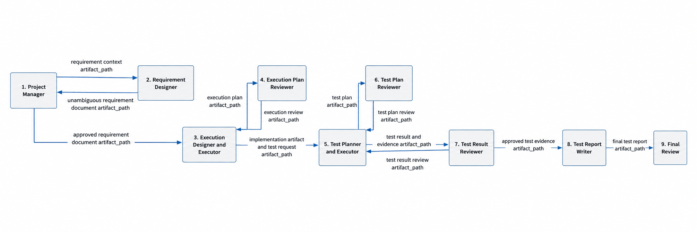

# Flat Node Graph

## Node Graph



## Message Contract

All node-to-node messages use the same minimal structure:

```json
{
  "artifact_path": "...",
  "reasoning_ledger_context_pack": "...",
  "status": true
}
```

- `artifact_path`: path to the transferred artifact folder.
- `reasoning_ledger_context_pack`: path to the exported reasoning context.
- `status`: coordinator-controlled routing result where a coordinator contract exists.

The artifact folder must contain `README.md` as the entry point. Long text must not be passed through graph state.

## Flow Explanation

1. The Project Manager sends the complete requirement context artifact to the Requirement Designer.
2. The Requirement Designer returns an unambiguous requirement document artifact to the Project Manager.
3. The Project Manager sends the approved requirement document artifact to the Execution Designer and Executor.
4. The Execution Designer and Executor sends the execution plan artifact to the Execution Plan Reviewer.
5. The Execution Plan Reviewer returns review feedback to the Execution Designer and Executor.
6. The Execution Designer and Executor sends implementation artifacts and the test request artifact to the Test Planner and Executor.
7. The Test Planner and Executor sends the test plan artifact to the Test Plan Reviewer.
8. The Test Plan Reviewer returns test plan review feedback to the Test Planner and Executor.
9. The Test Planner and Executor sends test results and evidence artifacts to the Test Result Reviewer.
10. The Test Result Reviewer returns result review feedback to the Test Planner and Executor.
11. The Test Result Reviewer sends approved test evidence to the Test Report Writer.
12. The Test Report Writer sends the final test report artifact to Final Review.

## First-Principles Rationale

The Project Manager has the full user interaction context, but later agents must not depend on hidden Project Manager context. Therefore, the Requirement Designer is separated from the Project Manager. Its job is to convert interaction context into an objective, standalone, unambiguous requirement document that later agents can use without private conversation state.

The graph is flat by design. There is no parent graph / subgraph split in this runtime model. Each node is a long-lived role-bound agent, and graph state only carries the next message envelope.

Runtime identity is split by role and turn. A/B use persistent role threads in
one planning App Server process. C-F also retain one persistent thread per role,
but every node turn runs in a new App Server process and TraceRelay session.
LangGraph controls node order; no role thread communicates directly with another
role thread.

C-F responses cannot change the coordinator-owned artifact or reasoning-ledger
paths. Completed C-F receipts are accepted only after the linked TraceRelay
journals are reverified from disk. A coordinator crash seals the exact saved
session and terminates the saved App Server only when both its PID and Windows
process creation FILETIME match before the known Codex turn is read from a new
traced process; an uncertain submission is never repeated.

## Detailed Operating Rules

### Project Manager Runtime

The Project Manager is the main agent in the Codex App window, not an independent subagent.

Rationale:

- The Codex App main agent has the most natural user interaction surface.
- The Codex App main agent has the most complete user conversation context.
- Requirement clarification benefits from the Codex App interaction model.
- This preserves the practical advantage of Codex App while keeping downstream agents context-independent.

Downstream agents must not depend on the Project Manager's private conversation context. They must depend only on artifact folders and their `README.md` entry files.

### Project Manager and Requirement Designer Loop

The Project Manager and Requirement Designer may interact multiple times before the workflow can continue.

Before any requirement draft is written, the Project Manager asks whether code obfuscation and semantic
decoys are enabled for this task. This is an explicit opt-in gate (default off). Only an unambiguous affirmative
developer answer enables it. A negative, ambiguous, or unrelated answer leaves it disabled. The decision and
its evidence artifact are part of the requirement document; configuration, ledger prose, and earlier tasks
cannot enable it implicitly.

The loop exists to produce an unambiguous requirement document that can guide later agents without hidden context. If the Requirement Designer finds missing objectives, unclear scope, unsupported technical path constraints, ambiguous success criteria, or insufficient evidence, it must return an artifact to the Project Manager. The Project Manager then asks the developer for clarification or confirmation.

The workflow may continue only after:

- the requirement document is objective and unambiguous;
- unsupported preferences are separated from hard constraints;
- technical path locks have sufficient evidence or are downgraded;
- the developer confirms the requirement document.

If semantic decoys are enabled, later agents use only the three classifications `REAL`,
`DECOY_UNREACHABLE`, and `UNKNOWN-STALE`. Current Seal-bound active ledger evidence establishes only
structural eligibility; implementation-plan and test-plan reviewers independently verify logical
unreachability. Their exact JSON receipts bind the frozen manifest, reviewed artifacts, evidence bytes, task,
and authority-verified project Seal. Every stale, warned, actively refuted, unproven, or reviewer-rejected
candidate loses its internal-test exemption.

### Review Thresholds

Execution plan review and test plan review are bounded optimization loops, not infinite review loops.

The purpose of review is to find material correctness, scope, evidence, and implementation risks. It is not to keep searching for minor stylistic objections. Since an LLM can always generate additional low-value objections, the review loop must stop once the plan reaches the configured acceptance threshold.

Default rule:

- score >= 95 passes;
- no `error` level issue may remain;
- `warning` level issues may be recorded but do not block flow;
- accepted warnings must be carried forward in the artifact package.

If a reviewer returns a score below threshold, it must provide concrete, actionable issues through the artifact folder. The producer node then revises the plan and returns it for review.

For A/B test-plan review, the coordinator enforces this rule mechanically:

- each author attempt writes to a new `round-NNNN` directory;
- round allocation is recorded before directory creation and resumes idempotently;
- the plan, project seal, and reasoning context are hashed before review;
- the reviewer writes a separate `TEST_PLAN_REVIEW.md` and identifies the exact plan hash;
- live and restored state require the reviewed hash to equal the frozen plan hash;
- model-provided `status` cannot pass the gate;
- only `score >= 95`, `error_count == 0`, and `verdict == PASS` publishes `APPROVED_TEST_PLAN.md` and `PLANNING_HANDOFF.json`;
- zero-round completion is rejected, and every planning TraceRelay session must have valid journal and bidirectional application evidence before C;
- rejected and approved rounds remain immutable evidence in `RUN_STATE.json`.
- uncertain remote turn submission fails closed instead of being resubmitted;
- approval is published in a recoverable `publishing -> approved` transition.

### Test Result Review

Test result review has two distinct parts.

First, the Test Plan Reviewer checks execution completeness against the approved test plan. It verifies whether any required test point, route, condition, or coverage item was missed. If anything is missing, the artifact is returned to the Test Planner and Executor for completion.

Second, the Test Result Reviewer checks evidence closure. It verifies whether each test point has enough evidence, whether the evidence is coherent, and whether the evidence logically proves the claimed result. If evidence is missing or does not close logically, the artifact is returned to the Test Planner and Executor for targeted retest, evidence collection, or evidence repair.

The Test Report Writer may receive the test package only after:

- the test plan has no missing execution steps;
- every required test point has evidence;
- the evidence logically supports the result;
- unresolved limits are explicitly recorded.
