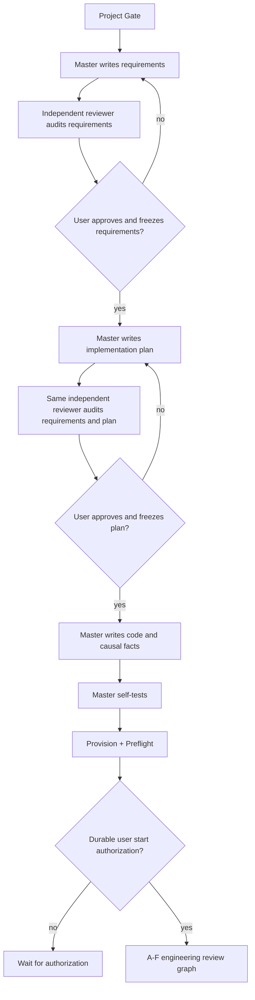

# Master Module Design

This file follows the current Master model. The authoritative contract is
[`docs/AEGIS_ARCHITECTURE_CONTRACT.md`](../../../AEGIS_ARCHITECTURE_CONTRACT.md).

## Boundary

Master is the single semantic author of requirements, implementation plan, code, and corresponding
causal facts. It must not delegate final semantic authorship to a subagent. An independent reviewer
performs adversarial review. The user freezes requirements, plan, scope, and start authorization.

Master is outside the A-F LangGraph. Frozen inputs must not change during an A-F run.
