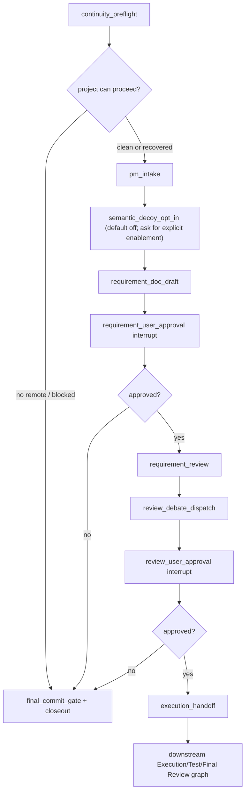

# Master Module Design

## Boundary

Master owns requirement admission, review routing, approval gates, continuity preflight, and
Execution handoff. Master does not execute code, run tests, or merge global causal truth.

User-stated implementation choices are preferences until admitted by project facts, written
customer evidence, hard external constraints, or first-principles necessity.

Every new requirement task asks about code obfuscation and semantic decoys before
`requirement_doc_draft`. Only an unambiguous affirmative answer enables the mechanism; every
other answer keeps the default disabled. The requirement document records the decision, which
cannot be inherited from configuration, ledger prose, or another task.
