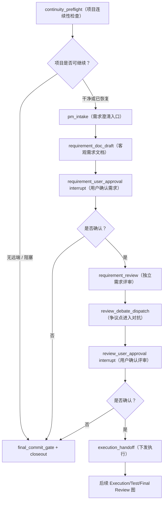

# Master 模块设计

```mermaid
flowchart TD
  A["continuity_preflight（项目连续性检查）"] --> B{"项目是否可继续？"}
  B -- "无远端 / 阻塞" --> Z["final_commit_gate + closeout"]
  B -- "干净或已恢复" --> C["pm_intake（需求澄清入口）"]
  C --> D["requirement_doc_draft（客观需求文档）"]
  D --> E["requirement_user_approval interrupt（用户确认需求）"]
  E --> F{"是否确认？"}
  F -- "否" --> Z
  F -- "是" --> G["requirement_review（独立需求评审）"]
  G --> H["review_debate_dispatch（争议点进入对抗）"]
  H --> I["review_user_approval interrupt（用户确认评审）"]
  I --> J{"是否确认？"}
  J -- "否" --> Z
  J -- "是" --> K["execution_handoff（下发执行）"]
  K --> L["后续 Execution/Test/Final Review 图"]
```

## 边界

Master 负责需求准入、评审路由、审批门、项目连续性检查和执行下发。Master 不直接写代码、
不运行测试、不合并全局因果真值。

用户指定的实现方案默认只是偏好。只有存在项目事实、客户书面证据、硬性外部约束或第一性
必要性时，才可升级为硬约束。
