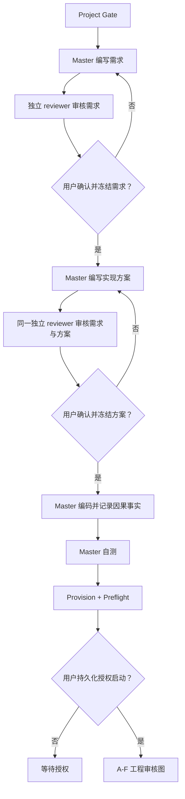

# Master 模块设计

本文件采用现行 Master 模型。完整约束见
[`docs/AEGIS_ARCHITECTURE_CONTRACT.md`](../../../AEGIS_ARCHITECTURE_CONTRACT.md)。

## 边界

Master 是单一语义执行者，直接完成需求、实现方案和代码。Master 不得把最终语义产出委托给
subagent。独立 reviewer 只负责对抗审核。用户负责冻结需求、方案、scope 和启动授权。

Master 不属于 A-F LangGraph。A-F 运行期间所有冻结输入禁止变化。
